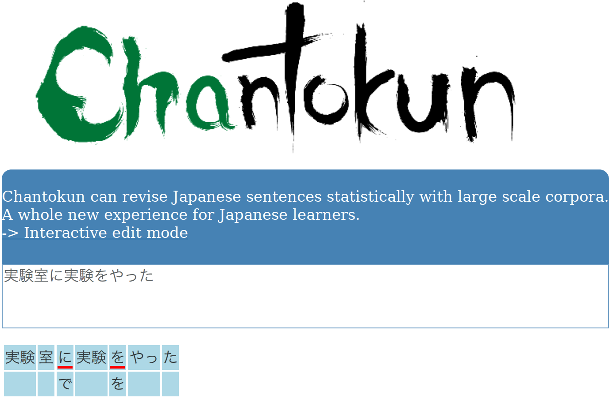

% Contextually Aware Writing Assistance System for Japanese
% Bor Hodošček
% 2013/6/11

\part{Background}

# Introduction

<!--
FIXME

1.  Demonstrate objectives.
2.  Goal
3.  Hypothesis

-->

Writing is not only an important form of communication but is one of the core skills of higher education.
The challenges of academic writing in Japanese as a second language (L2) are compounded by the complexities of the Japanese writing system and the difficulties of acquiring the specialized knowledge of academic writing style necessary to be an effective communicator in ones field of specialization.
Individual learners can rely on domain-specific dictionaries, style guides, or extensive study of documents from their field, but these activities are often separated from the act of writing on a computer.
Although the use of spellcheckers and online grammar correction services is becoming increasingly ubiquitous, the target of these services is often the general public, so they seldom <!-- FIXME support: they only support as general tools --> support the specialized needs of L2 writers in an academic setting.
For example, learners using a search engine are able to look for examples on how to use words and expressions, but the general purpose nature of many such tools limits the amount of assistance they can provide, especially in highlighting differences in writing style.
More recently, with access to large quantities of language data available at low monetary and computational cost, a number of methods have been proposed to utilize these large quantities of language data^[Referring to the gigabyte level and beyond.] for the purposes of writing assistance.
In this thesis, I propose the use of recently available Japanese language corpora to realize writing assistance systems for L2 writers attending Japanese institutions of higher education, where they are required to write reports and papers in Japanese.
I will show that:

1.  Linguistic resources such as corpora are effective for enhancing collocation usage in writing.
2.  It is possible to develop a model of writing style (register) that can discriminate between correct writing styles using corpora containing diverse registers.

<!--
Taken from JSPS proposal.

As a member of the 'Composition Support Group' of the Grant-in-Aid for Scientific Research on Priority Areas "Japanese Corpus", I participated in research activities aimed at applying the results of the project to writing assistance.
The main product, the Balanced Corpus of Contemporary Written Japanese (BCCWJ), is a collection (corpus) of text documents containing approximately 100 million words, which are divided into different media: books, magazines, Yahoo! Blogs, Yahoo! Chiebukuro (Q&A), and so on.
These media are further classified based on various criteria.
The book media, for example, are classified using the Nippon Decimal Classification (NDC) system, which classifies books into categories such as Philosophy, Arts and so on.
Yahoo! Blogs are classified according to topical categories such as Science, Hobby and Sports, and so on.
As these categories are not equivalent across media or other corpora, and because they are sometimes more aligned with topic than differences in actual language use, there is a need for better categories, or, at the least, a complimentary way of classifying them into categories that better reflect actual language use.
One example for such a category would be casual conversation which has no analog to any of the categories provided by the BCCWJ, though it exists as part of several different media.
These kind of categories are often called registers and have been shown to be quantifiable using corpora [@Biber1993; @Biber1995; @Biber2009].
The purpose of my research has thus been to find methods which would allow the automatic quantification of register for Japanese language writing assistance purposes.
-->

<!--

> 1.  Linguistics: Register Analysis using the BCCWJ
>
> -    In my master's thesis, "Development of a Register-based Writing Assistance System for Academic Japanese", I identified three sub-corpora which did not cleanly cluster using suppositional adverbs and functional expressions as clustering features: magazines, textbooks and a subset of Yahoo! Blogs.
> -   Classification of media on descriptive-summative scale [1]: Using bagplots[@rousseeuw1999bagplot], I was able to identify that the Yahoo! Blogs and Yahoo! Chiebukuro media exhibited greater variation on the descriptive-summative scale than other media, and that some samples are too short for reliable feature extraction and subsequent classification.
> -   Correlations between topic and register [7]: showed that the media labels used in the BCCWJ are not to be used as genre labels.
>     Genre labels should be created based on language use observed in each sub-corpus, particularly from the viewpoints of register and topic.
>     Latent Dirichlet Allocation4 was used to construct a topic model of the BCCWJ.
>     This research was able to identify documents with similar topics but varying registers.
>     Inter-media correlations were also found to be different for topics and registers.
> -   Orthographic variation [3]: explained the orthographic variation in modern Japanese from the viewpoint of short- and long-unit words.
>     While this research was not focused on revealing differences between different media, the variation data compiled can easily be expanded to a study on orthographic variation in registers.
>
> 2.  Technical Japanese Language Education and Educational Technology
>
> This part of my research is an application of 1. to academic Japanese writing assistance.
> Specifically, I participated in the designing and construction of the online writing assistance system Natsume (http://hinoki.ryu.titech.ac.jp/natsume), and worked on automatic register correction in the writing assistance system Nutmeg (http://hinoki.ryu.titech.ac.jp/nutmeg).
> Both systems make use of collocational data extracted from several corpora, including the BCCWJ, Japanese version of Wikipedia, as well as the Scientific and Technical Japanese Corpus (STJC), which was (is still being) collaboratively build by the author with other researchers.
>
> -   Natsume is a search system that allows users to search for collocations (commonly co-occurring sets of words, such as “strong tea”) and explore how they are used and in what registers they most appear in (Figure 1).
> -   Nutmeg is an extension of Natsume to automatic writing assistance and can automatically warn when one uses a collocation that is not appropriate for one writing domain, which is limited to report and academic paper writing at this moment (Figure 2).
>
>
> a. Present research related to research plan
>
> The purpose of my research has been to identify reliable markers of language variation between different subsets of the BCCWJ.
> These markers can then be used to discriminate between different varieties of language, commonly called registers, with related terms being genre and style.
>
> A central problem with the study of register (and associated terms: genre, style, topic) in the BCCWJ is that the contextual labels found in the BCCWJ do not align themselves with common register classification terminology: academic writing, casual spoken conversation, etc.
> Commonly, the media labels of the BCCWJ are used without qualification as registers in themselves.
> Contextual analysis in the vein of [@Biber2009] or [@Halliday2004] is the traditional way one would approach the classification of the BCCWJ according to register.
> Biber's methods are based in corpus linguistics and are thus the most applicable, but they require a big investment in the creation of linguistic features that correctly disambiguate differences between registers.
> There is a need for more methods that do not require this large investment in developing linguistic features.
> The BCCWJ has the potential, due to its rich meta-information and media labels, to enable the development of new techniques for register classification and description.
>
> b.  Purpose of proposed research
>
> The BCCWJ project has fueled new data-driven linguistics research in Japanese, especially in studies on language variation in modern Japanese.
> The identification of linguistic features that meaningfully disambiguate register is, however, an open topic and their identification, using the proposed register model, is a central concern.
> The purpose of this research is to enable researchers and language learners a look into language differences (register differences) that is based on actual observations in the corpus.
> As conjectures about differences in register require statistical proof, providing tools that can do these kinds of checks for the researcher is essential.
> The researcher can then apply his or her analytic skill to those problems which are not yet possible to analyze using existing natural language processing technology.
>
> A secondary purpose of this research is the expansion of the register model to corpora from other time periods.
> Many language resources including morphological dictionaries, that were previously limited to modern Japanese have become available for other periods, such as the Meiji, Taisho periods by the Kindaigo UniDic (Need to convey the importance of this new development and what it will mean for new research).
> Many of the same methods that were used on the BCCWJ could be applied to these other corpora.
> Furthermore, diachronic analysis, as described in 1, is necessary for a principled comparison between different eras of a language.

**Something about why/how the new system is significant**

-   corrects for style and semantic + syntactic errors

-->

## The Japanese Writing System
\label{sec:ws}

<!--
% FIXME Rephrase, simplify
% Mixed writing system hard for learners
% Kanji numbers, JIS standards
% Pronunciation differences due to complex language evolution
% Table of roles of each system
-->

Japanese is written in a mixture of script styles that reflect the language's history of borrowing and innovation [@kess1999japanese; @gottlieb2008japan; @tranter2008nonconventional; @joyce2011significance].
Modern Japanese writing is comprised of four principal component scripts: morphographic 漢字 /kanji/ ‘Chinese characters’, the two ‘kana’ syllabographic sets of ひらがな /hiragana/ and カタカナ /katakana/, and supplementary alphabetic ローマ字 /rōmaji/ ‘Roman alphabet’, Arabic numerals, and various other symbols.
This section will introduce these scripts and their interactions within the writing system as a whole.

<!--
Original:
As a language, Japanese is rare in its use of scripts that are varied in their type (morphographic vs. syllabographic) as well as their sphere of use.
-->

<!--
Commenting on the mixture of kanji, kana, and the alphabet, @kess1999japanese [p. 9] observe that the “Japanese may have the unique distinction of employing all three extant means” of expressing language in writing. This part of the paper offers a few remarks about each of the component scripts and some comments about the conventions that guide how the elements are employed in largely separate and complementary ways within an overall system.
-->

### Morphographic Kanji

The first component of the Modern Japanese writing system, kanji, was in fact borrowed from China as early as the \ordinalnum{1} century CE [@shibatani1990languages].
It was adopted with the Chinese language of the period and used as the written language, but retained Chinese syntax, orthography, and pronunciation.
The gradual change towards using kanji to write Japanese language led to the creation of the dual system of 音読み /on’yomi/ 'Sino-Japanese pronunciations' and 訓読み /kun’yomi/ 'Native-Japanese pronunciations' associated with kanji today.

One factor that contributed to the change was the invention of special conventions for reading order and the pronunciations of Chinese texts, known as 訓読 /kundoku/.
This greatly facilitated the influx of Chinese words into the Japanese language [@miller1967japanese],
where imitations of the original Chinese pronunciation were pronounced in the _kundoku_ style.

For example, the kanji 龍 representing a dragon was pronounced as /ryū/ in the Sino-Japanese approximation.
For many other words that already existed in the Japanese language, the Japanese _kun'yomi_ native pronunciation was preferred.
For example, the Chinese character 藤 is pronounced in Native-Japanese as /fuji/ and refers to the wisteria flower.
And in some other cases, the two readings coexist, providing us with two or more different ways to read one character.
In fact, the aforementioned dragon character 龍 was simplified to the character 竜 and which is more commonly pronounced in the Native-Japanese /tatsu/, although both kanji and pronunciations are still in common use, though they are used in different circumstances.

The number of kanji used has historically been high, but through several government reforms beginning in the middle of the \ordinalnum{20} century, the proscribed kanji list has ranged from the 1,850 kanji introduced in the first reform (the 当用漢字表 /tōyō kanjihyō/ list in 1946), to the most recent standard list (the 常用漢字表 /jōyō kanjihyō/ ‘List of characters for general use’, last modified in 2010) that contains 2,136 kanji.
A subset of the jōyō kanji list consisting of 1,006 教育漢字 /kyōiku kanji/ ‘education kanji’ is also the proscribed standard list of characters taught during the six years of elementary school.

In Modern Japanese, kanji are primarily used to write content words from many word classes, including nouns, verbs, adjectives, and adverbs.
As the number of kanji is large, and the _jōyō_ kanji list is typically learned by the end of high school, kanji can in some ways be associated with reading difficulties. \marginpar{See \S\ref{sec:readability} for more information}
Such difficulties are even more pronounced for L2 learners of Japanese^[The situation is somewhat different for Chinese learners of Japanese, as other issues such as semantic deviance between Japanese and Chinese characters exist. <!-- FIXME maybe move this someplace else -->] who are still in the process of learning kanji.

###  Syllabographic Hiragana and Katakana

The two native syllabaries of hiragana and katakana were developed in the \ordinalnum{9} century, although both were independently developed.
Their basis as a phonetic transcription is found in the 万葉集 /man’yōshū/ (759 CE), an anthology of Japanese verse^[Indeed, characters employed in the _man'yōshū_ are referred to as 万葉仮名 /man’yōgana/ [@miller1967japanese; @shibatani1990languages].].
While it is possible to write all sounds of the Japanese language in either hiragana or katakana, their use did not displace kanji^[Women traditionally forbidden from learning kanji were the first (and last) wholesale adopters of hiragana during the Heian period (794–1185).] completely, leading to the present mixed system of writing in Modern Japanese.

Hiragana and katakana characters represent syllables or morae of equal duration, and are both comprised of 46 basic characters.
For example, the syllable /na/ is represented as な in hiragana and ナ in katakana.
Additionally, using the 濁音 /dakuon/ ‘voiced’ (゛) and 半濁音 /handakuon/ ‘semi-voiced’ (゜) diacritics, the set of characters expands to 71 for both scripts.
For example, combining the syllable か /ka/ with the voiced diacritic ゛ results in the character が /ga/.

Though both syllabaries can represent all Japanese writing, their use is markedly different.
Hiragana are mostly used for grammatical elements and inflections.
They are also used in place of kanji in texts that are meant to be read by readers who have not yet learned all _jōyō_ kanji, typically children and pupils in compulsory education.
Katakana, on the other hand, are predominantly used to write foreign loan words, scientific names, and onomatopoeia^[@tranter2008nonconventional includes discussion of more novel uses.].

### Alphabetic Rōmaji and Arabic Numerals

The most recent borrowing of a foreign script is the rōmaji script, which was first introduced to Japan around 1548 through Japanese Catholics translating Catholic books using Portuguese orthography.
The prevailing transliteration conventions for Modern Japanese are the ヘボン式 /hebonshiki/ 'Hepburn system' (used here),  proposed by the American missionary James Curtis Hepburn (1815–1911), and the 訓令式 /kunreishiki/ 'Cabinet Ordinance System', which is the official transliteration method ordained by the Japanese government in 1954.
Rōmaji are commonly used for supplementary glosses in public transportation, and for advertising and mass media.

Arabic numerals are frequently used with horizontally-arranged text, especially on the Internet and in academic correspondence, while numbers represented with kanji are still very common for vertical text, such as that found in literary works.

### A Multi-Script Writing System

The mixed-script style of writing Modern Japanese is known as 漢字かな混じり文 /kanji-kana-majiribun/, which can be translated as 'mixed kanji and kana writing'.
Though the term implies mixing, the four components of this system --- kanji, hiragana, katakana, and rōmaji --- are used in complementary ways. \Fref{tab:ws}
These separate fields of use can thus be expected to influence the writing process in a great way. <!-- FIXME STAR -->

Table: Usage domains for each component of the Japanese writing system. In the case of the mixed examples, bold characters are used for kanji to distinguish them from hiragana symbols.\label{tab:ws}

--------------------------------------------------------------------------------------------------------
                **Example**                      **Common usage**
--------------- -------------------------------- -------------------------------------------------------
Kanji           漢字, **混**じり**文**           Nouns, verb stems

Hiragana        ひらがな                         Inflectional and grammatical elements

Katakana        カタカナ                         Foreign names, loan words, scientific
                                                 species names, onomatopoeia

Rōmaji          MOTTAINAI, MEXT                  Signs, advertisements

Arabic num.     42, 2013                         Numbers

Symbols         。, 「, 」, (^^)                 Punctuation, emoji (emoticons)
--------------------------------------------------------------------------------------------------------

<!--
[^M]: For example, MOTTAINAI (<http://mottainai.info/>) is a Japanese expression referring to the concept of 'wasteful' .

Indeed, @tranter2008nonconventional's assertion that use of loan scripts parallel aspects of spoken language contact is another example of the relationship between script and context.
-->

<!--
The relationship between script choice has been studied extensively in the ... (ことばの地図)
-->

<!-- Also, lead into discussion of units. -->

## Computer-Aided Writing Assistance

\label{sec:call}

This section briefly notes various methods for computer-aided writing assistance with a particular focus on those targeting the Japanese language.
The main types of writing assistance can be categorized according to the types of errors they seek to prevent: spelling, grammatical, stylistic, or semantic errors [@naber2003rule].

<!--
FIXME: expand table + types. Feature MS Research system.
-->

<!-- semantic    semantic checker      X-->

Online dictionaries and, especially, the Japanese language input environment (IME) exert considerable influences on the styles of many writers, but they provide little help in automatically checking for problems in meaning, grammar, or style.
Grammar checkers have predominantly been limited in scope; a good example is Chantokun, a recent system that only looks for misuses of Japanese particles. \marginpar{$\rightarrow$ \S\ref{sec:chantokun}}
Style checkers mostly help to identify common style incongruities, such as the distinction between the 'dearu-cho' and 'desu/masu-cho' forms of writing.
Overall, there is an increasing trend to take advantage of large-scale language data for these tasks, as is the case with the @AfterTheDeadline system as well as the Microsoft Research ESL Reading Assistant^[Although it operation has discontinued.] [@Mudge:2010:DPS:1860657.1860661; @leacock2009user].

Table: Error types and common applications providing assistance.

----------------------------------------------------------------------------------------------------------
**Error type** **Tools and systems employing these techniques**
-------------- -------------------------------------------------------------------------------------------
Spelling       Word Processor, Web Browser, IME (Japanese)

Grammar        Word Processor (limited support in MS Word)

Style          'After the Deadline' [@Mudge:2010:DPS:1860657.1860661; @AfterTheDeadline], @leacock2009user
----------------------------------------------------------------------------------------------------------

<!--

-   Online dictionaries
-   Spell checkers
    -   No equivalent for Japanese, because of prevalence of smart Input Method's such as Google IME
-   Grammar checkers (for Japanese)
    -   Effective in specific domains in English [@hoard1992automated], or specific sub-set of grammar such as case-particle misuse [@Mizumoto2012E]
-   Style checkers (for Japanese)
    -   Prescriptive style manuals; Yahoo! Japan's [_Kousei shien_](http://developer.yahoo.co.jp/webapi/jlp/kousei/v1/kousei.html) service

-   Increasing trend to leverage large-scale language data for automated writing assistance

Problems with the Word+dictionary (browser) writing method:

-   mostly stops at the word level
-   some level of grammatical checking, but rule-based
-   provides no scaffolding (active checking and suggestions based on the learners current text) or integrated writing

At what level can writing be automatically improved?

-   Spelling checkers
    -    Less applicable to Japanese because of the presence of intelligent Input Method Environments (IME)
-   Grammar vs. style checkers (cf. [@heidorn2000intelligent])
    -    Domain-specific grammar checkers can be effective (cf. Boeing's [@hoard1992automated]), but require considerable manual tuning and rule creation
-   Direct or indirect feedback?
    -    Indirect feedback preferred because it forces the writer to reflect [@godwin2008emerging]

-   what are the main evolutions (revolutions) in writing on a computer compared to, say, a typewriter or pen?
-   similar systems (feature matrix?)
    -   Newer efforts: Coori, lang-8
-   domain-specific grammar checkers have been found to be effective (cf. Boeing's [@hoard1992automated]) provided they encode domain-specific rules into the engine, which is time-labor intensive

> What tends to be of most use to learners is indirect feedback, which points to problems in written
> work but leaves it to the writer to find the solution. This requires the learner to reflect on the
> application of language rules to one's own actual writing. Many language teachers use codes (such
> as John Lalande's ECCO - error correction code) to mark student writing. -- [@godwin2008emerging]

-   <http://research.microsoft.com/en-us/projects/msreslassistant/>

-   "After the Deadline" [@Mudge:2010:DPS:1860657.1860661; @AfterTheDeadline]

: Feature matrix

Feature                  System 1  System 2
----------------------- --------- ---------
Spelling correction(*)
Thesaurus
Collocation checking
----------------------- --------- ---------

*: Spelling correction makes less sense in Japanese than for some other languages; the IME prevents many errors.

-   put all systems along writing assistance vs. general L2 learning systems axes?

-   scientific and technical Japanese (academic Japanese) should be less ambiguous, while friendly/personal conversation between friends can be creative

-->

## Japanese Second Language Education

\label{sec:l2-japanese-education}

<!-- Rephrase!
Need to give 2. reasons why WASs are beneficial: 1. to learners without access to native Japanese teachers, 2. students writing reports that need all th help they can get. -->
It is important to distinguish between different forms of Japanese L2 education, according to learner location, availability of language instructors, and access to native Japanese speakers.

<!--Arguably, Japanese language education is best done in Japan, but for those who are outside,-->

According to a 2009 report from the Japan Foundation, there are over three and a half million people learning Japanese outside Japan [@JF2009].
Fortunately, access to quality educational materials has become easier with the advent of the Internet.
However, the situation for learners with specialized language needs, such as those who are pursuing a degree at a Japanese institution of higher education, has, regrettably, not improved as much.

The @JASSO2012 reports that there are 138,075 international students in Japan; another report by the Japanese Ministry of Education, Culture, Sports, Science and Technology (MEXT) @Bunka2011 reports that there are 40,799 international students studying Japanese in Japan.
While recognizing that not all international students, whose primary research activity is conducted in English, need to master writing in Japanese, still the number of students who study Japanese while in Japan is not insignificant.
However, all students pursuing specialized study at institutions of higher education within Japan can undoubtedly benefit from mastering some of the following skills:

-   read Japanese textbooks
-   write reports and papers
-   listen to lectures and take notes
-   present at conferences and seminars

Because it is often not practical to tailor the Japanese language class to meet the specialized language needs of various learners from different fields of specialization, an alternative is needed [@大島弥生:2009-00-00; @MuraokaSTJE2009].
One way of approaching the problem is to provide Computer-Assisted Language Learning (CALL) systems for use online.
CALL systems can supplement the language learning provided to learners and assist them in studying authentic materials from their research domains.
For example, the reading assistance system Asunaro includes coursework for students in Japanese scientific and technical Japanese in addition to reading assistance features [@Nishina2004].

## Collocations

\label{sec:collocations}

The term collocations, as used in this thesis, is defined as frequently co-occurring patterns of words.
Knowledge of collocations is regarded as being essential to achieving high levels of L2 proficiency [@Pawley1983].
Specifically, collocations are important because they offer more contextual information about a word than can be found in conventional dictionaries.
Indeed, @Nation2001 likens collocations to the 'word properties' that @romer2006pedagogical argues interact with orthography, grammatical behavior, meaning, association, frequency, and style.

Collocations are usually extracted from corpora using computer programs and the strength of the association is measured by some statistical measure such as a $\chi^2$- or $t$-test. \marginpar{Appendix \S\ref{sec:measures} contains definitions for several collocation measures}
More recently, with the availability of morphological and dependency grammar analyzers, it is possible to compute more robust and comprehensive collocation rankings with less effort, if the collocations are further constrained to combinations of certain word classes or grammatical relations.
These techniques offer a complement to the filtering for 'less-interesting' functional and common words that are commonly employed with naive n-gram extraction approaches.
In this thesis, collocations are extracted \marginpar{See \S\ref{sec:units} for more information} based on the grammatical relations between them.

The application of collocations to language learning and teaching has a long history, beginning with @sinclair1987looking's COBUILD project, which led to the development of the COBUILD English dictionary.
@johns1991should's proposal^[See @johns2002data for a later conceptualization.] of data-driven learning (DDL) situates the role of the learner as a discoverer of language and the teacher as a guide who helps the learner to develop more effective strategies for learning the rules of the language.

<!--
In the context of language learning and teaching, corpora and corpus evidence have been used for more than twenty years now. John Sinclair’s work with COBUILD,1 Tim Johns’s data-driven learning (DDL), and Dieter Mindt’s empirical grammar research can be considered particularly groundbreaking developments in this field in the 1980s (cf. Sinclair ed. 1987 and 1991, Johns 1986 and 1991, Mindt 1981 and 1987). [@romer2006pedagogical]

-   Some ideas:
    -   DDL (Tim Johns) -> direct approach, research fed back into classroom pedagogy -> indirect approach
    -   frequency vs. phraseological view of collocations [@romer2006pedagogical, p. 3--7]
    -   'collocations as word property' [@Nation2001] interact with orthography, grammatical behaviour, meaning, association, frequency, and style [@richards1976role] -- look at the 8 assumptions and implications especially [@romer2006pedagogical, p. 125]

What is the point of collocations, why are they important?

What is a good collocation?
-->

## Problem Statement

L2 Japanese language learners enrolled at Japanese institutions of higher education, where they are required to communicate and write in Japanese, face formidable challenges in not only learning the day-to-day language skills that they need to successfully communicate with other students and teachers, but also in learning to write in the specific register of Japanese academic discourse.
Although some textbooks that specifically cover the Japanese academic register for L2 learners currently exist^[One relevant example is @Nishina2007.], they are inherently limited in what they can cover and, consequently, can only feature small subsets of the specialized vocabulary or expressions of a particular domain.
In contrast, the availability of large-scale language resources grants access to a wide variety of topic and registers.
The effective use of such resources holds the promise of supplanting static learning and reference resources with dynamic systems capable of covering a wider range of writing and information needs.

## Research Questions

\label{sec:rqs}

The aim of this research is to assist L2 Japanese language learners in writing better reports and research articles.
To that aim, I make use of corpora to develop context-aware writing assistance systems that enable learners to use the right word in the right context when writing Japanese compositions.

In evaluating the validity of this approach, it is essential to ask two important research questions.

<!--
This simplifies the typical work required to reach a conclusion when using standard concordancing software or collocation search systems with no notion of writing/search context.
-->

-  *Research Question 1*

    > Is it possible to utilize linguistic resources, such as corpora, to realize more effective systems for computer-assisted writing?

-  *Research Question 2*

    > Is it possible to provide writing style guidance based on corpora alone?

## Approach

The approach of this thesis can be summarized in the following two points:

1.  Undertake a linguistic theory-informed and quantitative exploration of language data.
2.  Conduct evaluation experiments with student participants to assess the efficacy of the developed system, to detect deficiencies, and make appropriate modifications to the system design.

In order to address Research Question 1, this research first presents the necessary foundation for modeling context within Japanese writing using register- and topic-diverse corpora.
First, context is modeled in terms of register, topic, and readability.
With a register model corresponding to the functional or stylistic aspects of writing, a topic model corresponds to the content part of writing, and a readability model can function to reflect the degree of field of experience overlap between a writer and a reader. \marginpar{Field of experience is defined in the next chapter}
With the first research question, my interest is primarily in demonstrating how collocation search can be used to improve writing collocations. <!-- FIXME STAR -->

Research Question 2 can be considered as being a more specific case of Research Question 1, where the interest is more in showing that collocations can be corrected not only in terms of their grammaticality, but also in terms of their register appropriateness.
This question is mainly addressed through the formalization of the register identification feature within Nutmeg, as introduced later in \S\ref{sec:ch8:register-method}.
This approach employs frequencies of collocations across different corpora to make inferences concerning their appropriateness for academic writing.

More specifically, responses to Research Question 2 require both the construction of a writing assistance system, based on the context models, and evaluations of the system in terms of both its contexts models and its features.

<!--
Construction:

-   Models of context
-   Web-based writing assistance system

Evaluation:

-   Evaluate models of context
-   Evaluate system features
-->

<!--
Finally, the aim of my research is to construct and evaluate a writing assistance system for Japanese based on the concept of writing context.
With respect to construction, I am referring to both the construction of the model of context in Part II, as well as the construction of a web-based writing assistance system in Part III.
With respect to evaluation, I am referring to the evaluation of the models of context in Part II, as well as the evaluation of the system in Part III.

The approach of this thesis in investigating the two research questions comprises of the following approaches:
-->

## Thesis Outline

Having sketched out some of the background necessary for subsequent chapters, this section concludes Part I of the thesis, which ultimately touches on several different academic fields such as linguistics, natural language processing and educational technology.
Part II will introduce the concept of context in writing, which is analyzed in terms of register, topic, and readability.
Part III will introduce two writing assistance systems and explain how the models introduced in Part II can be effectively used to improve the systems.
Finally, Part IV concludes the thesis with evaluations of its contributions.

\part{Contextual Model}

# Contextual Model and Writing Context

## Writing and Communication
\label{sec:context}

<!-- FIXME: highlight FOE in figure! -->

In Wilbur Schramm's model of communication, the components of communication are the source, the signal, and the destination.
In \Cref{fig:schr}, we see the source, a university student, encoding into the signal some concepts she wants to communicate to the destination, a university professor.
The signal is then decoded by the destination.
In this model, the intersection between the source and destination's respective fields of experience represents the common field of experience, which is the essential element for successful communication.

Given the definition of field of experience as the beliefs, values, experiences, and learned meanings of an individual [@schramm1955], clearly it is only possible for a signal to be successfully decoded when there is a significant degree of overlap between the respective fields of experiences that the source and destination bring to the communication.

As the form of communication examined in this thesis is written communication, the situation is somewhat more constrained than in the general model. \Fref{fig:schr-o}
Specifically, it is one in which the writer is attempting to communicate with a reader, but cannot obtain any feedback---one-way communication.
In order to increase the possibility of being correctly understood in such situations, writers must seek to accommodate the reader and attempt to narrow the gap between their respective fields of experience in the only way possible---by expanding their own field of experience.

<!-- FIXME: how to compensate for the gaps between the writer and reader (cf. register, topic...)
Contents of signal (facts and figures) will be seen differently by readers.
-->

The constrained version of the communication model has several direct implications for the writer and their field of experience:

-   The writer must consider the reader's perspective, which, within the model framework, refers to assuming, or targeting, to a certain level of knowledge on the part of the reader audience.
    Thus, the writer can only seek to convey information that falls within the field of experience that the readers are assumed to possess.
-   Reflecting these assumptions, the writer must also employ appropriate scaffolding strategies, including their gradual removal, in order to facilitate the reader in reaching an appropriate interpretation of the writer's intended signal. <!-- FIXME STAR Vigotsky ref? + who is doing the scaffolding? -->

<!--
-   best writing assistance: writing centers in the US?? staff talks through the essay with the writer, in a tight feedback loop (check [@Bawarshi2010])

-   what is the minimum language proficiency required to make use of writing assistance systems?

> This paper addresses the need to re-evaluate the aims and objectives underlying the teaching of English for Academic Purposes (EAP) in a European context. I argue here that for students to develop fully their abilities as writers, the objectives set in individual classes must reflect students’ communicative purposes, rather than those of expert writers, and for that reason specific student writing models are needed. This paper proposes a methodology for the development of such writing models, and presents results of the application of this methodology to the analysis of a corpus of 55 student paper conclusions. The notion of student genre(s) adopted here challenges the tacit assumption that EAP is a homogeneous whole, and that expert models can realistically be used as models in teaching EAP student writing. -- [@IJAL:IJAL200]
-->

While the importance of the shared field of experience is clearly implied within Schramm's model of communication, this thesis specifically seeks to develop and elucidate the key notion of context that the shared field of experience represents, by focusing on the three contributing factors of register, topic, and readability.
As illustrated in \Cref{fig:sn}, the model of context developed here consists of three distinct component models of register, topic, and readability, which are regarded as integral elements of the context model.
Although these component models are examined in more detail in separate chapters later, that is more for clarity of exposition, as their modeling draws on different established NLP methods.

<!--
Should show how different people have different register and topic knowledge and how this is transferred to and from the text.
-->

<!--
At the heart of this thesis is a detailed examination of the shared field of experience proposed in @schramm1955's model of communication in light of the constrained model of communication presented in \Cref{fig:schr-o} and its reinterpretation in terms of a model of writing context.

I examine the model with a view on explaining it in terms of writing intent, register, topic, and readability. \Fref{fig:sn}

-   especially when dealing with register and topic, the interrelation is complex and, depending on NLP constraints, the line can become blurred (to the point of the distinction not making sense anymore?)
-->

Within some approaches to register, such as that advanced by @Biber2009, topic is situated as a separate but influencing factor within register. <!-- FIXME page number -->
Similarly, in Halliday's Systemic Functional Grammar framework, register is defined in terms of field, mode, and tenor [@Halliday2004].
Certainly, the interrelationship between register and topic is rather complex, and, indeed, while some NLP methods make no distinctions between them, others only focus on one dimension.

<!-- FIXME STAR
Modify shape of shared FOE to match actual elliptical shape in figure or rather fix arrows and use colors to denote reader/writer split.
Refer to SFOE as the new model of context.
-->

The example in \Cref{fig:om-ex} contrasts two ways of writing about the same topic but using different registers.
The first example is taken from a transcript of the Japanese Diet, and, given that it represents spoken language, it contains colloquial variations of adverbs, such as やはり /yahari/ 'of course' (やっぱり /yappari/) and verb inflection contractions <!-- FIXME ? --> such as 〜ちゃ /\~cha/ (では /dewa/).
In contrast, the second example is an attempts to express the same sentence in a more formal, academic register.
It, thus, contains more compact expressions, including the compound noun 共同研究 /kyōdōkenkyū/ 'collaborative research', and use of the である /dearu/ sentence final copula form.

<!-- FIXME STAR add legend to colors! -->

<!--
Fix this figure!

-->

In this thesis, I adopt a practical approach towards the topic, in regarding it as a set of content words that can be expressed in many situations (i.e. different registers). \marginpar{A more detailed definition of topic as used here is provided in \S\ref{sec:topic}}
Register, then, represents the writer's repertoire of different expressions for a given topic, from which the writer selects the appropriate one according to the specific context/communication purpose/function of the communication.
As components of field of experience, register and topic are discussed again in \S\ref{sec:register} and \S\ref{sec:topic}, which explains how they can be indirectly measured from the linguistic features extractable from written text [cf. @Biber2009].
<!-- FIXME STAR

Frequently recurring patterns of context (genre) can be represented by empirical data extracted from corpora [@Biber2009].-->

<!-- FIXME STAR
**The problem with words and, by extension, collocations, is that they are not purely topical or purely functional --- need both to assess correctly.**
-->

<!--

-->

<!--
-   L2 learners are typically not exposed to as many registers as they are in their native language.
-   It is questionable if knowledge of some register in ones L1 can translate to useful knowledge in the corresponding register in the L2.
-->

## Register and Context

Variations in language can be analyzed from several different viewpoints, depending on the distinction that one wishes to apply.
The most general distinction is attributed to \citeauthor{Saussure1959} in his famous \citetitle{Saussure1959}, where he delineates language change into diachronic and synchronic change (\citeyear{Saussure1959}, p. 22, 88, 110).
When focusing on diachronic change, one attempts to trace the changes in language that occur with the passage of time.
In contrast, when focusing on synchronic change, one is concerned with the changes that occur due to other factors, such as social, geographic, and functional changes.

Many studies of linguistic variation have tended to focus on language dialects, from either a social or geographical perspective.
The social perspective is generally characterized by sociolinguistically-oriented studies that regard meaning-preserving phonetic variations in a language as an indicator of a social dialect [@Labov1994].
Studies from the social perspective usually assume that all dialects are communicatively equivalent and often limit the scope of their investigations to variations reflecting demographic differences such as gender, social position, ethnicity, and race.
On the other hand, although studies from the geographic perspective also tend to focus on meaning-preserving phonetic variations, they usually limit investigations to variations associated with a particular location.
One example of this orientation is the construction of dialect maps that document the variation in the pronunciation of /g/ between the velar plosive [g], nasal [ŋ], and others, in the word _kagami_ [@Kagami].
Recently, both perspectives have broadened the scopes of their investigations to cover various syntactic phenomena.

Following @Biber2009, however, another approach to more recently emerge, which is essentially the one taken in this thesis, is to analyze language variation from a functional perspective.
Thus, analyses of functional variation focus more on the contexts under which language exchanges occur, and variations in language are seen as being directly connected to the situation of language use.
In this way, the approach requires an implicit mapping of the context to the actual selection of specific language patterns, which, in turn, correspond to both language-internal and language-external criteria.
Language-internal criteria include linguistic features, such as the ratio of kanji in a sentence or the frequency of hedge words within a passage of text.
Language-external criteria include various factors, such as media labels, author information, publication year, and other metadata, as well as consumer information.
In terms of the constrained model of communication presented in \S\ref{sec:context}, while language-internal criteria roughly equates to the shared field of experience, the language-external criteria encompasses the wider range of factors that constrain the context under which communication can occur. <!-- production and consumption of a text and -->

<!-- FIXME Brown discussion?? -->

The terms 'register', 'genre', 'style', 'text type', and 'domain' have all been used within linguistic studies to refer to variations of one kind or another.
Unfortunately, different scholars subscribe to different definitions of almost all of these terms and what one scholar might describe as register, another might describe as style or genre.
For a comprehensive overview of the terms within linguistic studies, the reader is referred to \citeauthor{Lee2001}'s \citetitle{Lee2001} (\citeyear{Lee2001}).
However, it is useful to briefly note how these terms can be interpreted with respect to (1) the internal-/external criteria contrast, (2) the incorporation/absence of topic, and (3) their characteristic linguistic features.
A preliminary summary is offered in \Cref{tab:DefinitionsTable}.

Table: Tentative interpretations of register, genre, style, text type, and domain [Modified from @HodoscekMs2010].\label{tab:DefinitionsTable}

--------------------------------------------------------------------------------------------------
**Term**   **Interpretation**
---------- ---------------------------------------------------------------------------------------
Register   A variety of language associated with the specific situation of use. Example: register
           of written academic Japanese; classroom conversation

Genre      A category of language defined by a community, or associated with expected rhetorical
           structure and themes. Example: genre of Japanese research articles; crime novels

Style      Variations in language associated with an individual's 'unique' uses of language.
           Example: sensationalist style; vague written style

Text type  A grouping of texts based purely on linguistic features.
           Example: informational text type

Domain     Text devoted to a single topic or a small set of related topics, often inside one
           genre. Example: domain of computational linguistics
--------------------------------------------------------------------------------------------------

<!-- FIXME: !! How does MVR fit in here? -->

<!--

**Register definition:** _variation in language directly connected with the situation, or context, of its use._

Examples

-   Spoken vs. written language
-   Formal, academic prose vs. informal, casual prose

-   Proposed models

    N-gram language model, function word model, tf-idf (→ 0) vector space model

Note that PCA, or any other dimensionality reduction technique, should not be used with data that has different units/scales/ranges, or that has data with different dimensions. Don't use the covariance matrix for PCA in those cases, use the correlation matrix or z-score normalization.  Or rather just use random forests, etc.

**Outcome**: Infer the register of text.

Manifestation in language:

-   Register can be quantified by comparing corpora (databases containing collections of text) belonging to different genres [@ALAHodoscek2011]

> n-grams have been used widely and successfully for approximate string matching in many areas. s-grams have been introduced recently as an n-gram based matching technique, where di-grams are formed of both adjacent and non-adjacent characters. s-grams have proved successful in approximate string matching across language boundaries in Information Retrieval (IR). s-grams however lack precise definitions. Also their similarity comparison lacks precise definition. In this paper, we give precise definitions for both. Our definitions are developed in a bottom-up manner, only assuming character strings and elementary mathematical concepts. Extending established practices, we provide novel definitions of s-gram profiles and the L"1 distance metric for them. This is a stronger string proximity measure than the popular Jaccard similarity measure because Jaccard is insensitive to the counts of each n-gram in the strings to be compared. However, due to the popularity of Jaccard in IR experiments, we define the reduction of s-gram profiles to binary profiles in order to precisely define the (extended) Jaccard similarity function for s-grams. We also show that n-gram similarity/distance computations are special cases of our generalized definitions. -- [@Jarvelin:2007:SDG:1231532.1231694]

-->

<!-- try to incorporate with top discussion, but be aware of balance

## Language-External Criteria

Before examining linguistic features that measure register, I ...

Metadata contained in corpora can often be represented in a hierarchy.
For example, the text categories in the Brown Corpus can be represented as three-level hierarchy^[More information on the Brown Corpus, as well as the full list of categories is available at <http://icame.uib.no/brown/bcm.html>.].

Table: A sample of the text categories of the Brown Corpus in 1961.

**Top Category** **Text Category** **Subcategory**
---------------- ----------------- -----------------------
PRESS            Reportage         Political
                                   Sports
                                   ...
                                   Cultural
                 Editorial         Institutional Daily
                                   Personal
                                   Letters to the Editor
                 Reviews           ...
RELIGION         (RELIGION)        Books
                                   Periodicals
                                   Tracts
LEARNED          (LEARNED)         Natural Sciences
                                   Medicine
                                   ...
...              ...               ...

-->

<!--
The tabular representation of the text classification hierarchy in [A sample of the text categories of the Brown Corpus in 1961.] can be converted to the tree in [Brown Corpus hierarchy tree.].
-->

<!-- FIXME: http://tex.stackexchange.com/questions/125427/trees-in-latex-depth-of-4-nodes -->

<!--
The metadata hierarchy employed in this thesis is more complex and varied\Fref{fig:hrtt}\Fref{fig:hcp}.

-->

## Systemic Functional Linguistics (SFL)

Within Systemic Functional Linguistics (SFL), the functional bases of grammatical phenomena are described in terms of the INTERPERSONAL, TEXTUAL and IDEATIONAL metafunctions.
They, in turn, relate to the three contextual vectors: _tenor_, _field_, and _mode_, that together comprise the context within the SFL framework.
Increasingly, within the SFL framework, register has come to refer to the three contextual variables of field, tenor, and mode themselves \parencite[57]{ContinuumHasan2009}.
A conceptual image of the relationship between metafunction, context, and text is presented in Figure \ref{MetaContext}.

![The relationships between metafunction, context, and text \parencite[162]{ContinuumMartin2009}. \label{MetaContext}](images/continuum-sfl-p162.png)

The textual metafunction relates to mode; the internal organization and communicative nature of a text.
This comprises textual interactivity (disfluencies such as hesitators, pauses and repetitions), spontaneity (covering lexical density, grammatical complexity, coordination (how clauses are linked together) and the use of nominal groups) and communicative distance (cohesion).

The interpersonal metafunction relates to a text's aspects of tenor or interactivity.
Like field, tenor comprises three component areas: the speaker/writer persona (stance, personalization and standing of the speaker or writer), social distance (how close the speakers are to each other) and their relative social status (whether they are equal in terms of power and their knowledge of a subject).

The ideational metafunction is divided into two parts: the experiential and logical metafunctions.
The ideational metafunction relates to the field aspects of a text, or its subject matter and the context of use.
Field is divided into three areas:

-   Semantic domain: the subject matter of a text through organizing its nominal groups (nouns / noun phrases) and its lexical verbs, adjectives and adverbs.
-   Specialization: jargon or other technical vocabulary items.
-   Angle of representation: types of processes, participants and circumstances.

\begin{table}[ht]
 \centering
  \caption{Metafunctions in SFL \parencite{Halliday2004}}
  \label{MetafunctionsTable}\centering
 \begin{tabular}{@{}ll@{}}
 \toprule
 \multicolumn{1}{l}{\textbf{Metafunction}} & \multicolumn{1}{l}{\textbf{Aspects of context}} \\
 \midrule
 Ideational (experiential, logical) & Field \\
 Interpersonal & Tenor\\
 Textual & Mode\\
 \bottomrule
 \end{tabular}
\end{table}

The editors of the \textit{Continuum Companion to Systemic Functional Linguistics} (\citeyear[246]{ContinuumKeywords2009}) define register as
"a text type seen from the 'system' end, as a functionally motivated subsystem within a language that is characterized by a 'general['] (or 'generalized') structure potential and by distinctive (usually quantitative) patterns of selection within the lexicogrammar and semantics."
This definition is especially relevant for studies looking for ways to empirically quantify variation within the language in terms of some specific and concrete linguistic features.
However, while the SFL framework offers a comprehensive theoretical device for the study of register, there have been far fewer serious attempts to apply the framework to actual language data compared to other approaches.
Studies rooted within corpus linguistics, however, have tried to incorporate some of its elements and, over the course of the past two decades or so, there have been a few developments of empirical methods of capturing register variation based on exploratory multivariate statistics.

## The Multi-Dimensional (MD) Approach

In contrast, the Multi-Dimensional (MD) approach to register analysis, pioneered by Douglas Biber in his book \citetitle{Biber1995} (\citeyear{Biber1995}; also see \cite{Biber1993}), adopts a multi-pronged exploratory approach to register variation within language.
Specifically, the approach attempts to describe register variation in terms of the interactions between various linguistic features and their situations of use.
Thus, the approach that has been used to investigate register variations within English can be summarized through the following six steps (reproduced from \textcite{Biber1995, Biber2009}):

\begin{quote}
\begin{enumerate}
    \item An appropriate corpus is designed and collected based on previous research and analysis.
    The situational characteristics of each spoken and written register included in the study are documented.
    \item Research is conducted to identify the set of linguistic features to be included in the analysis.
    \item Computer programs are developed for automated grammatical analysis; the entire corpus of texts is analyzed to compute the frequency counts of each linguistic feature in each text.
    \item The co-occurrence patterns among linguistic features are analyzed, using a factor analysis of the frequency counts.
    \item Dimension scores for each text with respect to each dimension are computed; the mean dimension scores for each register are then compared to analyze the linguistic similarities and differences among registers.
    \item The ``factors'' from the factor analysis are interpreted functionally as underlying dimensions of variation.
\end{enumerate}
\end{quote}

Clearly, however, the design and compilation of the corpus and associated NLP tools used in the feature extraction processes from steps 1.-3. require a wide variety of linguistic knowledge and research in order to yield significant results at the subsequent factor analysis steps.
While the availability of large-scale corpora has ceased to be a major obstacle for conducting MD analyses, linguistic feature selection, extraction, and validation all still remain open problems, especially for languages other than English where MD analyses have yet to be undertaken.
In other words, the amount of register variation that can be explained relies heavily on the careful selection of linguistic features, which, in turn, depends on the existence of detailed investigations of the linguistic features under consideration.
Another problem that has been pointed out by Biber in \citetitle{Biber1995}, especially for large comparative studies, is that quantitative changes in the distributions of lexicogrammatical features across registers, when considered individually, can quickly become far too complicated to interpret reliably (qualitatively) in terms of the specific situations of use [@Biber2009].
However, since a register is characterized by a specific range, or pattern, of selections within the lexicogrammar, cooccurring lexicogrammatical features can be reinterpreted (qualitatively) as a small number of inherent dimensions of variation within lexicogrammar.
The methodology employed to achieve this, namely, MD analysis, was developed by \textcite{Biber1995} and consists of the statistical factor analysis of the frequencies of lexicogrammatical features.
The factors obtained from such analyses are then interpreted functionally as the underlying dimensions of register variation.

In a factor analysis, a large number of original variables are reduced to a small set of derived, underlying variables.
For each factor (or dimension), there are both positive and negative features.
When positive features occur with a high frequency within a text, negative features will occur with lower frequencies and vice versa.
When all the dimensions are identified, a dimension score can be computed for each text or corpus, which can further be used to graphically represent their positions on various dimensions.
Thus, linguistic variation can be described not in binary terms, but rather in terms of several continuous scales of variation that correspond to the identified dimensions.

As argued above, it has become possible, in principle, to utilize this approach for the Japanese language with the increased availability of large-scale Japanese language corpora.
However, the main obstacle to such analyses is at the step of extracting the linguistic features, as it is still necessary to make suitable modifications in order to be able to extract the features that are salient for register variation within the Japanese language.
As the automatic extraction of features from text remains a difficult task the higher one ascends up the lexicogrammar stratum, the SFL framework becomes even more attractive as an important source of inspiration for new directions to pursue towards realizing the corpus-based, exploratory approach.

## Summary

To recap, within the SFL framework, register can be represented through the three contextual vectors of field, tenor, and mode.
In a similar vein, Biber has posited seven broad categories of situation type that describe the external characteristics of functional variation.
A comparison of these two methods is provided in Table \ref{BiberHalliday}.

\begin{table}[!htbp]
 \caption{Situational characteristics and the three contextual vectors}
 \label{BiberHalliday}\centering
 \begin{tabular}{ll}
 \toprule
\textcite[111--112]{Biber2009} & \textcite{Halliday2004}\\
\midrule
Participants & Field\\
Relationships among participants & Field\\
Channel & Mode\\
Production and comprehension circumstances & Tenor\\
Setting & Tenor / field\\
Communicative purposes & Tenor\\
Topic & Mode / field / topic\\
\bottomrule
 \end{tabular}
\end{table}

As one concept closely related to register, it is vital to understand how the status of genre within both frameworks is intrinsically connected to both register and text.

As @ContinuumMartin2009's depiction of the cline of realization in \Cref{MetaContext} suggests, language is construed through the interpersonal, ideational, and textual metafunctions which, in turn, construe register through the contextual vectors of tenor, field, and mode and, thus, it is these contextual vectors that ultimately construe genre.
Accordingly, within the SFL framework, the difference between genre and register is one of realization---they are on different _semiotic planes_.

\begin{table}[htbp]
\centering
\small
  \caption{Relations between register, genre and style (reproduced from \textcite[16]{Biber2009})}
  \label{BiberRegisterGenreStyle}\centering
 \begin{tabular}{@{}>{\bfseries}p{3.1cm}p{3.3cm}p{3.3cm}p{3.3cm}@{}}
 \toprule
 \multicolumn{1}{c}{} & \multicolumn{1}{c}{\textbf{Register}} & \multicolumn{1}{c}{\textbf{Genre}} & \multicolumn{1}{c}{\textbf{Style}} \\
 \cmidrule[0.5pt](r){2-4}
 Textual focus & sample of text excerpts & complete texts & sample of text excerpts \\
 Linguistic characteristics & any lexicogrammatical feature & specialized expressions, rhetorical organization, formatting & any lexicogrammatical feature \\
 Distribution of linguistic characteristics & frequent and pervasive in texts from the variety & usually once-occurring in the text, in a particular place in the text & frequent and pervasive in texts from the variety \\
 Interpretation & features serve important communicative functions in the register & features are conventionally associated with the genre: the expected format, but often not functional & features are not directly functional; they are preferred because they are aesthetically valued
 \end{tabular}
\end{table}

@Biber2009 provides a contrastive view of the three perspectives associated with language variation, as is shown in \Cref{BiberRegisterGenreStyle}.
Moreover, the definition of genre provided by the editors of the \textit{Continuum Companion to Systemic Functional Linguistics} \citeyear{ContinuumKeywords2009} shares striking similarities with the one presented in \textcite{Biber2009}.
\begin{quote}
[A genre is] a higher-level grouping of texts having the same compositional structure (``generic structure''), corresponding to rhetorical categories of procedural, expository, narrative and so on.
The structure is specified in terms of a sequence of elements each having a distinct function with respect to the whole and each characterized by particular lexicogrammatical features.
\end{quote}
Indeed, remarking on the similarities between these two frameworks, \citeauthor{Biber2009} has stated that the 'distinction between \textit{register} and \textit{genre} [...] clearly shares some characteristics with the use of the concepts in Systemic Functional Linguistics, especially with respect to the genre perspective emphasizing the conventional features of whole texts, while the register perspective emphasizes variation in the use of linguistic features' \parencite[22]{Biber2009}.

# Context and Corpora

As the approach to writing assistance taken in this thesis is essentially data-driven, where corpora are used to model context, an important question that must be addressed is how can such data be used to effectively realize a writing assistance system.
Clearly, in order to properly verify this approach, it is essential to utilize multiple corpora varying in terms of register, topics, and readability, which are important components of context.

This chapter introduces the linguistic resources used throughout the thesis.
Native corpora are used to realize the data-driven learning (DDL) component of the developed writing assistance systems.
Learner corpora are also introduced as they are used later in \S\ref{sec:nutmeg}, when evaluating the register model.
Finally, the chapter also introduced some dictionaries and natural language processing tools, with special focus on the representation and extraction of words and collocations in Japanese.

## Scientific and Technical Japanese Corpus (STJC)

\label{sec:stjc}

A basic requirement for building a model of scientific and technical Japanese is the existence of a collection of authentic materials that adequately covers the target range of domains.
Unfortunately, the data requirements for a writing assistance system for academic contexts are not fully satisfied by either the BCCWJ or the Japanese version of Wikipedia, which are both introduced in the succeeding sections.
Although these corpora contain Japanese text covering many topics and registers, they do not offer a substantive and representative sample of scientific and technical Japanese, and no such corpus existed at the conception of this research.
Therefore, a new corpus, called the Scientific and Technical Japanese Corpus (STJC), was constructed in order to meet these requirements.

The following criteria were used when choosing journals for inclusion into the corpus:

1. The journal specializes in some scientific or engineering field.
2. The journal is published by a society with at least a thousand members.
3. The journal has established review procedures.
4. The journal gave permission to use article texts within the developed systems.

Currently, the corpus includes papers from the _Journal of Natural Language Processing_, the _Journal of the Japan Society of Civil Engineers_, the _Journal of Nippon Medical School_, the _Journal of the Chemical Society of Japan_, the _Journal of Environment and Natural Resources Engineering_, as well as the _Journal of the Institute of Electrical Engineers of Japan_. \Fref{tab:stjs-comp}
As illustrated in \Cref{tab:stjc:index}, six of the journals are listed within the top 100 of Google Scholar's Japanese index, which provides a measure of the relative impact of each journal.
For comparative purposes, one may note that the top-scoring journal in the Google Scholar's Japanese index is the _Journal of Information Processing_ (情報処理学会論文誌) with h5-index of 9 and h5-median of 14.

Table: Journal citation index scores as of July 2013. Higher index scores generally indicate higher journal standing. Source: @GoogleJapaneseCitationIndex \label{tab:stjc:index}

**Journal**                      **h5-index**  **h5-median**
------------------------------- ------------- --------------
J. of Natural Lang. Proc.                   7             12
J. Inst. of El. Eng. of Japan B             8              9
J. Japan Soc. of Civil Eng. B               5              7
J. Japan Soc. of Civil Eng. A               5              6
J. Japan Soc. of Civil Eng. D               5              6
J. Japan Soc. of Civil Eng. C               4              5
J. Chem. Soc. of Japan                    N/A            N/A
J. Inst. of El. Eng. of Japan A           N/A            N/A
J. Nippon Med. Sch.                       N/A            N/A

Table: Composition of the Scientific and Technical Japanese Corpus.\label{tab:stjs-comp}

**Journal**                      **Tokens**  **Chunks**  **Sentences**  **Sources**
------------------------------- ----------- ----------- -------------- ------------
J. of Natural Lang. Proc.         1,655,975     541,277         45,885          201
J. Chem. Soc. of Japan              708,269     222,453         18,698          184
J. Inst. of El. Eng. of Japan A     640,259     206,464         17,057          163
J. Japan Soc. of Civil Eng. D       389,182     123,598          9,797           41
J. Inst. of El. Eng. of Japan B     241,303      78,669          6,521           50
J. Japan Soc. of Civil Eng. C       159,338      53,669          5,535           21
J. Japan Soc. of Civil Eng. A       156,644      50,679          3,873           34
J. Japan Soc. of Civil Eng. B        84,234      28,066          2,216           21
J. Nippon Med. Sch.                  66,885      21,204          1,664           28
TOTAL                             4,102,089   1,326,079        111,246          743

## Balanced Corpus of Contemporary Written Japanese (BCCWJ)

\label{sec:bccwj}

The Balanced Corpus of Contemporary Written Japanese (BCCWJ) was developed as a five year project led by the National Institute for Japanese Language and Linguistics (NINJAL).
Its aims were to construct a representative sample of written Modern Japanese from 1975 to 2005 [@Maekawa2007; @Maekawa2007b; @Maekawa2011].
Additionally, the corpus was to be compiled as a tagged corpus and have sufficient scale and coverage of the sub-varieties of written language to offer a representative sample of the Japanese written language.
The first official release of the corpus in 2012 (version 1.0) includes three sub-corpora of roughly equal size. \Fref{tab:bccwj-comp}

Table: Composition of the BCCWJ sub-corpora.\label{tab:bccwj-comp}

--------------------------------------------------------------------------------------------
**Sub-Corpora**            **Approx. size**     **Year**  **Content**
-------------------------- -------------------- --------- ----------------------------------
Publication                35 million words     2001-2005 Published books, magazines, and
                                                          newspapers

Library                    30 million words     1985-2005 Books cataloged at more than 13
                                                          public libraries in the Tokyo area

Special-purpose            35 million words     1975-2008 White paper text, Internet text,
                                                          Diet minutes, best-selling books,
                                                          etc.
--------------------------------------------------------------------------------------------

\marginpar{The composition of media in the BCCWJ corpus is presented in \Cref{tab:bccwj-t} in terms of token, chunk, sentence, paragraph and source counts. While the term token is commonly used to denote a word, a token here is defined as a Short Unit Word. Refer to \S\ref{sec:units} for more information.}

Reflecting their different purposes, different sampling methods were used in the compilation of each sub-corpus.
The publication sub-corpus was sampled during a shorter time span than the library sub-corpus in order to be a representative sample of books, magazines, and newspapers that were sold and presumably consumed by the public.
The library sub-corpus is more representative of the books for which public demand was deemed sufficient for copies to be available across many libraries within the Tokyo region.
In contrast to the first two sub-corpora, the special-purpose sub-corpus serves more for comparative purposes, for, although not necessarily totally representative of each component register, the overall variety of registers is much greater than for the other two.

Table: Breakdown of major BCCWJ media labels.\label{tab:bccwj-t}

**Media label**      **Tokens**  **Chunks**   **Sentences**   **Paragraphs**  **Sources**
------------------- ----------- ----------- --------------- ---------------- ------------
Books                70,472,742  24,654,541       3,155,084        1,552,490       22,058
Yahoo! Blogs         13,212,757   4,275,507         943,646          783,871       52,676
Yahoo! Q&A           12,088,127   3,947,304         780,510          624,616       91,445
Minutes of the Diet   5,600,649   1,858,486         139,802           45,810          159
White papers          5,495,254   1,705,664         139,373          101,587        1,500
Magazines             5,114,752   1,718,895         281,765          155,260        1,996
Gov. pamphlets        4,739,306   1,295,337         255,841          209,679          354
Legal documents       1,206,481     401,505          33,289           25,364          346
Textbooks             1,126,214     392,651          63,370           45,952          412
Newspaper             1,036,285     343,304          50,960           26,546        1,473
Verse                   237,685     106,265          18,974           18,974          252
TOTAL               120,330,252  40,699,459       5,862,614        3,590,149      172,671

The BCCWJ corpus is encoded in an XML format that includes sentence and paragraph-level metadata annotations, such as tags for speech, titles, and quotations.
As can be seen in the XML sample shown in \Cref{fig:xml}, the inclusion of quotations and other tags that relate to the register of a sample make this data particularly useful for investigating or controlling for register variation within the samples, such as, for example, controlling for the presence of dialog within works of fiction.

\begin{figure}
\small
\begin{verbatim}
<?xml version="1.0" encoding="UTF-8"?>
<sample sampleID="LBa1_00004" version="1.0" type="variableLength">
<article articleID="LBa1_00004_V001" isWholeArticle="false">
<info arg="article/@isWholeArticle" value="完結-不完全" />
<titleBlock>
<title>
<sentence type="quasi">第十　復興の時代</sentence>
 
</title>
</titleBlock>
<cluster>
<titleBlock>
<title>
<sentence type="quasi">一　再婚</sentence>
 
</title>
</titleBlock>
<paragraph>
<sentence>　大正六年（一九一七）二月十一日には『ときのこゑ』禁酒号を発行した。</sentence>
<sentence type="quasi">山室は、</sentence>
 
</paragraph>
<quotation>
<citation>
<paragraph>
<sentence>　紀元節の目出度い祭日に世間では祝盃をあげて、これを祝うといふ際、私共は却つて禁酒の主義を拡張するために此の日を用いようとする。</sentence>
 
</paragraph>
</citation>
</quotation>
...
\end{verbatim}
\caption{Sample from BCCWJ XML format file.}
\label{fig:xml}
\end{figure}

<!--
Such a language resource had not previously existed for Japanese, and its creation was seen as important for the future development of any research with a need for representative Japanese language data, including official government language policy.
% TODO: automatically regenerate from database + add more data like average sentence length etc.

\begin{table}
\small
\centering
\caption{\footnotesize Different corpora employed in this research}
\vspace{.3em}
\begin{tabular}[c]{ll|r}
\toprule
\multicolumn{2}{c|}{\textbf{Corpus}} & \textbf{Characters}\\
\midrule
& \textbf{STJC} & 6,108,143\\
& \textbf{Wikipedia} & 372,901,202\\
\midrule
\multirow{8}{*}{\textbf{BCCWJ}} & Books & 53,801,124\\
& Yahoo! Q\&A & 9,763,298\\
& Diet minutes & 8,712,108\\
& Textbooks & 1,818,571\\
& White papers & 8,443,965\\
& Yahoo! Blogs & 5,246,121\\
& Magazines & 455,634\\
& Newspapers & 1,188,355\\
\midrule
& Total & 468,438,521\\
\bottomrule
\end{tabular}
\end{table}

-->

## Japanese Wikipedia

\label{sec:wikipedia}

Currently, the largest freely available corpus of Japanese text is the Japanese version of Wikipedia^[Accessible from <https://ja.wikipedia.org/>.].
The decision to include it, in addition to the STJC and BCCWJ, was made for two reasons.

The first reason is that for many tasks, the quantities of data provided by the STJC and BCCWJ are insufficient.
The amount of data required to accurately capture some language pattern is a function of both the number and the frequencies of its components, i.e. their complexity---also commonly referred to as the 'sparseness problem'^[An intuitive way of thinking of this is of conducting a search query on the Internet, where each consecutive word entered into the search box returns fewer results.].
<!-- Reprase!  search space? -->
Due to the nature of the data used within Natsume, which includes triplet combinations of nouns, case particles, and verbs, the amount of extractable data is only really sufficient for the most common expressions.
Moreover, other NLP technologies deployed within the Natsume system, such as `getassoc`^[Available from <http://getassoc.cs.nii.ac.jp/>.], are more precise at the scales of data available with Wikipedia.
The total size of the Wikipedia corpus is around four times larger than the BCCWJ. \Fref{tab:wiki}
However, one unfortunate side effect of including Wikipedia is that for many less frequent collocations, the only information available is from Wikipedia, making it impossible to compare between corpora.

Another requirement of the project is that there are no legal restrictions relating to displaying online examples obtained from the corpora texts.
The permissive license of Wikipedia allows for the display of all text sentences as example sentences in the systems.
As a community effort, the quality of the Wikipedia data can vary considerably, and in some cases, texts contain ungrammatical elements or overly complex sentences.

Table: Various unit sizes for the Wikipedia corpus (as of 7/3/2013).\label{tab:wiki}

**Corpus**  **Tokens**  **Chunks**  **Sentences**  **Paragraphs**  **Sources**
---------- ----------- ----------- -------------- --------------- ------------
Wikipedia  416,472,135 131,701,931     15,915,085       6,525,344      853,975

## Natane Learner Corpus

\label{sec:natane}
<!-- FIXME

-   can humans correct learners papers?
    -   i.e., can they give reasons for learner errors WRT genre/register
    -   can we describe the genre schema of experts?

-->

Natane is a Japanese language learner corpus annotated for learner errors.
Compared to solely utilizing native corpora, the principle benefit of also incorporating a learner corpus from the perspective of developing a writing assistance system is that the learner corpus can highlight the kinds of errors that learners tend to make.
For example, in the case of Natane, by comparing learner error tendencies based on their first language, it is possible to provide customized guidance with lesson plans that are more appropriate to the learner's first language.

Compared to native corpora, learner corpora tend to be much smaller in size and variety.
This is due to the difficulties of obtaining learner writing, which in most cases is specifically elicited for the construction of a corpus rather than collected from readily-available sources, as was the case in the construction of the BCCWJ or STJC.
Another important differentiator is the inclusion of error annotations and background information about the learners who generated the original texts.

The end goal of the on-going construction of the Natane corpus is to compile a database that is both well-formed and sufficient in size for the automatic identification and correction of writing errors.
It should be noted that, even though it is possible to construct relatively simpler systems such as the spellcheckers, co-occurrence checkers, and writing style checkers, it is far more difficult, even for state-of-the-art NLP systems, to engineer features that require more sophisticated understandings of semantics and discourse.
As more features are annotated within corpora, it is likely that the number of automatic correction targets will increase.

As an on-going joint project involving several Japanese language teachers, the collection and annotation of the corpus initially progressed through the following stages:

1.  Collection of learner essays and their transcription.
2.  Initial annotation of learner errors using Excel [@Cao2010; @CaoICJLE2010].
3.  Analysis of the initial annotations leading to specification of framework for classifying learner errors [@CaoICJLE2011; @CASTELJCao2012].
4.  Use of the multipurpose annotation tool Slate^[More information on Slate is available on its homepage: <http://www.cl.cs.titech.ac.jp/slate/>.] for error tagging [@Dain2012].

For more detailed information about each stage in the construction process, the reader is referred to the papers cited above.

### Collection

The essays were collected from undergraduate and graduate students as well as students attending Japanese language schools.
All essays were written on a specific topic, though not all topics were the same.
Data concerning learner age, nationality, university level, first language, major, and Japanese language learning experience, as well as other background information, was recorded with the essay.
Additionally, the learners signed a waiver authorizing the anonymous use of their essay within Natane, which includes a web interface with full-text search features^[Available at <http://hinoki.ryu.titech.ac.jp/natane>.].
Although more than 5,000 sentences have been collected, currently, only around 3,500 have been annotated.
In its present state, Natane consists of 285 essays obtained from 192 learners, totaling 205,520 characters. From a total of 9,041 annotations, there are 6,789 learner errors.
The distribution of learners by their first language, as shown in \Cref{tab:essays}, is biased towards Mandarin Chinese speakers, who account for more than half of the learners and the essays.
The remaining languages are predominantly from Asia.^[Current statistics shown in \Cref{tab:essays} are available on the Nutmeg website (<http://hinoki.ryu.titech.ac.jp/natane/stats>).]

Table: Distribution of Natane essays by first language and gender.\label{tab:essays}

**First language**   **Male**  **Female**  **Unknown sex**  **Total**
------------------- --------- ----------- ---------------- ----------
Mandarin Chinese           62          64               26        152
Marathi                     6          23                7         36
Vietnamese                 18           9                0         27
Korean                     24           3                7         34
Spanish                     2           0                0          2
Malay                       8           0                0          8
Slovenian                   7           0                0          7
Hungarian                   1           0                0          1
Thai                        1           0                0          1
Unknown                     5           0               12         17
TOTAL                     133          90               62        285

### Initial Annotation

While error classification frameworks for languages such as English and French already exist [@Diaz2006; @Granger2003; @LHaire2003], there was no preexisting comprehensive error annotation scheme or descriptive framework for Japanese language learner errors.
Given the absence of a suitable framework, the project decided to proceed with constructing one by drawing on both previous research and the teaching experience of the annotators [@Cao2010].
During the initial annotation process, it became clear that there were two major kinds of errors.
The first were unambiguous errors (_ordinary errors_), while the second were errors that the annotators regarded as being unnatural language uses (_unnatural production errors_), but not ungrammatical.
The ordinary errors include deviations from standard orthography, syntactic function (voice, tense, aspect, and modality), conjugation, and subject-predicate incongruity.
They are typically easy to annotate and occur frequently.
In contrast, the unnatural production errors include word choice, addition, or omission of text units (phrase, paragraph, etc.).
They are typically less frequent, and being harder and more subjective to annotate, there tends to be less agreement between annotators.

### Framework of Error Classifications

The feedback gained from the initial annotation process was crucial for refining the framework of error classifications [@CaoICJLE2011].
The resultant error annotation framework is essentially hierarchical in nature, and is able to take into account different viewpoints regarding the learner errors, as well as allowing for the systematic annotation of such errors [@BonjinshaYagiSuzuki2011E].
The hierarchy consists of up to four levels, with the higher levels corresponding to courser, more abstract categories, and branching out into three principal dimensions:

1.  Error domain: linguistic level of the error (i.e. phoneme, word, phrase, ..., discourse; the word tag is further classified into word classes like noun, verb, etc.). \Fref{fig:natane:error-domain}
2.  Error category: type and form of the error. \Fref{fig:natane:error-category}
    -   Type: addition, omission, word order, deviation from standard orthography, etc.
    -   Form: conjunction, conjugation, collocation, and (Japanese letter) script.
3.  Error source: reason or background for the error (i.e. annotator's subjective opinion about the source of the error---register and style mismatch, coherence, first language interference, etc.). \Fref{fig:natane:error-source}

<!--

-->

<!--
FIXME: just mention Slate.
-->

<!--

### Error Annotation Process with Slate

>    After the error classification framework was decided on, the choice had to be made between continuing to use Excel to annotate the corpus or finding another solution.
>    Though Excel's free-form nature served the formative stage of the annotation process, significant drawbacks related to its ad-hoc usage became clear.
>    The choice was then made to use the web browser-based Slate corpus annotation and management system2, as it offers the following advantages over Excel: higher data integrity and greater data diversity [@Dain2012].
>    Slate decreases the chance for inconsistent annotation by eliminating the chance for errors with respect to formatting differences between annotators and misplacement of annotations into the wrong table cell, among other problems.
>    Using Slate also increases the diversity of possible annotations, by enabling more than one annotation per segment (sentence) as well as annotations that overlap or span multiple sentences.
>    Previously the format of the Excel table limited the amount of possible error annotations to one per sentence.
>    Slate also provides an overhead view of the hierarchical error classification framework that - coupled with an interface that allows the user to see all annotations at a glance - enables efficient and speedy annotation.
>    As there was considerable data included in the existing Excel tables, it was not re-annotated but rather converted for inclusion into Slate.
>    All new annotations are being recorded using Slate.
>    Three teachers specializing in Japanese language education at different universities separately annotated all essays using the Slate corpus annotation and management system.

Figure of Slate annotation interface.
-->

### Other Japanese Language Learner Resources

Although there are still relatively few other Japanese language learner corpora, the situation has improved somewhat recently, with the release of the following resources: the Learner's Language Corpus of Japanese^[More information available from <http://cblle.tufs.ac.jp/llc/ja/>.], Teramura corpus^[More information available from <http://teramuradb.ninjal.ac.jp/>.], NINJAL's learners corpus^[More information available from <http://jpforlife.jp/taiyakudb.html>.], and the JC Corpus^[More information available from <http://www34.atwiki.jp/jccorpus/pages/21.html>.].
The major difference between Natane and these learner corpora is that, because they are more focused on the annotation of grammatical errors, they have less comprehensive error classification frameworks than the one used in Natane.
That is especially important for the present research, as errors related to register misuse included in Natane can be used to evaluate register identification systems. \Fref{sec:register-identification}

### Conclusion

Natane is a learner corpus that has many potential uses, although Japanese language educators and NLP researchers are naturally its primary target users.
Using the search interface for the Natane corpus, Japanese language educators can utilize Natane to find examples of learner errors.
Moreover, the data provided is particularly useful for analyzing the error tendencies due to first language interference, as well as for helping to observe the overall language acquisition process.
The latter usage is primarily aimed at NLP and machine learning applications, where Natane can be applied to the construction of novel error correction systems.
An example of one such system is the Nutmeg writing assistance system introduced in \S\ref{sec:nutmeg}.

While the availability of more Japanese language learner corpora is undoubtedly a welcome situation, given that they all use different frameworks of error classification, one pressing issue is for some common standard to emerge.
It is hoped that the present research, in particular, can contribute to identifying some of the issues surrounding the annotation of register-related errors. \marginpar{Refer to \S\ref{sec:nutmeg} for a discussion on some issues relating to register annotations}

## Units of Language

\label{sec:units}

<!--
Explain why short *and* long unit words are not ideal from a language learning perspective.
Include discussion of dictionary head-words.

Diagram of the pre-processing pipeline used (tagging, transformations, and extraction).
-->

<!--

### Treatment of lemmas within UniDic

> As a core tool for analyzing the BCCWJ, UniDic has undergone continuous development. For instance, [@Ogura2010] , building on their work on UniDic 1.3.12, outline a policy change regarding the treatment of homophones for the next version of UniDic (to be distributed in XML format). Because of the high incidence of homophones in Japanese, UniDic is seeking to adopt a consistent treatment policy for the accurate tagging of the BCCWJ. However, this is a difficult issue and the objectives of a parsing dictionary may not be consistent with traditional notions of kanji usage. The examples used in Ogura et al. can also help to illustrate the issue. UniDic version 1.3.12 distinguishes between three homophonous lemmas associated with the Native-Japanese pronunciation of K O /a.u/, as listed in 12–14.
>
> Ogura et al. present the token counts for all inflected forms of these respective orthographic forms within the BCCWJ, as shown in (15).
>
> Based on these frequencies, which indicate that Japanese writers are generally able to distinguish between the two most frequent homophones of ùO and qO, and on further analysis of the hiragana orthographic representations to determine the intended lemma meanings, future versions of UniDic will only distinguish between two lemmas, even though the orthographic variants of qO have different nuances of meaning, as shown in Table 4.
>
> Table 4. Treatment of KO/a.u/ homophones in future versions of UniDic
>
> A second example discussed by [@Ogura2010] may seem even more radical in treating all the various orthographic representations of the homophone S /osamaru/ as variants of the one lemma. UniDic version 1.3.12 distinguishes between four lemmas, as listed in 16–19.
>
> 16. /osa.maru/ ‘be obtained; end’
> 17. /osa.maru/ ‘be at peace, be quelled’
> 18. /osa.maru/ ‘order (one’s life); study, cultivate, master’
> 19. /osa.maru/ ‘be paid (in), supplied; stay (in stomach); be contented’
>
> Similarly, Ogura et al. present token frequencies for the respective orthographic forms within the BCCWJ, as shown in (20).16
>
> In contrast to the previous example, the hiragana representation of S is the most frequent. This indicates that Japanese writers are often less certain about which is the correct kanji representation when writing and so commonly adopt the hiragana representation. Based on these frequencies and considering the high frequency of the hiragana representation, future versions of UniDic will regard all the orthographic forms as variants listed under the one lemma XX, despite the considerable semantic variation represented by the different kanji, as shown in Table 5.
>
> Table 5. Treatment of  /osa.maru/ homophones in future versions of UniDic

-->

<!-- Rephrase! FIXME STAR -->

The concept of the word unit in Japanese is not as straightforward as in many Western languages, in large part because the Japanese writing system does not employ spaces to delimit word boundaries.
One of the goals of the BCCWJ project was to provide a standardized unit of language that could simplify research on language [@Maekawa2007]. \Fref{tab:sluw}
The basic word unit taken up by the project was the Short Unit Word (SUW), which represents a relatively short unit corresponding to one morpheme.
The second unit, called the Long Unit Word (LUW), is closer to the 文節 /bunsetsu/ 'phrase' that consists of an independent element (noun or verb) and a dependent element (particle or inflection suffix).
The potential benefit of adopting two language units is in allowing different levels of linguistic analysis. For lexical and morphological research involving concordance searches of the corpus, the SUW provides the greatest flexibility for identifying and selecting appropriate examples, while the LUW may be a more appropriate unit for investigating some issues such as lexical comparisons within genre-related studies.

\Cref{tab:sluw} shows how a sentence can be broken down into chunks, LUWs, and SUWs.
Although based on the bunsetsu, the process of identifying LUWs is rather complex because it involves both top-down and bottom-up processing. In the initial top-down parsing step, a sentence is chunked into bunsetsu that are analyzed in terms of SUWs and in the subsequent bottom-up parsing step, LUWs are constructed from component SUWs (independent and dependent elements). Accordingly, LUWs include combinations formed from SUWs plus common conjugations, inflections and affixes, and combinations formed by joining noun and verb elements into compound units.

\begin{table}
\caption{Relationship between SUWs, LUWs, and chunks (Source: Yomiuri shimbun (evening edition), 4/28/2004; BCCWJ sample ID: PN4c\_00026).}
\label{tab:sluw}
\centering
\scalebox{0.6}{
\begin{tabular}{|l|c|c|c|c|c|c|c|c|c|c|c|c|c|c|c|c|}
Chunk & \multicolumn{2}{c|}{今回、} & この & \multicolumn{2}{c|}{ホテルを}  & \multicolumn{2}{c|}{使って}   & \multicolumn{5}{c|}{大型夜景鑑賞イベントを} & \multicolumn{4}{c|}{企画した。}\\
LUW & 今回 & 、 & この & ホテル & を & 使っ & て & \multicolumn{4}{c|}{大型夜景鑑賞イベント} & を & \multicolumn{2}{c|}{企画し} & た & 。\\
SUW & 今回 & 、 & この & ホテル & を & 使っ & て & 大型 & 夜景 & 鑑賞 & イベント & を & 企画 & し & た & 。\\
Reading & Konkai & , & kono & hoteru & o & tuka & tte & ōgata & yakei & kansyo & ibento & o & kikaku & si & ta & .\\
\end{tabular}}
\end{table}

Specifically constructed for morphological parsing of the BCCWJ corpus, the morphological parser dictionary UniDic is a hierarchical dictionary that essentially adopts SUWs for its dictionary entries [@UniDic].
The top-level word classes of the UniDic hierarchy are nouns (名詞 /meishi/), pronouns (代名詞 /daimeishi/), verbs (動詞 /dōshi/), i-adjectives (形容詞 /keiyōshi/), na-adjectives (形状詞 /keijōshi/), adverbs (副詞 /fukushi/), prefixes (接頭辞 /settōji/), suffixes (接尾辞 /setsubiji/), interjections (感動詞 /kandōshi/), particles (助詞 /joshi/), auxiliary verbs (助動詞 /jodōshi/), pre-nominals (連体詞 /rentaishi/), conjunctions (接続詞 /setsuzokushi/), symbols (記号 /kigō/), punctuation (補助記号 /hojokigō/), and white-space characters (空白 /kūhaku/) [@UniDic].
As LUWs are constructed from SUWs, the word class hierarchy is identical for the most part. One important difference, particularly relevant for the present study, is that ambiguous SUWs that, depending on context, can be either a noun or adverb, or a noun or verb, are disambiguated in the process of becoming LUWs.

The relationship between SUWs and LUWs may be further elucidated with reference to the notion of chunks within the Japanese dependency grammar analyzer CaboCha^[Available from <http://code.google.com/p/cabocha/>.] [@CaboCha].
CaboCha's dependency grammar consists of chunks linked by grammatical dependency.
The chunks consist of either one or more morphemes (SUWs) that can be separated into content and grammatical or functional portions.
Content portions roughly correspond to LUWs, while there is no direct analog to the grammatical and functional portions, which can comprise several SUWs or even several LUWs (commonly consisting of particles), as illustrated in \Cref{fig:deptree}.
<!-- FIXME STAR explain -->

<!--
\begin{figure}
\centering
\includegraphics[scale=.5]{images/dep-tree.pdf}
\caption{Dependency tree between the chunks in \cref{tab:sluw}.}
\label{fig:deptree}
\end{figure}
-->

<!--
> The correspondences between SUWs and LUWs within a phrase are illustrated in Figure 1.
>
> Figure 1. Correspondences between SUWs and LUWs within a phrase
> (POSS = possessive marker, LOC = locative marker, and TOP = topic marker)
>
> The principal disadvantage of two language units from the perspective of creating Japanese word lists is that it is not possible with SUWs alone to extract all inflected forms of verbs and i-adjectives, all words formed by derivational morphology, and, of special importance for a language where compounding is extremely productive, all compound words. Therefore, in order to create more comprehensive word lists, it was necessary to utilize both SUWs and the LUWs in extracting words from BCCWJ. As shown in Table 3 above, the total number of SUW lemma types is 175,708, while the number of LUW lemma types is 2,396,515. The considerable gap between these numbers of lemma units identifiable according to the two different language units clearly underscores the different ways of thinking about language units that are encapsulated within these two unit concepts. The approximately thirteen-fold increase in the number of LUW lemma types over the number of SUW lemma types clearly testifies to the highly agglutinative nature of the Japanese language.

-->

<!--

Look into http://tex.stackexchange.com/questions/1901/how-can-i-draw-arrows-between-words-in-linguistic-examples

-->

<!--

FIXME: resurrect these sections!

## Count Distributions

Token/chunk counts and n-gram counts are not guaranteed to have the same frequency distribution: Zipf or...

(Here or somewhere else) Compare statistical population to counts and counts by metadata.
This should include a discussion of the sampling methods employed in the BCCWJ.

## Corpus Metadata

Describe the myriad metadata used to categorize corpora.

Introduce the hierarchical tree model.
Explain how counts work in such a model and how they can be transformed to information measures.
Show how the model is absolutely essential to all else that I want to show.
Pitfalls of the model: some metadata is not strictly hierarchical -- some is flat (conversation, Q/A, etc.).
In reality, it's more of a directed graph?

## Count Normalization

Normalizing counts is important because ....

When comparing counts from different corpus subsets, normalization is done based on the count type.
For example, when comparing occurrences of adjective-noun collocations among different corpus subsets, each subset's count is normalized with the total number of collocations in that subset.
In this way it is possible to do a fairer comparison between subsets that differ in size.
A problem with this approach (raw frequency) is that it does not correctly account for _hapax legomenon_ ^[Tokens or other languages units which only occur once.] or yet-unseen tokens/language units.

Another way of comparing counts is to use some form of smoothing that takes into account the existence of unseen occurrences and assigns some probability mass to them.
Common techniques for smoothing language data are Good-Turing ...

Differences in frequency distribution between tokens, composite tokens as used here, and collocation n-grams: smoothing method depends on this.

## Metadata

Should give an overview of all metadata available in the BCCWJ and other corpora.
This includes discussion on sentence, paragraph, and document level metadata.

A comparison to more register-like labels in other corpora like Brown: press-reportage, press-editorial, press-reviews, religion, skill-and-hobbies, popular-lore, belles-lettres, miscellaneous-government-house-organs, learned, fiction-general, fiction-mystery, fiction-science, fiction-adventure, fiction-romance, humor.

This should culminate in a Biber-style table of contextual features of the BCCWJ, STJC and Wikipedia compared to Brown and others.
-->

# Register Model

\label{sec:register}

This chapter provides an outline of the research project's attempt to model the register component using word class-based linguistic features.

<!-- In order to measure register variation, -->

## Modifier-Verb Ratio (MVR)

\label{sec:mvr}
<!-- Rephrase! FIXME STAR -->

The modifier-verb ratio, commonly abbreviated as MVR, was proposed in 1965 by Kabashima and Jugaku as part of a study on Japanese stylistics.
More recently, as more sophisticated language processing tools and larger, more varied, corpora have become available, word class ratios have been reexamined in studies such as that of @Fujiike2011.
This section attempts to explore the variability in register between and within the media in the BCCWJ, by observing the distribution of this linguistic-internal measure.

According to Kabashima and Jugaku, texts can be classified on a scale ranging from summative (要約的 /yōyakuteki/) to descriptive (描写的 /byōshateki/) (1965). Summative texts convey only the bare minimum---the skeleton or frame---of what they are describing. In contrast, descriptive texts specify in detail what they are describing, making the reader feel as if he is part of the situation described.
@Kabashima65 further characterizes descriptive texts as either active (動き描写的 /ugokibyōshateki/) or static (ありさま描写的 /arisamabyōshateki/).

The modifier-verb ratio was first introduced as a quantitative method of classifying texts into these categories using only the ratio of modifier to verb counts. Kabashima and Jugaku define modifiers as consisting of adjectives, adverbs, and pre-nominals (\citeyear{Kabashima65}, p. 122).
Once words are classified according to their word classes and ratios for each word class are calculated, one can then calculate the modifier-verb ratio by dividing the ratio of modifiers with the ratio of verbs in a text:

\begin{equation}
MVR = 100 \frac{\text{modifiers}}{\text{verbs}}
\end{equation}

In summary, texts with a high noun ratio and low modifier-verb ratio tend to be summative, while those with low noun ratios tend to be descriptive. Furthermore, descriptive texts with low modifier-verb ratios tend to be active, while those with high modifier-verb ratios tend to be static. \Fref{fig:MVRfig}

\begin{figure}
\centering
\begin{tikzpicture}[grow=right]
\tikzset{edge from parent/.style={thick,
draw,
    edge from parent path={(\tikzparentnode.east)
    -- +(0,0pt)
    |- (\tikzchildnode)}}}
\tikzset{level distance=110pt,sibling distance=12pt}
%\tikzset{execute at begin node=\strut}
\Tree [.text [.summative(N=high) ] [.descriptive(N=low) [.static(MVR=high) ] [.active(MVR=low) ] ] ]
\end{tikzpicture}
\caption{Categorization of texts using noun and modifier-verb ratios (adapted from \cite{Kabashima65}, p. 25; N and MVR information added by author).}
\label{fig:MVRfig}
\end{figure}

## MVR Extraction
\label{sec:mvr:extraction}

Modifier-verb ratios were computed for a pre-release version of the BCCWJ, as follows.
First, using plain text samples from the BCCWJ, sentences were split based on a set of common sentence delimiters (from the set of both half- and full-width characters “.!?．。！？”), except for when a delimiter was encountered inside a quotation.
Next, the sentences were morphologically analyzed into SUWs using the morphological parser MeCab (version 0.98) and UniDic dictionary (version 2.1.0) [@MeCab; @UniDic; @BCCWJSeikaDVD]. In the next step, the SUW data was fed into the LUW analyzer Comainu (version 0.53a), which produced morphologically parsed Japanese text with LUWs as the base unit.

<!-- FIXME STAR find N+V(suru) -> V discussion -->

Finally, following @Kabashima65, all word classes were coded and counts were made for the five classes of modifiers (M), nouns (N), verbs (V), interjections (I), and other (O). <!-- FIXME STAR which are modifiers? -->
Using these frequency counts, it was straightforward to calculate the modifier-verb ratio as $MVR = 100 \frac{M}{V}$.
Special care needed to be taken for samples that contained no verbs, where it was not possible to calculate a modifier-verb ratio, and such samples were treated as outliers (572 and 492 samples from Yahoo! Q&A and Yahoo! Blogs, respectively, were treated as such).

@Kabashima65's method of sampling of materials differs slightly from the one used for the BCCWJ, because in their sampling method, they took random sentences from each book, to yield an average word class ratio of each book.
In contrast, for at least the library and publication sub-corpora in the BCCWJ, the sampling was done on the whole body of material, with samples taken in fixed- and variable-length chunks from random books and other media [@Maruyama2010].
Thus, while the sample may be less than representative of the sampled work, when taken together, the samples do constitute a representative sample of the complete body sampled.

## Results

Compared to @Fujiike2011, whose study was based on smaller sample sizes and used a scatterplot to visualize noun and modifier-verb ratios, the relationship between noun and modifier-verb ratios is plotted for each media using a bivariate visualization method called a bagplot.
The bagplot, first proposed by @rousseeuw1999bagplot, is a 2D generalization of a boxplot used to analyze the relationship between two variables. According to @rousseeuw1999bagplot, "the bagplot visualizes the location, spread, correlation, skewness, and tails of the data." More specifically, it consists of a bag containing 50% of the data points, a fence (computed by magnifying the bag by a factor of 3) that separates inliers from outliers, and a loop containing the points outside of the bag but inside the fence.
In addition, the central point for each bagplot is defined as the point with the highest halfspace depth and is denoted by a star-shaped point, while any point outside the fence is considered an outlier. \Fref{fig:mvr:bagplot}

The ratios computed by the method outlined in \S\ref{sec:mvr:extraction} were used to plot the bagplots using the `aplpack` package for the statistical programming environment `R` [@wolf2010aplpack; @R].
\Cref{fig:MVRPlots} shows the bagplots plotting the relationship between the noun and modifier-verb ratios for each media, here limited to noun ratios of 0-60% and modifier-verb ratios of 0-200 for clarity.

<!--
Based on the median MVR ratio, \Cref{fig:mvr:group1} shows high MVR media, while \Cref{fig:mvr:group2} shows lower MVR media.

-->

Furthermore, for easier comparisons and quantitative assessments of each media, \Cref{tab:bags} presents the halfspace median of N and MVR, the percentages of samples inside a bag, the percentages of samples outside a bag but inside a fence, as well as the percentage of outliers for each media.

Table: Summary of the bagplot statistics for each media, sorted by MVR median.\label{tab:bags}

**Media**            **Bag(%)**  **Fence(%)**  **Outliers(%)**  **N median**  **MVR median**
------------------- ----------- ------------- ---------------- ------------- ---------------
Newspapers                51.17         47.45             1.37         31.50           36.35
White papers              49.47         49.40             1.13         33.07           36.93
Textbooks                 49.69         47.62             2.69         29.00           40.82
Minutes of the Diet       49.06         48.43             2.52         22.46           49.86
Books                     52.36         46.22             1.41         25.00           52.86
Magazines                 50.33         48.14             1.53         27.63           54.96
Yahoo! Q&A                53.91         41.35             3.66         21.01           56.82
Yahoo! Blogs              48.51         43.28             3.71         23.76           64.77

## Discussion

In general, the negative correlation of noun ratios with modifier-verb ratios observed by Kabashima and Jugaku (1965) was re-confirmed for the BCCWJ, which is indicated by the consistently downward orientations of the bags.
The media of Magazines was the only exception to this tendency and merits further investigation. Interestingly, Magazines have both a relatively high noun ratio as well as a high modifier-verb ratio, a combination not adequately treated in Kabashima and Jugaku (1965).
Although both Internet corpora, Yahoo! Blogs and Yahoo! Q&A, showed the largest bag and fold areas, as well as the highest outlier percentages, Yahoo! Q&A, in particular, has the highest concentration of samples in the bag and the least between the fence and the bag, suggesting a different distribution of variations in the word classes compared to the other media.
Not surprisingly, White papers, Newspapers, and Textbooks have the highest noun ratios, as well as the lowest modifier-verb ratios, classifying them as summative texts, while the Books media has an average noun ratio, but a higher than average modifier-verb ratio.

## Conclusion

This section has attempted to shed some light on the ways in which the modifier-verb ratio can be applied to the modeling of inter- and intra-corpus register differences.
More specifically, it briefly touched on the issues of extracting word class ratios pertaining to word classes and word units in the morphological parser dictionary UniDic and Comainu LUW parser.
From using bagplots to visualize the distributions of word classes within the BCCWJ, it was possible to essentially replicate the negative correlations between noun ratios and modifier-verb ratios observed by @Kabashima65.
Finally, the combination of the bagplot and modifier-verb ratio revealed clear differences on both the summative-descriptive and static-active scales between media, while also providing insight into the amount of variation inherent inside a particular media.

## Future Work

Modifier-verb ratios are a relatively simple index of the variety observable both inside and between corpora, and, clearly, more needs to be done to extend Kabashima and Jugaku's analysis to new varieties of writing, such as those found in Internet corpora, and to possible investigations of the positive correlation between nouns and MVR observed for Magazines.
Moreover, comparisons with other measures, such as lexical density, for example, in @ContinuumHalliday2009 [p. 75-77], or the multidimensional feature approach outlined in @Biber1995, should be attempted.

As a word class based measure, one may expect the modifier-verb ratio to be relatively robust for topic changes in an otherwise situationaly homogeneous register.
However, this could be further investigated by, for example, using the Nippon Decimal Classification (NDC) library classification system supplied for the Books media, the topical information available for the Internet corpora, as well as a model of topic as introduced in the next chapter, for a deeper understanding of the intra-corpus variation phenomena.
Finally, although the BCCWJ contains material sampled from a relatively short timespan of up to 30 years, there is no guarantee that any inferences derivable from the empirical data can be attributed to diachronic differences.

<!-- END rephrase! -->

<!--
Proposed Model:

-   Compare existing models and choose the best one (tf-idf based, word class based, \ldots)

-   \parencite{ALAHodoscek2011}

    How to tie this in with my final model: emphasize the theory behind the method, it was a stepping stone to other models

-   Master's thesis

    The arbitrary separation of functional and content words was useful, but neglected to take into account differences in topic distributions between genres

Create per model:

Table: Models

+----+----+----+----+
| G1 | G2 | G3 | ...|
+----+----+----+----+
| G1 |  1 | 0.6| ...|
+----+----+----+----+
| ...| ...| ...| ...|
+----+----+----+----+

-   distances are? from MD analysis?????! Or just model comparisons?
    -   (Yamagen) use mid-level tf-idf words (can be a small amount, must be relatively common, should be common in all genres), compare freq. matrices
    -   cells should include cf-idf scores for (word1, word2)
    -   Which language level is more appropriate? lemma, kihon-kei, or surface?

-   n-gram language model
    -   by making a language model per genre, it is possible to fit any text to a genre
    -   comparing models may reveal quantifiable differences in the genres
    -   to get distance between n-gram models, use model from genre 1 to score texts from genre 2
    -   disadvantage: does not differentiate between content and function words
    -   lingpipe n-gram models (character-, token-, and custom-based)
    -   how to fix the high correlation scores????
-->

<!--
The following could be used to add a section on the lemma-orthography problem and how it relates to register!

### Conclusion

This paper has sought to highlight a number of issues relevant to orthographic representation within the Japanese writing system, which beneficially illuminate the complex nature of the relationships that can exist between units of language and units of writing. As briefly documented in Joyce (2011), the Japanese writing system has frequently been described by writing systems researchers as one of the most complicated systems ever developed, and one factor that has undoubtedly motivated some of those portrayals is the multi-scriptal nature of the Japanese writing system. The principle mixture of morphographic kanji and the two syllabographic sets of hiragana and katakana, supplemented with alphabetic rōmaji and symbols, means that within the Japanese writing system the fundamental relationship between units of language and units of writing is a one-to-many relationship, which, on the one hand, entails a higher degree of complexity, but, on the other hand, offers a great level of orthographic flexibility.

Indicative that the relationship between lemma types and orthographic representations is not straightforward in the case of the Japanese writing system, a summary of the generated word lists showed that there are 277,792 orthographic representations for the 175,708 lemma types in the SUW word lists and that the mean LOTR for SUWs is 0.63, which indicates that, on average, SUW lemmas have approximately two orthographic representations.

Although presented primarily from the perspective of creating the word lists, the issues discussed in Part 5 have wider and more profound implications for thinking about the complex relationships between units of language and units of writing within the context of the Japanese writing system. Given the intricate nature of these issues, that touch on sociolinguistic aspects of writing, such as language policy, their full discussion is beyond the scope of this paper. Instead, this paper has sought to draw attention to the problems as warranting further examination and to highlight the significant contribution that the BCCWJ can make for such investigations.

At one level, the first issue of what to treat as lemmas within UniDic is about developing an efficient morphological parsing dictionary by establishing a consistent policy for the accurate tagging of the BCCWJ, but, at another level, the issue highlights the difficulties of meeting the diverse research objectives of various researchers, such as lexicographers, corpus linguists, educators and policy makers, as well as Japanese language instructors. The issue is also closely connected with the multi-scriptal nature of the Japanese writing system, because, as illustrated in Table 2, UniDic entries need to specify the range of orthographic forms associated with a lemma, which will often include both kanji orthography and kana orthography representations. However, as noted in Part 5.1, UniDic’s lemma treatment policy is at the expense of maintaining traditional distinctions between different kanji representations of homophone words that sometimes signal nuances between senses. The second issue is about defining units of language that are appropriate for parsing a highly agglutinative language, such as Japanese, that does not employ spaces to delimit words, and the distinction between SUWs and LUWs within the BCCWJ. While the recognition of two linguistic units may facilitate different levels of linguistic analysis, it seems fair to remark that neither linguistic unit corresponds very well to a general notion of the word; SUWs often necessitate a deeper awareness of morphological structures while LUWs tend to emphasize phrasal structures. As the summary of the word lists in Table 3 indicates, it is clearly necessary to employ both linguistic units in order to extract a wider range of word types from a Japanese language corpus, such as the BCCWJ.

Given the complex relationships between units of language and units of writing, due to the multi-scriptal nature of the Japanese writing system, problems with identifying separate lemmas, and the distinction between SUWs and LUWs, the third issue addressed in Part 5 was an attempt to capture the extent of orthographic variation within the Japanese writing system. Although simple comparisons of the lemma type counts to orthographic forms counts in Table 3 indicate that, on average, there are approximately two orthographic representations for every SUW-based lemma in the BCCWJ, this study also calculated LOTRs and plotted their distributions in order to more accurately quantify the extent of orthographic variation. These distributions of orthographic variation reveal considerable levels of orthographic variation, with up to 34 orthographic variants for one SUW noun lemma and mean variations of 8.44 for SUWs and 5.80 for LUWs (based on the most frequent 100 lemmas). Moreover, from comparisons of the graphs presented in Figures 2 and 3, it is clear that the SUW and LUW lemmas with high degrees of orthographic variation are predominately within the most frequent 100 lemmas for each of the four word classes focused on in this paper.

Admittedly, the present paper has not touched on the complex sociolinguistic factors that might influence the selection of one orthographic representation over another when writing in Japanese, such as the association of kanji orthography with education and erudition or the popularity of katakana and rōmaji in the mass media [see @tranter2008nonconventional for some discussion of nonconventional script choices in terms of language function]. It has, however, presented quantitative data from word lists generated from the recently-compiled BCCWJ – particularly, the highly-similar distributions of orthographic variation across the four main word classes of nouns, verbs, i-adjectives, and adverbs – that clearly demonstrate that orthographic variation is a major characteristic of the Japanese writing system, at least, in terms of the orthographic representation of the most common words of the Japanese language.
-->

# Topic Model

\label{sec:topic}

Within this thesis, topic is used to refer to sets of words corresponding to the informational content in a text.
This, in contrast, to the more commonly encountered definition as the grammatical subject of a sentence.
Thus, the term topic refers to more than just one word, but to a set of words connected by an underlying concept.

<!--
-   Proposed models [@NCHodoscek2012E]

    Probabilistic topic model (Latent Dirichlet Allocation), tf-idf ($\rightarrow max$) vector space model

**Outcome:** Infer the topics of a text.

-   same as previous (LDA), or maybe DMR (Dirichlet-Multinomial Regression: using genre labels as features)
    -    one model per corpus or one big model?

-   Investigated relation between sub-corpora of the BCCWJ $\rightarrow$ topic $\ne$ register
-   Proposed Models

-   find topics which tend to appear in only one genre -- i.e. check the genre distribution of topics
-   check collocation/word's topic distribution and compare it to the register distribution

-   http://metaoptimize.com/qa/questions/5740/corpora-similarity
-->

## Latent Dirichlet Allocation Topic Model

Latent Dirichlet Allocation (LDA) is a type of probabilistic topic model.
From the perspective of document classification, it is an unsupervised approach to annotating document collections with thematic information, while from the perspective of discovery, it can help the process of hypothesis formation concerning some aspects of documents [@Blei:2012:PTM:2133806.2133826]. <!-- [@grimmer2010bayesian]. -->
@Blei:2012:PTM:2133806.2133826 offers the following comments of explanation concerning the intuitions behind latent Dirichlet allocation.
From the assumption that some number of 'topics,' as distributions over the words, exist for a whole collection, it is possible to select a distribution of the topics, then, select a topic assignment from the distribution, and, finally, select a word from the selection of corresponding topics.
Thus, the overall relationships between documents, topics, and words within the LDA topic model can be represented as the graphical model in \Cref{fig:ldam}.
Taking an example of a posting to Yahoo! Blogs, Figures \ref{fig:DocumentTopic} and \ref{fig:TopicWord} also illustrate the relationships between documents and topics and between topics and words, respectively.

<!--From the perspective of language-internal criteria,-->

As LDA uses words as features, it is natural to ask questions about what kinds of words should or should not be included.
From the perspective of attempting to maintain a practical distinction between topic and register, it is important to avoid the inclusion of grammatical particles and functional expressions that reflect features relating to register.
On the other hand, content words that reflect the theme and the topic of a text should be included.
From this perspective, the distribution of content words within a passage of text corresponds to the topic of that text.
Correspondingly, the topic features used within the model are nouns (excluding numbers), verbs (excluding dependent verbs), adjectives (excluding dependent adjectives), and adverbs based on the SUWs provided by UniDic.
Finally, an LDA model of 1,000 topics (with parameters: $\alpha=50, \beta=.01$) was built using Yahoo! LDA [@smola2010architecture] for the BCCWJ using these features.

## Results

<!-- \Cref{tab:topic:correlations} 15 -->

Similar to the methodology employed in the previous chapter, the topic proportions within a particular media were examined by using the topic and word proportions generated by the LDA model for every BCCWJ sample.
Table \ref{tab:topic:top5} lists the top five topics obtained per BCCWJ media label.
Overall, the topic model is able to differentiate between media that are more similar in style from those that are more similar in terms of their topics.
For instance, conducted analyses revealed just some of the following correlations from Table 15, arranged according to media:

-   Books

    First, correlations between the three Books corpora reflect some aspects of the sampling methodology used in their construction.
    The Library (LB) and Publication (PB) media, though employing different sampling bodies, were highly correlated.
    However, the Bestseller (OB) media showed markedly weaker correlations with both, indicating that its sampling method has exerted some influence on the selection of topics.
    Accordingly, while topic correlations for both the Yahoo! Blogs (OY) and Q&A (OC) are weaker than for the Library and Publication media, Bestseller media has slightly stronger correlations.

-   Magazines

    This media is more strongly correlated with the Internet media (OY and OC), the Books media (PB and LB), as well as the Newspapers media.
    Although individual magazines tend to focus on specific topics, when taken together as the Magazines media, they also cover a wide range of general interest topics and news, which results in the considerable degree of topic variation observed for this media.

-   Yahoo! Blogs and Q&A

    For these media, the correlations are generally low, apart from stronger mutual correlations and their correlations with the Magazines (PM) media.
    While the variety of topics within the Yahoo! Blogs and Q&A media is considerable, as evidenced by the fact that together they cover 1,000 topics, their weak correlations with the Books media, which also contains similar numbers of topics, imply that the proportions of these topics are different.

-   White papers

    The strongest topic correlations observed are for the Legal documents media, the Minutes of the Diet media, and with the Newspapers (PN) media.
    These correlations reflect the fact that White papers are also closely related to government and politics, which are also central domains for these other media.
    Interestingly, even though the Minutes of the Diet media is different in register, it is remarkably similar in topic.
    This would seem to suggest that the topic model is able to successfully discriminate between topic and register, at least in this particular instance.

-   Minutes of the Diet

    The strongest correlations were observed with the Legal documents (OL) and White papers (OW) media.
    In stark contrast to their close similarities as media forms in both containing colloquial communications, the Minutes of the Diet media displays a weak negative correlation with the Yahoo! Q&A and Blogs media.
    This also represents evidence that the topic model's ability to successfully differentiate between register and topic.

The overall patterns of topic correlations between the various media also relate directly to the results obtained from a hierarchical cluster analysis, as shown in \Cref{fig:topic:hclust}. \marginpar{Performed with the \texttt{pvclust} package for \texttt{R} \parencite{Shimodaira2004}}
Within the figure, there are two clear clusters: one on the left side that relates to government and public policy (OP, OM, OW, and OL), and one looser clustering on the right side consisting of one statistically significant cluster representing a balanced range of general topics (OC, PB, OY, LB, PM, OB, and PN), together with the Textbook (OT) and Verse (OV) media that capture yet another distinctive range of topics.
\Cref{tab:topic:topic-numbers} presents a summary of the topic coverage across BCCWJ media labels.

\begin{sidewaystable}
\small
\label{tab:topic:correlations}
\caption{Spearman correlations between topic probabilities assigned to all samples of BCCWJ media. Strong correlations are emphasized in bold ($>.50$).}
\begin{tabular}[c]{llrrrrrrrrrrrr}
\toprule
&  & PB   & LB   & OB    & PM    & PN   & OC    & OY    & OW    & OV    & OT   & OP    &  OL  \\
\midrule
Books     & PB &      &      &       &       &      &       &       &       &       &      &       &      \\
Books     & LB & \bfseries0.85 &      &       &       &      &       &       &       &       &      &       &      \\
Books     & OB & \bfseries0.50 & \bfseries0.66 &       &       &      &       &       &       &       &      &       &      \\
Magazines & PM & \bfseries0.58 & \bfseries0.56 &  0.43 &       &      &       &       &       &       &      &       &      \\
Newspapers & PN & \bfseries0.56 & \bfseries0.55 &  0.29 &  \bfseries0.59 &      &       &       &       &       &      &       &      \\
Yahoo! Q\&A & OC & 0.25 & 0.18 &  0.28 &  \bfseries0.54 & 0.33 &       &       &       &       &      &       &      \\
Yahoo! Blogs & OY & 0.18 & 0.22 &  0.34 &  \bfseries0.60 & 0.37 & \bfseries 0.77 &       &       &       &      &       &      \\
White papers & OW & 0.33 & 0.17 & -0.09 &  0.10 & 0.49 &  0.06 & -0.11 &       &       &      &       &      \\
Verse & OV & 0.28 & 0.42 &  0.42 &  0.27 & 0.16 &  0.16 &  0.33 & -0.20 &       &      &       &      \\
Textbooks & OT & \bfseries0.52 & \bfseries0.54 &  0.35 &  0.34 & 0.38 &  0.19 &  0.20 &  0.24 &  0.29 &      &       &      \\
Govt. pamphlets & OP & 0.14 & 0.09 & -0.02 &  0.17 & 0.37 &  0.10 &  0.13 &  0.29 & -0.01 & 0.13 &       &      \\
Legal documents & OL & 0.24 & 0.04 & -0.15 & -0.08 & 0.29 &  0.04 & -0.17 &  \bfseries0.61 & -0.22 & 0.12 &  0.23 &      \\
Minutes of the Diet & OM & 0.18 & 0.10 & -0.04 & -0.01 & 0.36 & -0.03 & -0.15 &  \bfseries0.53 & -0.18 & 0.08 &  0.21 & \bfseries 0.56\\
\bottomrule
\end{tabular}
\end{sidewaystable}

Table: Topic coverage across BCCWJ media labels sorted by topics found.\label{tab:topic:topic-numbers}

Media                    Topics found
------------------ --- --------------
Books               PB          1,000
Yahoo! Q&A          OC          1,000
Yahoo! Blogs        OY          1,000
Books               LB            999
Magazines           PM            946
Books               OB            892
Newspapers          PN            847
Textbooks           OT            646
White papers        OW            484
Verse               OV            409
Legal documents     OL            329
Govern. pamphlets   OP            264
Minutes of the Diet OM            224

<!--
Two slight exceptions to this are the Textbook and Verse media, which contain a more biased selection of topics, but still distinct from the government and public policy cluster.
-->

## Discussion

\begin{sidewaystable}
\tiny
\caption{Top five topics per BCCWJ media.}
\label{tab:topic:top5}
\resizebox{\textheight}{!}{
\begin{tabular}[c]{rlllllll}
\toprule
Rank & Published books (PB) & Library books (LB) & Bestselling books (OB) & Magazines (PM) & Newspapers (PN) \\
\midrule
1& 顔, 目, 声, そう, 手         & 言う, 事, 思う, そう, 時            & 言う, 事, 思う, そう, 時      & 人気, スタイル, 感, デザイン, 使う    & 優勝, 回, 大会, 初, 決勝 \\
 & face, eyes, so, hands      & say, thing, think, so, time      & say, thing, think, so, time & popular, style, feel, design, use & win, times, tournament, first, finals \\
2& 言う, 事, 思う, そう, 時       & 顔, 目, 声, そう, 手    & 顔, 目, 声, そう, 手 & バッグ, スカート, ニット, パンツ, スタイル & 大統領, 米国, 関係, 政府, 外交 \\
 & say, thing, think, so, time & face, eyes, so, hands & face, eyes, so, hands & bag, skirt, knit, shorts, style    & president, USA, relation, government, diplomacy \\
3& 事, 於く, つく, 因る, 物           & 言う, 声, 顔, 事, そう & 言う, 出る, 男, 電話, 入る & シャツ, ブランド, ジャケット, プリント, カラー & 首相, 自民, コイズミ, 政治, 総理 \\
 & thing, at, about, due to, thing & say, thing, think, so, time & say, leave, man, telephone, come & shirt, brand, jacket, print, color & premier, LDP, Koizumi, politics, prime minister \\
4& 言う, 於く, 因る, 関係, 意味 & 言う, 出る, 男, 電話, 入る                   & 言う, 声, 顔, 事, そう & 映画, 監督, 作品, 出演, 描く & イラク, テロ, イスラエル, 戦争, イラン \\
 & say, at, due to, relation, meaning & say, leave, man, telephone, come & say, voice, face, thing, so & movie, director, work (film), production, depict & Iraq, terrorism, Israel, war, Iran \\
5& 表示, クリック, 設定, ボタン, 選択 & 事, 言う, 時, 年, 思う & 事, 者, 申す, 物, 今 & モデル, ボディー, シート, リットル, エンジン & 町, 年, 月, 会, 事 \\
 & display, click, setting, button, option & thing, say, time, year, think & thing, person, say, thing, now & model, body, seat, liter, engine & town, year, month, meeting, thing \\
\midrule
 & White papers (OW) & Verse (OV) & Textbooks (OT) & Government pamphlets (OP) & Legal documents (OL) \\
\midrule
1& 於く, 為, つく, 行う, 図る & 夜, 日, 花, 秋, 月 & 実験, 調べる, 事, 考える, 分かる & 月, 日, 市, 申し込み, センター & 条, 項, 規定, 当該, 於く \\
 & at, for, about, perform, plan/aim & night, day, flower, autumn, moon & experiment, examine, thing, think, know & month, day, city, apply, center & clause, paragraph, regulation, concern, at \\
2& 年, パーセント, 増加, 図, 別 & 風, 白い, 中, 空, 赤い & 計算, 数字, 数, 答え, 桁 & 課, ■■, 月, 平成, 市 & 条, 項, 規定, 因る, 業務 \\
 & year, percent, increase, plan, separate & wind, white, center, sky, red & calculation, numeral, number, answer, line & section, ■■, month, heisei, city & clause, paragraph, regulation, due to, business \\
3& 事業, 整備, 年度, 施設, 実施 & 姿, 巨大, 物, 光, 今 & 運動, 力, 速度, 時, 物体 & 時, 日, 午後, 分, 午前 & 事業, 事, 指定, 定める, 大臣 \\
 & project, maintenance, fiscal year, enforce & figure, huge, thing, light, now & exercise, power, speed, time, body & time, day, years after, minute, morning & project, thing, regulation, decide, cabinet minister \\
4& 年, 国際, 月, 於く, 協力 & 顔, 目, 声, そう, 手 & 反応, 液, 化学, 分子, 水溶 & 区, 月, ファックス, 日, 役所 & 法, 法律, 改正, 物, 年 \\
 & year, international, month, at, cooperation & face, eyes, voice, so, hand & reaction, liquid, chemistry, molecule, water-soluble & precinct, month, fax, day, govern. office & act, law, revision, thing, year \\
5& 率, 上昇, 年, 因る, 事 & 目, 中, 声, 手, 体 & 式, 関数, 時, 次, 事 & 町, 年, 月, 会, 事 & 執行, 命令, 債権, 裁判, 事 \\
 & rate, rise, year, due to, thing & eyes, center, voice, hands, body & formula, function, time, next, thing & town, year, month, meeting, thing & enforcement, order, credit, trial, thing \\
\midrule
 & Yahoo! Q\&A (OC) & Yahoo! Blogs (OY) & Minutes of the Diet (OM) & & \\
\midrule
1& 方, 教える, どう, 分かる, 出る & 所, もう, 後, 前, 気 & 委員, つく, 事, 大臣, 政府 \\
 & manner of, teach, how, know, leave & place, already, after, before, mood & cmt. member, about, thing, cabinet minister, govern. \\
2& 言う, 今, 人, 時, 知る & 言う, 事, 思う, そう, 時 & 言う, 訳, そう, 事, 風 \\
 & say, now, person, time, know & say, thing, think, so, time & say, reason, so, thing, way \\
3& 言う, 事, 思う, そう, 時 & 今日, 明日, 笑い, 頑張る, まあ & 案, 国会, 提出, つく, 法案 \\
 & say, thing, think, so, time & today, tomorrow, laugh, persist, you might say & bill, Diet, submit, about, bill \\
4& 落札, 出品, 評価, 連絡, メール & 食べる, 弁当, 美味しい, 御飯, 今日 & 言う, 事, 思う, 問題, 訳 \\
 & prize winning, exhibit, valuation, contact, mail & eat, lunchbox, delicious, food, today & say, thing, think, problem, reason \\
5& 所, もう, 後, 前, 気 & 言う, 今, 人, 時, 知る & 言う, 思う, 参考, 事, 風 \\
 & place, already, after, before, mood & say, now, person, time, know & say, think, reference, thing, way \\
\bottomrule
\end{tabular}}%
\end{sidewaystable}

Results from the correlation and hierarchical clustering analyses would seem to suggest a split between the media that cover many topics and the media that cover only a specific subset.
An investigation of frequent topics from each of these groups might provide a clearer sense of these differences.
Referring to Table \ref{tab:topic:top5}, the top topics for the Books media, such as 'face, eyes, so, hands' and 'say, thing, think, so, time', clearly reflect the general, descriptive style of fiction writing, which accounts for a large portion of this media.
These topics are in fact similar to those identified for the Yahoo! Q&A and Blogs media, which also underscores the similarities in their ranges of topics.
In contrast, the other media include more specific topics that do not feature as highly in the other media.
For example, the Newspaper media includes a sports-related topic represented by 'win, times, tournament, first, finals' and several topics relating to politics such as one of foreign diplomacy ('president, USA, relation, government, diplomacy') and another of domestic politics ('premier, LDP, Koizumi, politics, prime minister').
In a similar vein, the Verse media contains topics that are only typically found in verse, such as 'night, day, flower, autumn, moon' and 'wind, white, center, sky, red'.
Thus, the other media category clearly contains more selective sets of topics.

<!--

-->

## Conclusion and Future Work

In summary, the LDA topic model is capable of generating topics that, arguably, reflect fairly faithfully the real topics and themes of their respective media.
By using this model, it is possible to obtain three advantages: (1) identification of media that contain a wide variety of topics, (2) identification of media that contain similar or specific/original topics, and (3) a supplement to the classification of media according to register presented in \S\ref{sec:register}, that is more capable of capturing context.

There are three possible directions that could be profitably pursued in future work: (1) improving the specification of the topic model by incorporating other aspects of the media, such as media labels relating to language-external criteria, and by further investigating the employment of LUWs rather than SUWs, for the language-internal criteria, given that LUWs further constrain the situational contexts in which they occur; (2) improving the topic model by varying the number of topics utilized and by comparing separate topics generated from separate topic models for individual media, and (3) evaluating the utility of these topics within writing assistance systems.

<!--
Proposed Model:

-   same as previous (LDA), or maybe DMR (Dirichlet-Multinomial Regression: using genre labels as features)
    -    one model per corpus or one big model?

-   find topics which tend to appear in only one genre -- i.e. check the genre distribution of topics
-   check collocation/word's topic distribution and compare it to the register distribution
-->

# Readability Model

\label{sec:readability}

Readability may be simply defined as the relative difficulty of reading or understanding a text.
It is an important part of written communication as it is a function of both the writer's and reader's fields of experience.

Constructing a model of readability can potentially aid in realizing a number of important applications for writing assistance systems.
For example, a writing assistance system that presents example sentences to the user would be greatly enhanced by being able to show examples that are highly appropriate to the user's proficiency level.
Similarly, another interesting direction would be to develop the ability to consider the user's proficiency level and, based on that information alone, to weight different kinds of search queries and suggestions.

<!--
In the chapter, a model of readability is constructed to automatically asses the readability

Eventually developing a readability measure for L2 Japanese learners that can be used to sort example sentences based on the users query.
-->

## Previous Work

Readability research in English has a long and varied history beginning as early as the late \ordinalnum{19} century [@Benjamin2012].
In contrast, there is considerably less published research on readability formulas for Japanese, with the exception of the readability formula of @Tateisi1988, which is essentially a linear regression that takes the average number of characters, average roman, hiragana, katakana, and kanji characters per sentence, and the ratio of commas to periods as its predictors.
More recently, readability assessment systems have been developed that incorporate a number of novel features or newer statistical methods: for example, @Shibasaki2010 uses a multivariable polynomial model, based on surface features, but with predicate counts, while @Sato2008 proposes another using a bigram language model.

<!-- FIXME STAR multivariable -->

## Data

It should be noted, however, that there are some issues with applying the Japanese readability formulas and classifiers, just described, to the context of L2 Japanese learners.
As a working solution to the absence of an appropriate corpus graded for L2 Japanese learners, this research project utilizes the Textbook media of the BCCWJ version 1.0. \marginpar{See \S\ref{sec:bccwj} for more information about the BCCWJ}
The Textbook media consists of samples from nationally approved K-12 textbooks, with every sample containing information on its grade level, which is used in the present research as an approximate proxy for readability levels.

As can be seen in \Cref{tab:r:grades}, there were imbalances in the amounts of Textbook media texts across the grades.
In order to redress this situation somewhat, grade levels were grouped under three school levels: elementary (grades 1-6; coded as E), middle (grades 7-9; coded as M), and high (grade 10-12; coded as H) school.
Moreover, as \Cref{fig:r:grades} shows, there were also imbalances in the distributions of subjects across the elementary, middle, and high school levels.

<!-- FIXME: better bottom table: -->

Table: Textbook media composition by grades.\label{tab:r:grades}

**School**  **Grade**   **Sentences**  **Paragraphs**  **Samples**
----------- ---------- -------------- --------------- ------------
Elementary  1                     363             121            9
            2                     505             173           10
            3                   1,492             460           19
            4                   1,418             414           15
            5                   2,228             552           20
            6                   3,340             888           21
Middle      7                   1,570             523           14
            8                   5,172           1,149           29
            9                   4,438           1,056           24
High        10                 32,926           6,744          251
            TOTAL              53,513           9,750          412

In order to tune and evaluate models of readability, the data was split into training and test sets according to a 3:1 ratio.
<!-- 75% of the data was used as the training set and the remaining 25% was used as the held-out test set. -->
Additionally, a stratified random split strategy based on school level was employed to maintain similar school level distributions for both the training and test sets. \Fref{tab:r:tt}

Table: Textbook sub-corpus training and test sets.\label{tab:r:tt}

               **Sentences**  **Paragraphs**  **Samples**  **% of total**
------------- -------------- --------------- ------------ ---------------
Training set          40,136           7,314          311              75
Testing set           13,377           2,436          101              25
TOTAL                 53,513           9,750          412             100

## Predictors of Readability

In contrast with previous studies that have used more traditional surface features, the present research includes several vocabulary and syntactic-level features that may be more applicable to L2 learners [@Heilman2007]. Overall, 14 different linguistic features were selected for their potential impact on readability, which can be grouped according to their complexity and linguistic level:

-   Surface features: \Fref{fig:r:SurfaceFeatureOverview}

    In addition to the number of characters in a sentence, tokens (SUWs) and chunks are counted from the morphological and dependency structures of the sentences.

-   Syntactic features: \Fref{fig:r:SyntacticFeatureOverview}

    Based on CaboCha, calculate average chunk depths and average distances between chunks.
    While not strictly speaking a syntactic feature, numbers of predicates per sentence were also calculated following the definition in @Shibasaki2010.

-   Writing system features:

    As described in \S\ref{sec:ws}, the Japanese writing system employs several different scripts in writing: rōmaji, katakana, hiragana, kanji, and symbols.
    Accordingly, ratios of each word class were recorded at the sentence, paragraph, and source levels.

-   Vocabulary features:

    In contrast to the other features that focus on surface or structural features of language, two vocabulary level features were also included.
    The first is the average (pre-2010) Japanese Language Proficiency Test (JLPT) word level^[A JLPT vocabulary list is available from <http://www7a.biglobe.ne.jp/nifongo/data/noryoku.html>.], which is consistent with the goal of assessing L2 readability.
    The second is the average log-scaled probability of tokens (matched on word class and lemma) found in the BCCWJ Library Books (LB) media, which is used as a measure of the general vocabulary usage in the context of printed materials for adult native speakers—contrasting with the vocabulary usages encountered within the Textbook media, which is related to adolescent readers.

In order to identify the correlates of readability at the sentence, paragraph, and sample levels, Pearson correlation coefficients were calculated for each feature with grade level. \Fref{tab:rcorlevel}
Hiragana and kanji consistently showed the highest correlations to grade level at all levels of analysis.
That is to be expected, as the nationally accredited textbooks that form the Textbook corpus conform to stringent guidelines on which kanji are to be used in which grades.
When comparing between levels and groups, hiragana and kanji from the writing system group, and the surface and syntactic groups in general, correlate higher as the level of analysis increased from the sentence to the sample, while the vocabulary group features remain mostly unaffected.
Finally, the group of surface features (characters, tokens, and chunks), as well as link distance and chunk depth from the syntactic group were all found to be highly correlated ($r>0.9$, $p<0.001$) at all levels of analysis (sentence, paragraph, and sample).

Table: Pearson correlations for the linguistic features with Textbook grade level for sentences, paragraphs, and samples (top 3 in bold).\label{tab:rcorlevel}

**Level**      **Factor**              **Sentence**    **Paragraph**       **Sample**
-------------- ------------------- ---------------- ---------------- ----------------
Writing system Hiragana            \bfseries -0.334 \bfseries -0.470 \bfseries -0.720
               Katakana                       0.091            0.142            0.168
               Kanji               \bfseries  0.331 \bfseries  0.443 \bfseries  0.730
               Rōmaji                         0.067            0.145            0.153
               Symbols                       -0.071           -0.056           -0.373
               Commas                        -0.047           -0.114           -0.028
Surface        Characters                     0.206            0.147            0.334
               Tokens              \bfseries  0.209            0.303            0.589
               Chunks                         0.201            0.290            0.597
Syntactic      Link distance                  0.174            0.302 \bfseries  0.631
               Chunk depth                    0.182 \bfseries  0.311            0.606
               Predicates                     0.126            0.190            0.544
Vocabulary     JLPT word level               -0.206           -0.169           -0.283
               BCCWJ-LB word level           -0.154           -0.185           -0.301

## Models

After examining the correlations for individual predictors with grade level, the research project next turns to investigate which combinations of predictors would be the most effective in predicting overall readability classification performance.
Expanding on the modeling conducted in @CASTELJHodoscek2012, several supervised learning and statistical classification algorithms were selected for variety and performance across a range of data sets to predict the three readability classes (E, M, and H) using the 14 predictors:

-   SVM

    A Support Vector Machine using a Gaussian radial basis kernel function.
    Contained in the `kernlab` package for `R` [@kernlab].

-   C5.0

    According to the @C5.0Documentation, 'C5.0 is an evolution of the C4.5 model described in @quinlan1993combining containing several new features, such as winnowing for feature selection, boosting as well as using a cost function for building the model. C5.0 can create both tree- and rule-based models.'
    Contained in the `C50` package for `R`.

-   Random forest

    Classification and regression based on a forest of trees using random inputs, as described in @RFArticle.
    Contained in the `randomForest` package for `R` [@RFManual].

-   Neural net

    Single hidden-layer neural networks with possible skip-layer connections.
    Contained in the `nnet` package for `R` [@nnet].

-   Lasso and elastic-net regularized generalized linear model

    A multinomial regression model using the `glmnet` package for `R` [@Friedman:Hastie:Tibshirani:2009:JSSOBK:v33i01].

Depending on the machine learning model, feature selection can greatly impact model performance, such as when there is colinearity between features.
For this reason, most of the selected models incorporate some form of automatic feature selection^[The variety of neural networks used in this thesis being the exception.].

Training and validation of the models was carried out using the `caret` package for `R`, which provides functions for data splitting, pre-processing, feature selection, model tuning using resampling, and variable importance estimation, among others [@Kuhn:2008:JSSOBK:v28i05].
The algorithm used for the training and validation of the models, presented in Algorithm \ref{alg:tune}, is essentially that of @Kuhn:2008:JSSOBK:v28i05, and is reproduced here for the purpose of exposition.

\begin{algorithm}[H]
   \label{alg:tune}
   \caption{Model training and validation.}
   \SetAlgoLined
   \RestyleAlgo{algoruled}
   \DontPrintSemicolon
  Define  sets of model parameter values to evaluate \nllabel{A:grid}\;
  \For{each parameter set}{

    \For{each resampling iteration}{
      Hold—out specific samples \nllabel{A:resample} \;

%      [Optional] Pre—process the data\;
      Fit the model on the remainder\;

      Predict the hold—out samples\;
    }
    Calculate the average performance across hold—out predictions \nllabel{A:perf}
  }
  Determine the optimal parameter set \nllabel{A:best}\;

  Fit the final model to all the training data using the optimal
  parameter set\;
  \vspace*{1em}
\end{algorithm}
\vspace*{1em}

Parameter tuning was carried out using 10-fold cross-validation with 3 repetitions (lines 3-7). \marginpar{The tuning search grid specification for each model corresponding to lines 1-9 is included in Appendix \S\ref{sec:app:tuning}}
The accuracy performance measure was used (line 10) to determine the best model, which was then fit on the held-out test data (line 11).
This procedure was repeated for every type of model on the three granularity levels: sources, paragraphs, and sentences.
Thus, the total number of final models produced was 15.

## Results

The results of the models are summarized in \Cref{tab:r:model-stats}.
As the classification is three-way in nature, the results are calculated by comparing each class factor level to the other two levels.
Accuracy rates for the models are computed along with 95% confidence intervals.
The Kappa statistic is used to measure the amount of agreement between the predicted and reference classes.
$p$-values from McNemar's test are used to test for the significance of this agreement.
One-sided tests were also conducted to test whether the accuracy was better than for the 'no information rate,' which is set to the largest class percentage in the data (high school level). <!-- (using `binom.test`) -->

Analysis of model differences based on accuracy alone revealed no significant differences between models at the sources and paragraphs levels, while significant differences were found for almost all models at the sentences level. \marginpar{Pairwise differences between models are presented in Appendix \S\ref{sec:app:readability:model-differences}}

A more detailed view of classifications is offered in \Cref{tab:read:conf-stats} using confusion matrices that tabulate the predicted and reference classes for each model.
When comparing the grade levels, it is clear that the middle school level (M) consistently had more misclassifications compared to the other school levels, where, for example, the sentence model only yielded a two-way classification, as either belonging to the elementary school or high school levels.

The analysis of confusion matrices across the five models and three levels revealed that the glmnet model, while exhibiting similar classification to the other models, also exhibited the highest count of undesirable classifications, which can be attributable to the model's low performance on the middle school class.

In summary of the prediction performance, the confusion matrices (\Cref{tab:read:conf-stats}) and performance statistics (\Cref{tab:r:model-stats}) for each model show a general increase in the number of misclassifications from samples to sentences, and, in particular, at the middle school level. \marginpar{Detailed results of model statistics by class is presented in Appendix \Cref{tab:r:class-stats}}

\begin{sidewaystable}
\centering
\small
\caption{Model statistics for each level.}
\label{tab:r:model-stats}
\begin{tabular}[hc]{@{}|l|l|l|l|l|l|@{}}
\hline
\multicolumn{6}{|c|}{\textbf{Source}} \\
\hline
& SVM &  C5.0 & Random Forest &  Neural Net & glmnet \\
\hline
Accuracy                          & 0.891          & 0.901          & 0.921         & 0.851          & 0.881          \\
95\% CI                           & (0.813, 0.944) & (0.825, 0.951) & (0.85, 0.965) & (0.767, 0.914) & (0.802, 0.937) \\
No Information Rate               & 0.614          & 0.614          & 0.614         & 0.614          & 0.614          \\
$p$ {[}Acc \textgreater{} NIR{]}  & 4.7e-10        & 8.83e-11       & 2.25e-12      & 1.53e-07       & 2.27e-09       \\
Kappa                             & 0.802          & 0.813          & 0.852         & 0.722          & 0.766          \\
Mcnemar's Test $p$                & 0.543          & 0.062          & 0.112         & 0.228          & 0.0186         \\
\hline
\multicolumn{6}{|c|}{\textbf{Paragraph}} \\
\hline
& SVM &  C5.0 & Random Forest &  Neural Net & glmnet \\
\hline
Accuracy                          & 0.736         & 0.724         & 0.735         & 0.703          & 0.706          \\
95\% CI                           & (0.72, 0.752) & (0.708, 0.74) & (0.719, 0.75) & (0.686, 0.719) & (0.69, 0.722)  \\
No Information Rate               & 0.558         & 0.558         & 0.558         & 0.558          & 0.558          \\
$p$ {[}Acc \textgreater{} NIR{]}  & <2e-16        & <2e-16        & <2e-16        & <2e-16         & <2e-16         \\
Kappa                             & 0.525         & 0.509         & 0.528         & 0.471          & 0.456          \\
Mcnemar's Test $p$                & <2e-16        & <2e-16        & <2e-16        & <2e-16         & <2e-16         \\
\hline
\multicolumn{6}{|c|}{\textbf{Sentence}} \\
\hline
& SVM &  C5.0 & Random Forest &  Neural Net & glmnet \\
\hline
Accuracy                          & 0.678         & 0.682         & 0.692          & 0.67           & 0.657          \\
95\% CI                           & (0.67, 0.686) & (0.674, 0.69) & (0.684, 0.699) & (0.662, 0.678) & (0.649, 0.665) \\
No Information Rate               & 0.616         & 0.616         & 0.616          & 0.616          & 0.616          \\
$p$ {[}Acc \textgreater{} NIR{]}  & <2e-16        & <2e-16        & <2e-16         & <2e-16         & < 2.2e-16      \\
Kappa                             & 0.291         & 0.343         & 0.354          & 0.296          & 0.229          \\
Mcnemar's Test $p$                & <2e-16        & <2e-16        & <2e-16         & <2e-16         & < 2.2e-16      \\
\hline
\end{tabular}
\end{sidewaystable}

\begin{sidewaystable}
\centering
\small
\caption{Model classification confusion matrices for E, M, and H on the sources, paragraphs, and sentences held-out test sets. Rows represent predicted classes while columns represent the true classes. Best prediction numbers across models are marked with bold weight, while the highest undesirable prediction (misclassifying E as H or H as E) numbers are underlined.}
\label{tab:read:conf-stats}
\begin{tabular}[hc]{@{}|l|r|rrr|rrr|rrr|rrr|rrr|@{}}
\hline
\multicolumn{17}{|c|}{Reference}\\
\cline{2-17}
\multirow{18}{*}{\rotatebox[origin=c]{90}{Prediction}} & \multicolumn{16}{c|}{\textbf{Source}}\\
\cline{3-17}
& \multirow{2}{*}{} & \multicolumn{3}{c|}{SVM} & \multicolumn{3}{c|}{C5.0} & \multicolumn{3}{c|}{Random Forest} & \multicolumn{3}{c|}{Neural Net} & \multicolumn{3}{c|}{glmnet} \\
\cline{3-17}
& & E & M & H & E & M & H & E & M & H & E & M & H & E & M & H \\
\cline{3-17}
& E & \bfseries 22   &   1            &\underline 2  & \bfseries 22  &  2   &\underline 2  & \bfseries 22  &   1            & \underline 2   &\bfseries  22  &  3   &\underline 2 &\bfseries 22   &   2  &   1          \\
& M &  1             &  \bfseries 11  &   3          &   1           &  9   &   0          &   1           &  \bfseries 11  &  0             &   0           &  7   &   3         &  0            &   6  &   0          \\
& H &  0             &   4            &  57          &   0           &  5   &  60          &   0           &   4            & 60             & \underline 1  &  6   &  57         &\underline 1   &   8  &\bfseries 61  \\
\cline{3-17}
& \multicolumn{16}{c|}{\textbf{Paragraph}}\\
\cline{3-17}
& \multirow{2}{*}{} & \multicolumn{3}{c|}{SVM} & \multicolumn{3}{c|}{C5.0} & \multicolumn{3}{c|}{Random Forest} & \multicolumn{3}{c|}{Neural Net} & \multicolumn{3}{c|}{glmnet} \\
\cline{3-17}
& & E & M & H & E & M & H & E & M & H & E & M & H & E & M & H \\
\cline{3-17}
& E &   471& 117  &   60 & \bfseries 481 & 135  &  \underline{96} &  453 &111             &   70 & 467  & 129  &   91 &  466            & 122  &   85           \\
& M &    60& 218  &   92 &   68          & 207  &   92            &   89 &\bfseries 248   &   98 &  76  & 183  &  122 &   32            & 115  &   49           \\
& H &   121& 347  & 1534 &  103          & 340  & 1498            &  110 &323             & 1518 & 109  & 370  & 1473 & \underline{154} & 445  & \bfseries 1552 \\
\cline{3-17}
& \multicolumn{16}{c|}{\textbf{Sentence}}\\
\cline{3-17}
& \multirow{2}{*}{} & \multicolumn{3}{c|}{SVM} & \multicolumn{3}{c|}{C5.0} & \multicolumn{3}{c|}{Random Forest} & \multicolumn{3}{c|}{Neural Net} & \multicolumn{3}{c|}{glmnet} \\
\cline{3-17}
 & & E & M & H & E & M & H & E & M & H & E & M & H & E & M & H \\
\cline{3-17}
& E & 1114 &  330 &  368 & 1216 &  416 &  460 & 1228 &  353          &  419 & \bfseries 1246 &  479 & \underline{538} & 1009             &  367 &  454           \\
& M &   69 &  176 &   91 &  203 &  474 &  349 &  163 & \bfseries 475 &  275 &   79           &  136 &  126            &    1             &    0 &    3           \\
& H & 1153 & 2289 & 7772 &  917 & 1905 & 7422 &  945 & 1967          & 7537 & 1011           & 2180 & 7567            & \underline{1326} & 2428 & \bfseries 7774 \\
\hline
\end{tabular}
\end{sidewaystable}

Finally, as a sub-goal of the research project is to identify the relative importance of the selected predictors, \Cref{tab:read:varImp:svm} shows the variable importance data for the SVM model, while \Cref{tab:read:varImp:C5.0} shows another for the C5.0 model.
The analysis here is limited to the sentences level, as the performance of predictors at that level has the most applications for an example sentence display feature.

\begin{table}
\centering
\caption{The results of variable importance in the tuned SVM model based on ROC curve analysis. Variables are sorted by average importance across the classes.}
\label{tab:read:varImp:svm}
\begin{tabular}[!htbp]{@{}lrrr@{}}
\toprule
\textbf{Variable} & \textbf{E} & \textbf{M} & \textbf{H}\\
\midrule
Hiragana    & 100.0 & 72.4 & 100.0 \\
Kanji       &  97.1 & 70.1 &  97.1 \\
Tokens      &  61.6 & 40.8 &  61.6 \\
Length      &  59.9 & 40.6 &  59.9 \\
Chunks      &  57.0 & 40.1 &  57.0 \\
Chunk depth &  52.0 & 39.8 &  52.0 \\
Link dist   &  51.0 & 39.3 &  51.0 \\
JLPT level  &  38.9 & 27.5 &  38.9 \\
Katakana    &  36.8 & 25.9 &  36.8 \\
Rōmaji      &  35.5 & 24.8 &  35.5 \\
Predicates  &  35.1 & 31.4 &  35.1 \\
BCCWJ level &  24.6 & 24.6 &  19.2 \\
Symbols     &  24.5 & 20.5 &  24.5 \\
Commas      &   0.0 & 11.0 &  11.0 \\
\bottomrule
\end{tabular}
\end{table}

\begin{table}
\centering
\caption{The results of variable importance in the tuned C5.0 model based on the percentage of training set data that fall into all the terminal nodes after the split.}
\label{tab:read:varImp:C5.0}
\begin{tabular}[!htbp]{@{}lr@{}}
\toprule
\textbf{Variable} & \textbf{Overall}
\\
\midrule
Predicates    & 100.0 \\
Commas        & 100.0 \\
Chunk depth   & 100.0 \\
Chunks        & 100.0 \\
JLPT level    & 100.0 \\
Length        & 100.0 \\
Link dist     & 100.0 \\
Tokens        & 100.0 \\
Hiragana      & 100.0 \\
Kanji         & 100.0 \\
Rōmaji        &  98.8 \\
Symbols       &  96.3 \\
BCCWJ level   &  89.0 \\
Katakana      &   0.0 \\
\bottomrule
\end{tabular}
\end{table}

## Discussion

Examinations for the importance of the predictor variables for the SVM and C5.0 models reveals that features that do not necessarily appear in most sentences, such as rōmaji, katakana, symbols, and commas, are less important predictors for the sentence model.
The two most important features were identified as hiragana and kanji.
Other important features were chunk depth and link distance from the syntactic feature group, and tokens, length, and chunks from the surface feature group.
On the other hand, the results for the BCCWJ and JLPT level vocabulary-based features indicate that they are less relevant to classification performance compared to the other feature type groups.
This also highlights the inappropriateness of the JLPT level feature within an L1 data context.
Finally, these data suggest that for sentence-level predictors to be useful, they should be sufficiently general to be of relevance for most sentences or, at the very least, are useful for discrimination where other more general features fail.

In cases where some predictors are highly correlated with some other predictors (such as the general inverse relationship between hiragana and kanji in a sentence), it may be detrimental to classifier performance to include all such predictors within the model.
Given, however, that an important sub-goal of the present research project is to try and identify which predictors are the most predictive of readability within actually-implemented classification models, highly-correlated predictors were not excluded from the conducted analyses.
On the other hand, it is also relevant to note that some of the classification models used here are not greatly influenced by the presence of such highly-correlated predictors, so decisions about whether or not to exclude can be rather moot.

As differences in terms of model accuracy were not significant for the source and the paragraph levels, in considering which model might be more preferable over the other, it is important to take into account criteria such as the ease of interpretability.
In terms of that criteria, the glmnet model would seem preferable.
However, closer inspection of the model's classification profile across classes reveals a high rate of misclassifications for the elementary school level with the high school level and the high school level with the elementary school level.
These are naturally undesirable properties, as applying such a model to the selection of example texts to users of writing assistance systems would lead to the systems offering sentences that are less readable to beginner-level L2 learners.
Based on this criteria, then, any of the following three models would be more preferable: random forest, SVM, or C5.0.

<!-- FIXME

RF are better at colinearity...

-->

<!--

SVM, random forest, etc. compare:

http://en.wikipedia.org/wiki/Receiver_operating_characteristic
-->

## Conclusions and Future Work

<!-- Rewrite -->

<!--
FIXME: Type III errors: I want to predict lower difficulties more reliably than higher difficulties for example sentence presentation.
-->

Having investigated which linguistic features correlate best with Japanese K-12 Textbooks' grade levels, the research project next constructed classification models using a combination of the features as predictors, and measured the effectiveness of each predictor within the model at each level of analysis (sentence, paragraph, and sample).
The preliminary findings suggest that for certain predictors to be effective, they should be applied to the paragraph or higher levels.
However, the results also indicate that the relative importance of some other predictors, such as JLPT word level, is less influenced by the level of analysis.

While the present models and predictors have been shown to be effective at the sample level, the findings also point to the value of future work that would seek to develop new predictors that are also effective at the sentence level.
Moreover, a clear prerequisite for the development of an L2 readability measure is to construct a Japanese language corpus that is graded in terms of its readability for L2 learners, as that would be fundamental to the construction of models that are capable of predicting the readability of texts for L2 learners.
In such models, the L1 of the target learner might also play an important role, because, for example, learners from China may experience different problems in understanding sentences that have a high kanji ratio compared to learners from languages that do not use Chinese characters.

Finally, other future work could attempt to vary ratios between the training and test data sets to investigate the impact on performance, as well as investigating different remedies for the class imbalances between the school levels within the data, perhaps by using down-sampling techniques or setting prior probabilities.
As the primary goal of building the readability model is to utilize it in classifying sentences from the BCCWJ, STJC, and Wikipedia, which differ from the Textbook media in both topic and register, particular care should be taken to not over-fit the model.

<!--
**Readability definition:** _quality of text that makes it easy or hard to understand._

-   Proposed models [@CASTELJHodoscek2012]

    A combination of vocabulary, collocation, syntactic structure, and language-model based readability measures

**Outcome:** Grade readability of text, sentences, collocations, and words.

Readability is the result of interaction between the text (content, style, design, ...) and the reader (prior knowledge, reading proficiency, motivation, ...).

Readability as aspect of context.

Readability at the micro and macro scales:

-   micro: sentence readability
-   macro: logical structure readability

-   Why do we focus on the micro?
-   What are the problems with extending the micro readability measures to the macro scale?

    (Even if the text uses easy to understand words, the meaning cohesion might be bad and confusing to read. The point is that when giving feedback to learners on the readability of their texts, we should be wary of using micro-measures. The obi-2 measures work out because they expect professional writing (what about Yahoo! & friends?).)

In @schramm1997communication's model:

-   reader decoding capacity > writer encoding capacity \rightarrow writer can/should use higher-level words, expression, and grammar that are common in the chosen domain
-   reader decoding capacity < writer encoding capacity \rightarrow writer can/should add redundant information, use lower level words, expressions, and grammar

-   Output (not write overly-convoluted sentences, be able to write for the readers level)
-   Input (searching for expressions/examples one is more likely to be able to understand)

-   do more errors in learner corpora translate into harder to read texts (WRT readability measures; what parameters are most responsible for this)?
-   readability measures are not reliable on short text (or one sentence in general), so often the most simple measures, like sentence length, are powerful enough
    -   use whole-text readability only

Previous Research:

1.  Vocabulary-based (JLPT)
2.  Collocation-based
3.  Syntactic structure-based
4.  Language model-based (Obi2)

Proposed Model:

-   [@CASTELJHodoscek2012]
-   JLPT word list
-   BCCWJ word list (Matsushita TM list (Tokyo Univ.): [日本語を勉強する人のための語彙データベース](https://www.google.co.jp/url?sa=t&rct=j&q=&esrc=s&source=web&cd=1&cad=rja&ved=0CC4QFjAA&url=http%3A%2F%2Fwww.wa.commufa.jp%2F~tatsum%2FVDLJ_Ver1_0_International-Students.xlsx&ei=owAaUfOXDO_vmAXvmoHwDA&usg=AFQjCNHMEPokeGPt7vQlSf-J78ZxHcXhsg), Tsukuba Univ. list: [日本語教育語彙表](http://kotoba.nuee.nagoya-u.ac.jp/jc2/base/))
-   Obi2

-->

\part{Writing Assistance Systems}

<!--
\section*{System Architecture Overview}

This part details the construction and evaluation of the Natsume and Nutmeg writing assistance systems.

-   Timeline
-   Language
-   Architecture
-   API

-->

<!--
Composable system architecture (vs. contextual --- plugin-based).

Modular, API based systems.

What are the common and unique points between the systems?

-->

# Natsume

\label{sec:natsume}

<!-- FIXME STAR
Include discussion of architecture for figure

-->

<!--
Rephrase!

-   Helps them to make correct use of these patterns according to their writing goal (i.e. paper)
-   Follows the philosophy of data-driven language learning (authentic examples, exploration, etc.)
-->

Natsume is an online writing assistance system that began operating in 2009 [@AsakuraHodoscek2012E; @NLPAbekawa2011E].
The focus during the initial development of Natsume was to allow users not only to search for collocations, but also to provide several ways for the learner to obtain some degree of confidence concerning the correct usages of the collocation.
For example, search results would provide not only raw collocation information, but would also allow the user to look for a selection of similar collocations from which to make a final selection.
Similarly, by comparing collocational tendencies across different genres, the user would be able to make more informed decisions concerning the suitability of selected collocation according to their specific writing goals.

Thus, Natsume focuses on assisting L2 learners of Japanese in writing technical Japanese.
For example, writing reports or papers at universities can be hard if the students cannot differentiate between candidate words or expressions in terms of whether they correspond to spoken or written Japanese.
As a study and writing aid, the use of conventional (non-corpus-based) electronic dictionaries is prevalent among L2 Japanese learners. <!-- ref to study? -->
However, these dictionaries seldom contain information concerning a word's usage with respect to written and spoken language.
Natsume, by virtue of having access to corpora representing various registers, contains information that can be used to determine if a word is more appropriate for spoken Japanese or for written Japanese.

When writing in a second language, it is often the case that one knows the meaning of a noun or verb, but does not know what verb goes together with what noun.
Conventional dictionaries often contain only a limited amount of information on the frequently co-occurring patterns of words. \marginpar{See \S\ref{sec:call}}
These frequently co-occurring patterns of words---_collocations_---are important because they offer more contextual information about a word than available from conventional dictionaries. \marginpar{See \S\ref{sec:collocations}}
Moreover, knowledge of the collocations has been identified as an important factor in achieving high second language proficiencies [@Pawley1983]. \marginpar{See \S\ref{sec:l2-japanese-education}}

With Natsume, users can use the system to find the collocations of a word, compare the observed frequencies for various genres, and check correct uses by looking at example sentences. \Fref{fig:natsume:overview}
These tasks are consistent with the philosophy of data-driven language learning (cf. \S\ref{sec:collocations}), where providing users with access to authentic information is essential for them to be able to make decisions about word choices and regarding their writing.
Currently, Natsume is targeted primarily at intermediate to advanced learners of Japanese, although it can be used by Japanese native speakers as well.

The opening interface to Natsume includes a search box and a number of selectable options relating to collocational patterns and sorting.
After choosing an appropriate word to search for and clicking the search button, the user is presented with the collocation view, from which the user can access additional information from both genre comparison and example sentence views:

1.  Collocation view: This displays collocates of the searched keyword. \Fref{fig:natsume:search}
2.  Genre comparison view: This displays the distribution of genre frequencies for a given collocation, in revealing use trends for the collocation across different genres. \Fref{fig:natsume:genre}
3.  Example sentence view: This displays authentic examples so the user can see how the collocation is actually used in context. \Fref{fig:natsume:examples}

## Collocation Search Interface

Upon loading the Natsume webpage in a browser, users must select the particular collocation pattern they wish to search for and a matching noun, verb or adjective into the search box to commence a search. \Fref{fig:natsume:search}
The search will present a table containing 8 columns representing different case particles.
Inside every column are relevant collocates of the search keyword, which, by default, are sorted by frequency.
It is possible to obtain different sets of collocations by changing the sorting of results according to various criteria (frequency, Dice's coefficient, $t$ score, Jaccard similarity coefficient, Log-likelihood ratio, $\chi^2$ coefficient, and Mutual Information score). \marginpar{The formulas for these measures are given in \S\ref{sec:measures}}
Color bars to the right of each collocate indicate either the relative frequency or the association measure score of the collocation in all corpora.
Additionally, users can search for and compare two or more similar patterns at the same time to help decide which one is more suited for them.
By using this feature, users can also resort on any input word, which, in turn, makes it easy to see at a glance which words collocate with which input words.
The example in \Cref{fig:natsume:search} includes such a three-way comparison between the semantically similar verbs やる /yaru/ 'do (colloquial)' , する /suru/ 'do', and 行う /okonau/ 'perform, do'.

If the user is interested in seeing more information on a particular collocation triplet, they can click on a collocate within the table in order to load the genre comparison view below the collocation view.
It is also possible to determine the behavior associated with clicking, from the following options:

-   Particle/conjugation expansion: Can be used to compare among different grammatical uses of collocates.
-   Synonym expansion: Can be used to automatically compare among similar collocates.
    Synonym expansion is provided by `getassoc` [@Abekawa2010].
-   No expansion (default): The standard view, only provides genre information for the selected collocation.
-   Click expansion: Can be used to manually compare genre information for collocates.

## Genre Comparison Interface

With the genre comparison view, users can visually compare a collocation's usage across different genres.
The frequency numbers visible within the genre comparison interface are the relative frequencies of occurrence of a particular collocation per 100,000 collocations.
This calculation is carried out to help make frequencies more comparable, even when corpus sizes differ, as is the case here.
Moreover, Natsume uses data from the $\chi^2$ tests to color-code genres as pink if the frequency of occurrence is significantly larger than the average across all genres, and blue if the frequency is significantly lower (using a significance threshold of 0.05). \marginpar{This method is more formally defined in \S\ref{sec:ch8:register-method}}
Thus, for genres that are not color coded, the frequencies are not significantly different from the mean.
When even more information is desired, the user can bring up the example sentence view which shows example sentences from the selected corpora.
The primary use of this interface is to utilize the genre comparison feature to help in deciding whether one's word choice is indeed appropriate for one's chosen register.

## Example Sentence Interface

The example sentence interface, which is triggered as a pop-up by the user clicking on a collocate in the genre comparison interface, is shown in \Cref{fig:natsume:examples}.
Examples are grouped by genre, with up to 6 randomly-chosen sentences displayed per genre.
Every part of the collocation is highlighted, including verb suffixes, to better convey the sense of the complete meaning unit.
To the right of every sentence, the sentence's publication source appears, which includes the title of the source, its author, and publication year.
The example sentence view can also be used when the user desires more contextual information concerning a collocation which is not already provided by one of the other views.

## Usage Summary

The user can judge if a collocation is suitable for one's writing context by comparing its frequency across genres, the differences with similar collocations, and actual usages, as presented within the example sentences sampled from the different corpora.
The defining feature of Natsume is the ability to differentiate between expressions that are suitable for writing in academic contexts and those that are not. Consider the following example from the STJC corpus:

-   代謝により発生した二酸化炭素は水に溶解し、･･･

    /Taisha ni yori hasseishita nisankatanso wa mizu ni yōkaishi, .../

    'The CO2 produced through the metabolism dissolves in water, ...'^[Excerpt from Terajima, R, Shimada, S., Oyama, T., & Kawasaki, S. (2009) "Fundamental Study of Siliceous Biogrout for Eco-Friendly Soil Improvement", Doboku Gakkai Ronbunshū C, Vol. 65 No. 1, p. 120-130.]

Comparing the expression /nisankatanso ga mizu ni yōkaisuru/ 'CO2 dissolves in water', taken from the example below, with the expression /satō ga mizu ni tokeru/ 'sugar dissolves in water', one can say that native Japanese speakers with experience in writing scientific and technical Japanese can judge the former as written in an academic, technical style, while the latter as being of a more informal, spoken variety.
For learners without such native language intuitions, but needing to arrive at the same conclusion, Natsume provides a data-driven way of helping them to move a step closer towards gaining such intuition.

## Natsume Evaluation

<!--
Compare: Natsume+word processor vs. word+dictionary
-->

### Sentence Rewriting Task

\label{sec:experiment1}

The first evaluation was conducted to measure the improvements in terms of register usages for collocations within a sentence rewriting task.
The experiment was limited to eliciting rewrites from participants, mainly, in areas where using Natsume could aid the user in selecting an appropriate collocation and did not tackle any issues relating to how use of Natsume could potentially improve writing skills in general.

#### Experimental Procedure

<!-- FIXME STAR design name?? -->

The experimental procedure, as shown in \Cref{fig:natsume:exp1:design}, was used to test for the effects of using Natsume to assist with sentence rewrites.
The experiment was conducted in January 2011 with 40 undergraduate participants enrolled in a 4-year university in Tokyo.
The Japanese language proficiency level of participants was high enough for the participants to be able to conduct studies in Japanese, corresponding to levels 1 or 2 of the (pre-2010) Japanese Language Proficiency Test (JLPT). <!-- CHECK -->
The first phase of the experiment involved Group A solving Task 1, and Group B solving Task 2 as the control condition. \Fref{fig:natsume:exp1:design}
The second phase of the experiment involved both groups solving the opposite task, as the treatment condition of using Natsume.
After completion of both tasks, the participants were asked to fill out a survey concerning their experiences using Natsume.

More than half of the participants had Mandarin Chinese as their L1 (22), followed by Korean (9), Indonesian (2), Thai (2), Mongolian (2), and one participant for Vietnamese, Khmer, and Bengali, respectively.
Participant group selection was carried out in order to roughly balance participant L1s across the groups.
<!-- FIXME STAR: add table on participant L1s per group -->

The two tasks (Task 1, Task 2) each consisted of 15 sentences and one short passage of text written in a colloquial style. \marginpar{Copies of the tasks with associated instructions are available in Appendix \S\ref{sec:ap:TaskText}}
Care was taken to closely match the levels of difficulty for the two texts based on the numbers of words per each level of the JLPT.

Several restrictions were imposed on the participants during the experiment:

-  Participants were allotted 30-60 minutes to complete each task.
-  Use of electronic and online dictionaries^[Dictionaries were restricted to non-scientific and technical Japanese, i.e. general Japanese-Japanese and L2 learner dictionaries.] was permitted during the tasks, and most participants made use of them.
-  Participants were instructed in the use of Natsume for 5 to 10 minutes prior to commencing the treatment task.
-  For both tasks, the participants were instructed to rewrite the sentences into an academic style.
   During the control phase, participants had to rely solely on their intuitions about academic style.
   During the treatment phase, the participants were instructed to look at the STJC genre frequency when deciding on about the appropriateness of expressions for academic writing.

All the instructions provided to the participants were in Japanese. <!-- CHECK -->

#### Scoring Method

The same scoring method was used for both tests and conditions.^[For this particular study, scoring was conducted by the authors of @STJEOral2011E.]
Each sentence involved either one or two collocations, with the total number being 23 for each task.
Points were awarded according to the appropriateness of the rewrites as examples of the academic register and according to whether the type of collocation was searchable with Natsume; with maximums of 1 point for unsearchable and 2 points for searchable (i.e. NPV).
The number of such expressions was approximately 20 per task.
That aspect of the scoring method was included to try and identify cases where Natsume would be less helpful and to try and obtain some sense of what kinds of rephrasing strategies such L2 learners might employ.
The types of collocations that were unsearchable with Natsume at the time this study was conducted included, for example, ones involving adverb, adjective, and adverbial adjective words.

Example (@exp1orig) is a sentence taken from Test A <!-- FIXME or B? --> (Appendix \ref{ex:app:sample:sentence}), and can be roughly translated as 'Even if meteorites collide, it is unlikely to affect us in a great way'.
Example (@exp1part) is an actual rewrite taken from the experiment, while Example (@exp1ideal) is a more appropriate rewrite for the target academic register.

(@exp1orig) <!--課題の問題例：-->天体の中の _小惑星がぶつかって_ も、私たちは *大きい* _影響をもらわない_ でしょう。

    /tendai no naka no shōwakusē ga butsukatte mo, watashitachi wa ōkī ēkyō o morawanai deshō/

(@exp1part) <!--実験協力者解答例：-->天体の中の _小惑星がぶつかる_ が、私たちは *大きい* _影響を受けない_ だろう。

    /tendai no naka no shōwakusē ga butsukaru ga, watashitachi wa ōkī ēkyō o ukenai darō/

(@exp1ideal) <!--模範解答例：-->天体の _小惑星が衝突して_ も、我々は *重大／深刻な* _影響を受けない_。

    /tendai no shōwakusē ga shōtotsushite mo, wareware wa jūdai/shinokuku na ēkyō o ukenai/

In Example (@exp1part), 影響をもらわない /ēkyō o morawanai/ 'to not receive an affect' is rewritten as 影響を受けない /ēkyō o ukenai/ 'to not be affected' which is awarded 2 points, while 小惑星がぶつかる /shōwakusē ga butsukaru/ 'the meteorite impacts' and 大きい /ōkī/ 'big' are not rewritten and so receive 0 points.
Thus, the total points awarded to Example (@exp1part) are 2.

Example (@exp1ideal) shows the more appropriate rewrite in this context, where the collocation of 小惑星が衝突して /shōwakusei ga shōtotsushite/ 'the meteorite impacts' and one of the word-level rewrites 重大な /jūdaina/ 'severe' or 深刻な /shinkokuna/ 'serious' are also employed, to receive an additional 2 and 1 points, respectively.
Thus, the total number of points awarded to (@exp1ideal) are 5.

<!-- FIXME: make rewrite figure.
例文の引用元：岡田淳、加藤真志（2009）「高強度鋼を用いて塑性化を考慮した合成I桁の曲げ耐荷力特性の評価」『土木学会論文集Ａ』65(1)
-->

#### Results

\label{sec:natsume:1:results}

<!-- FIXME: [@10.3389/fpsyg.2010.00146] for DA -->

\Cref{fig:1:boxplots} shows boxplots for the scores as a function of group, test, and condition.
Given that direct comparisons of the possible interactions between all levels of the three independent variables (condition, test, and group) are not feasible with the experimental design used, a ANOVA was conducted with L1 as the covariate.
Prior to conducting the analysis, the L1 factor was recoded to include only three levels: Chinese ($N=24$), Korean ($N=6$), and Other ($N=10$). <!-- CHECK -->

<!-- look at differences in score means by fixing one level of one factor and controlling for the other two. \Fref{tab:1:t-test2}
Scores from groups A and B were compared and we found no significant differences between groups and tests using a Welch two sample $t$-test.
The scores between Condition levels were found to be significant at the $.001$ level using a paired $t$-test. \Fref{tab:2:t-tests}
-->

<!--
Anova(aov(Score ~ L1 + Condition + Test + Group, data = m), type = 3)
-->

The results of the ANOVA, presented in \Cref{tab:natsume:1:anova}, indicated a significant effect of condition ($F=13.25$, $p<.001$) and a significant effect of L1 ($F(2,1)=3.32, p < .05$)
Post-hoc comparisons using the Tukey HSD test indicated that the mean score for the treatment condition was significantly higher than the mean for the control condition.
However, the post-hoc tests for L1 did not detect any statistical differences between the means for Mandarin, Korean, and Other languages (\Cref{tab:natsume:1:tukey}).

Table: The results of the type III ANOVA conducted on score with L1 as a covariate and condition, test, and group as independent variables.\label{tab:natsume:1:anova}

              Sum Sq  Df  F value     Pr(>F)
----------- -------- --- -------- --------------------- --------
(Intercept)   5089.7   1    30.33  $5.035\times10^{-7}$  \*\*\*
L1            1114.4   2     3.32               .0416      \*
Condition     2223.6   1    13.25               .0005    \*\*\*
Test            14.2   1     0.08               .7719
Group          147.1   1     0.88               .3522
Residuals    12418.9  74

Table: The results of the post-hoc Tukey HSD tests.\label{tab:natsume:1:tukey}

Factor     Comparison          $\mu_1-\mu_2$    Lwr bound    Upr bound  $p_{\text{adj}}$
---------- ------------------ -------------- ------------ ------------ -----------------
L1         Mandarin-Korean              0.39        -8.10         8.88             .9934
           Other-Korean                 8.45        -1.35        18.25             .1047
           Other-Mandarin               8.06        -0.42        16.55             .0661
Condition  Treatment-Control           10.51         4.74        16.28             .0005

<!--

Table: Results of $t$-tests on scores by Condition, Test, and Group.\label{tab:1:t-tests2}

**Score ~ $\sqcup$ | Partition** **$t$-test type**  **Test statistic**  **df**  **$p$ value**
-------------------------------- ----------------- ------------------- ------- -------------- --------
Condition|Group: A               Paired                         -5.01       21       5.85e-05  \*\*\*
Condition|Group: B               Paired                         -5.33       17       5.52e-05  \*\*\*
Condition|Test: 1                Welch Two Sample               -2.80    37.82          0.008  \*\*
Condition|Test: 2                Welch Two Sample               -2.20    34.95          0.034  \*
Group|Condition: Treatment       Welch Two Sample               -0.13    37.27          0.894
Group|Condition: Control         Welch Two Sample               -0.57    36.16          0.569

Table: Results of $t$-tests on scores by Condition, Test, and Group.\label{tab:2:t-tests}

**Score ~ $\sqcup$**  **$t$-test type**  **Test statistic**  **df**  **$p$ value**
--------------------- ----------------- ------------------- ------- -------------- ------
Condition             Paired                        -7.353       39      7.044e-09 \*\*\*
Test                  Paired                        -0.074       39          .9416
Group                 Welch Two Sample              -0.452   74.999          .6526

-->

<!--
Summary statistics for both groups are provided in \cref{fig:1:hist} and \cref{fig:1:box}.

-->

<!--
FIXME: better table (use new analysis data + R summary stats.)

In order to see the effect of language proficiency on scores, we grouped Participants from groups A and B three skill levels, the results of this are shown in \Fref{tab:1:res}.
-->

<!--
A linear regression of participants' scores showed a negative linear relationship between language proficiency and improvement in task \Fref{fig:1:lr}.
In general, while advanced learners did not measurably improve, beginner, and intermediate learners improved most.

-->

Finally, even though more than half of the participants were Chinese and the average scores for the Chinese and Korean participants were higher than the averages for the other groups, the highest overall scoring participant was from Mongolia (coded as 'Other' in the ANOVA analysis).

#### Discussion

Overall, scores were found to be higher for the treatment than for the control condition, suggesting that even first-time users could successfully navigate the Natsume interfaces and make appropriate decisions based on the data presented to them.

One can also gain useful insights into the participants' impressions and preconceptions towards the Japanese academic register and about the rewriting strategies that L2 learners may employ by examining the rewriting results from the control task.
Although in the minority, there were five participants who scored lower under the treatment condition than for the control tests, and further examination of these rewrite sentences revealed that they were generally higher-scoring participants on the control test, possibly indicating higher levels of language proficiency and deeper knowledge of the academic register.
Certainly, the rewrite strategies that they employed were rather advanced, including conjunctive particles, adverbs, adjectives, and written style expressions, as well as various paraphrasing strategies, such as adjusting for abstract/concrete concepts and verb nominalizations. \Fref{tab:exp1:rewrite:examples}

These points suggest a few possible reasons for the lower scores under the treatment condition of using Natsume.
One is that the tested version of the system did not provide sufficient collocational patterns to support the participants' existing rewrite strategies, as shown in \Cref{tab:exp1:rewrite:examples}.
Another possible reason could be that for such highly-proficient learners, it may not have been particularly time-effective for them to undertake the rewrite task using an unfamiliar system, which did not necessarily provide any better rewrite suggestions than they could already generate themselves based on their own fields of experience, which would already reflect their exposures to academic topics and the Japanese written academic register.

Table: Examples of rewriting not supported by Natsume.\label{tab:exp1:rewrite:examples}

**Type of rewrite**              **Before**                               **After**
-------------------------------- ---------------------------------------- -------------------------------
Lower$\rightarrow$higher concept プラスチックなどのゴミ                       不燃ゴミ
                                 /purasuchikku nado no gomi/              /funen gomi/
                                 'garbage such as plastic'                'incombustible garbage'
Noun phrase$\rightarrow$noun     水の深さ                                  水深
                                 /mizu no fukasa/                         /suishin/
                                 'depth of water'                         'water depth'
Verb nominalization              決まった条件                               先決条件
                                 /kimatta jōken/                          /senketsujōken/
                                 'terms that were decided on'             'predetermined terms'
Adverb                           いくつかの                                 若干
                                 /ikutsuka no/                            /jakkan/
                                 'some' (hiragana)                        'some' (kanji)
Adjective                        \textbf{いろいろな}観点                    \textbf{様々な}観点
                                 /iroirona kanten/                        /samazamana kanten/
                                 'various viewpoints'                     'various viewpoints'
Noun                             大きい\textbf{違い}                        大きい\textbf{差}
                                 /ōkī chigai/                             /ōkī sa/
                                 'large difference'                       'large difference'
Compound particle                家族\textbf{について}                      家族\textbf{に関して}
                                 /kazoku ni tsuite/                       /kazoku ni kanshite/
                                 'concerning the family'                  'related to the family'
Modality                         条件が合うようにしなければならない             条件を満たすべきだ
                                 /jōken ga au yō ni shinakerebanaranai/   /jōken o mitasu beki da/
                                 'the terms must be made to fit'          'the terms must be fulfilled'
Conjunctive particle             考え出したので                             提出したがゆえに
                                 /kangaedashita node/                     /teishutsushita ga yue ni/
                                 'Because ... thought of ...'             'For that reason ...'

<!--
名詞句を１名詞にする           水の深さ                                 水深
動詞の名詞化                  決まった条件                              先決条件
副詞                         いくつかの                               若干
形容詞                       いろいろな観点                            様々な観点
名詞                         大きい違い                               大きい差
複合辞                       家族について                              家族に関して
モダリティ、文末表現            条件が合うようにしなければならない           条件を満たすべきだ
接続詞                       考え出したので                            提出したがゆえに
-->

Returning to the larger pattern of results, however, while the findings do indicate that many of the study participants possibly had some awareness of the academic register, which was also indicated by responses to the questionnaire survey, they also highlight a lack of practical knowledge concerning techniques and steps for finding and determining whether collocation candidates are actually appropriate for the academic register. <!-- while also indicating a lack of knowledge of practical techniques and steps to make collocations fit the academic register.-->
For instance, the main comments regarding the participants' own perceived knowledge of academic writing from the post-experiment survey included the following:

-   There are written words that should be used instead of their spoken equivalents. <!-- FIXME -->
-   Higher usage of kanji is appropriate.
-   Use of the /de-aru/ form is preferred.
-   There are certain noun phrases, predicates, conjunctive particles, and adjective usages that are unique to the academic register. <!-- 名詞句、述部、接続詞、副詞も論文らしい表現があるらしい -->
-   Having seen an academic word or phrase before, it is still hard to use it correctly in a sentence.

Thus, in summary of the survey results, while some participants were aware of the differences between non-academic and academic writing styles, they are unable to determine if the particular expressions that they use are appropriate for academic writing.
Finally, the significant effect for L1 within the ANOVA analysis would seem to suggest a need for further investigations of L1 effects within each of the coded language groups. <!-- CHECK -->

<!--
There were some indications of selection error from the possible collocates presented by Natsume.

FIXME example?
-->

<!--
下位概念から上位概念への書き換え、副詞、複合辞、モダリティなど「なつめ」の機能では書き換えができない項目で得点を得た協力者がいたためとわかった。
-->

### Report Writing Task

\label{sec:experiment2}

<!--
Natsume is a writing assistance tool for learners of Japanese as a foreign language that uses genre-diverse corpora to assist co-occurrence writing tailored to the writer’s target genre and register of writing. In this paper, we present results of an evaluation study of Natsume in the context of advanced learners’ academic report writing that aims to measure the effect of the tool on co-occurrence usage. Results from the evaluation, which compares subjects’ reports written with and without Natsume with respect to each co-occurrence’s meaning, syntax and register, indicate improvements across all evaluated categories.
-->

University-level report assignments require the student to observe and analyze data, form objective conclusions based on that data, as well as to refer to previous work within the problem space [@Swales1990].
In order to measure the effectiveness of Natsume within an authentic writing environment, a second evaluation experiment was conducted in June 2011.
The experiment consisted of a report writing task with 20 undergraduate participants of intermediate-advanced Japanese language proficiency from technical and scientific fields attending a 4-year university in Tokyo.

<!--
No difference between the groups based on pre-test score was found \Fref{tab:2:t}.
-->

#### Experimental Design

The experimental design for Experiment 2 closely follows that of Experiment 1, but rather than having the students rewrite sentences, they were given themes to write reports about.
Moreover, as shown in \Cref{fig:2:ed}, participant group selection was carried out randomly based on the students' language proficiency level^[Based on their language proficiency test scores at the beginning of the semester.] and L1.
\Cref{tab:2:t-test} presents the results of a paired $t$-test carried out on language proficiency scores by group, which fails to reject the null hypothesis.
In other words, the results supported the appropriateness of the assignments. <!-- CHECK -->

Table: The result of the $t$-test for language proficiency scores between groups A ($\bar{\mu} = 35.10$, $SD = 6.20$, $N = 10$) and B ($\bar{\mu} = 34.8$, $SD=7.40, N = 10$).\label{tab:2:t-test}

**$t$-test type**  **Test statistic**  **df**  **$p$ value**
----------------- ------------------- ------- --------------
Paired                          0.145      19           .886

The following two topics were chosen and assigned to the different groups: \marginpar{Full introductory text and instructions are available in Appendix \S\ref{sec:ap:experiment2.topics}}

1.  Should Japan prohibit animal experiments? (「日本は動物実験を全廃にすべし」)
2.  Should English be made an official language of Japan? (「日本は英語を第二公用語にすべし」)

Both topics came with a short introduction setting out the problem by providing relevant basic vocabulary and directions to help the participants argue for their positions.

<!--
The experimental design used is a balanced two-measure cross-over design. \Fref{fig:2:ed}
-->

While writing, the participants had to observe the following guidelines:

-   The participants were provided with laptops, wrote in MS Word 2010, and used the Firefox 5 browser (when using Natsume).
-   The participants had to write for at least half an hour but no longer than one hour.
-   In their reports, they had to decide to either reject or agree with the theme and to back up their decision with reasoning. <!-- 主張の是非の判断とその理由を書くように指示した -->
    A short summary of the topic for each theme was provided and is available in Appendix \S\ref{sec:ap:experiment2.topics}.
-   Each report had to be at least 200 characters long.
-   Use of the /de-aru/ form was mandated. <!-- 「である」体で文をまとめること -->
-   When using Natsume, the participants would refer to the STJC genre frequency when deciding if a collocation was suitable for the report.
-   Use of general, non-specialized electronic or online dictionaries was allowed for both conditions (control and treatment).
-   Before the experiment, all participants were introduced to Natsume and trained in how to used it for 5-10 minutes.

<!-- TODO Add practice time and survey at end to design figure. -->

During the experiment, the amount of time each participant spent on the writing task, as well as the usage log for Natsume during the treatment condition was recorded.

#### Data Extraction

Collocation data was extracted from the written essays using Natsume.
In order to compare the collocation productions between the two conditions, all extracted collocations were matched with the Natsume usage logs for each participant, so that only those collocations that contained keywords searched for with Natsume were retained.
In total, there were 146 keywords contained in the search logs, 100 of which were unique.
Furthermore, the collocations were required to contain the top 8 most frequent keywords.
Based on these criteria, 66 collocations were identified for the control condition, while 36 collocations were found for the treatment condition.

#### Evaluation Procedure

<!-- Collocations can be evaluated from several different viewpoints. FIXME: references -->
In this experiment, collocations were evaluated from three viewpoints (register, semantics, and syntax) and two levels (collocation and sentence).

The first level only focuses on the collocation without considering its connection to the context sentence, while the second level rather focuses on how the collocation fits within the sentence.
This distinction allows for the following measurements of the collocation productions: if a collocation was correctly copied from Natsume and if a collocation was also then correctly integrated into the sentence.

The first viewpoint is that of register and captures how well the collocation fits into the academic register.
For register, this research project only considers the appropriateness of the collocation and not the whole of the sentence.
The second is that of semantics and captures the appropriateness of the collocation with respect to either the cohesive meaning of the two collocates or the meaning of the sentence.
Finally, the third is syntax and captures the syntactic appropriateness of either the two collocates or the collocates as part of the larger syntactic structure of the whole sentence.

Three Japanese language teachers with experience in writing technical papers were asked to grade the collocations based on five criteria on a 5-point Likert scale.  <!-- FIXME STAR wirte 5-p scale -->
The five criteria are shown below with examples of high and low evaluations from the experiment:

1.  **Register**: Is the collocation suitable for the academic register?

    High evaluation: 実験を行う /jikken o okonau/ 'to conduct an experiment'

    Low evaluation: 実験をやる /jikken o yaru/ 'to do an experiment'
2.  **Collocation semantics (C-Semantics)**: Is the collocation semantically correct?

    High evaluation: 薬を飲む /kusuri o nomu/ 'drink medicine'

    Low evaluation: 薬をとる /kusuri o toru/ 'take medicine'

3.  **Collocation syntax (C-Syntax)**: Is the collocation grammatically correct?

    High evaluation: 被害にあう /higai ni au/ 'to meet with damage'

    Low evaluation: 被害をあう /higai o au/ 'to meet damage'
4.  **Sentence semantics (S-Semantics)**: Is the usage of the collocation semantically correct with respect to the whole meaning of the sentence?

    High evaluation: 科学者が実験に\textbf{命をかける} /kagakusha ga jikken ni inochi o kakeru/ 'a scientist risks his life in an experiment'

    Low evaluation: 動物の\textbf{命をかけて}実験をするのは動物にとって残酷すぎる /dōbutsu no inochi o kakete jikken o suru no wa dōbutsu ni totte zankokusugiru/ 'to risk an animal's life for the sake of an experiment is too cruel to the animal'

4.  **Sentence syntax (S-Syntax)**: Is the usage of the collocation syntactically correct with respect to the syntactic structure of the sentence?

    High evaluation: 文章を\textbf{英語で書いた} /bunshō o eigo de kaita/ '[subject] wrote text in English'

    Low evaluation: 英語圏を中心とする今の科学界には､多くの文献は\textbf{英語で書いた} /eigoken o chūshin to suru ima no kagakukai ni wa, ōku no bunken wa eigo de kaita/ 'The English-centered nature of the present scientific community is the reason that much writing is in English'

Analyses conducted on the 5-point Likert scale evaluations revealed a low level of inter-annotator agreement of 20.3% across all collocations and evaluation items. \marginpar{Agreement percentages computed using the \texttt{agree} function in the \texttt{irr} package for \texttt{R}}
As actual differences in the magnitude of agreement or disagreement within the evaluation was deemed less important than the general direction of the evaluations, after recoding the scale to 3 points, the agreement level increased to 44% (see \Cref{tab:2:agree}).
This recoding of the evaluation scale was done by replacing evaluation scores of 4 and 5 with 1, 1 and 2 with -1, and 3 as 0.
These recoded scores correspond to 'suitable usage' (1), 'neutral' (0), and 'inappropriate usage' (-1).

Table: Inter-annotator agreement, mean, and SD values for the recoded 3-point scale evaluations for each evaluation item.\label{tab:2:agree}

               **Register**  **S-Semantics**  **C-Semantics**  **S-Syntax**  **C-Syntax**  **Overall**
------------- ------------- ---------------- ---------------- ------------- ------------- ------------
Agreement (%)          34.2             29.5             56.8          34.9          64.4         44.0
$\bar{\mu}$            0.38             0.27             0.66          0.36          0.68         0.47
SD                     0.79             0.84             0.67          0.83          0.67         0.78

The results show lower mean scores and agreement percentages for register and sentence-level semantics and syntax.
By using Natsume, one may expect that clear semantic and syntactic violations would be limited by choosing from the collocations provided, assuming that they are sufficiently frequent, which is one possible reason for the higher mean at the collocation level compared to the sentence level.
Furthermore, evaluations at the collocation level are inherently more limited than those at the sentence level, as there are fewer factors that would impinge on judgment of appropriateness.

Pearson correlations between the evaluation items for all annotators revealed strong correlations within the two levels (collocation and sentence). \Fref{tab:natsume:1:cor}
Register was found to be the least correlated item, which suggests that it is more independent.
This is fairly reasonable, as the spoken collocation 実験をやる /jikken o yaru/ 'to do an experiment', is both syntactically and semantically correct, but is not appropriate for the academic register.

Table: Pearson correlations between the responses (upper diagonal part contains correlation coefficient estimates, lower diagonal part contains the corresponding $p$-values).\label{tab:natsume:1:cor}

                 **Register**       **S-Syntax**          **C-Syntax**       **S-Semantics**          **C-Semantics**
--------------- ------------- ------------------ --------------------- --------------------- ------------------------
**Register**                                0.29                  0.32                  0.34                     0.39
**S-Syntax**           < .001                            \bfseries0.64                  0.57                     0.45
**C-Syntax**           < .001             < .001                                        0.47            \bfseries0.67
**S-Semantics**        < .001             < .001                < .001                                  \bfseries0.63
**C-Semantics**        < .001             < .001                < .001                < .001

#### Report Writing Results

Looking at the mean scores of all evaluation items reveals higher scores in the treatment condition.
A Welch $t$-score test confirmed that the mean score for the treatment was greater than that for the control condition ($N(control) = 66$, $N(treatment) = 36$, $p<0.05$) with all evaluation items combined. \Fref{fig:natsume:exp2:finalscores} <!-- FIXME input results -->
Individual items are presented in \Cref{fig:natsume:exp2:finalscores}.

Register evaluation scores were lower compared to semantics and syntax items indicating the difficulties of using appropriate collocations for the academic register, compared to the other items.
Moreover, the fact that the inter-annotator agreement for register items was low would seem to reflect the difficulties to reliably annotating for this item.
<!-- FIXME STAR perhaps reflecting their FOE? -->

<!-- possible to do an chisq test on Likert factor sums per group combined with different averages. -->

<!--
The null hypothesis is that there is no significant difference between Category A and Category B scores.

Or.

p (both tests) < 0.05 so reject the null hypothesis -- there is a significant difference between ...
-->

The following three examples of collocation usage were given different evaluation scores.

(@upper) **グローバル化が**非常に**進んでいる**現在、多くの領域での国際的な協力が期待される。

    /**gurōbaruka ga** hijō ni **susundeiru** genzai, ōku no ryōiki de no kokusaiteki na kyōryoku ga kitaisareru./

    'Presently, as globalization rapidly advances, international cooperation may be expected in many areas'

Example (@upper) was assigned high evaluation marks from all the annotators and is an example of correct usage in terms of all the evaluation items.

<!--
下位例においては、「影響をとる」が「影響を受ける」という意図であると推測される。「影響をとる」の場合は、共起表現として意味が成立しないと評価され、他の項目においても評価が概ね低くなっている。このように共起表現として意味が成立しない場合は、構文およびレジスターが評価しづらくなることが推測される。
-->

(@middle) 小学生１年生から英語授業を導入したら、小さい子から英語**能力を養う**ことを通して、日本人全民の英語**能力が向上できる**。

    /shōgakusē ichi-nensē kara ēgo jugyō o dōnyūshitara, chisai ko kara ēgo **nōryoku o yashinau** koto o tōshite, nihonjin zenmin no ēgo **nōryoku ga kōjōdekiru**./

    'If English language classes are introduced from the first grade of elementary school, and as English proficiency is fostered from childhood, the English proficiency of all Japanese people will increase.'

In example, Example (@middle), the usage of the first collocation 能力を養う /nōryoku o yashinau/ 'to foster proficiency' received high scores, while that of 能力が向上できる /nōryoku ga kōjōdekiru/ 'proficiency can improve' was graded lower.

(@lower) 子供の考えはどこから**影響をとる**かというと、日常生活なのである。

    /kodomo no kangae wa doko kara **ēkyō o toru** ka to iu to, nichijōsēkatsu na no de aru./

    "If anything, everyday life influences childrens' thinking"

Finally, Example (@lower) used the expression 影響をとる /ēkyō o toru/ instead of the correct 影響を受ける /ēkyō o ukeru/ 'to be affected by ~', leading to an overall low score for all evaluation criteria.

<!--
表Xは「実験」について、「なつめ」使用と非使用の場合の共起語を対照したものである。「実験」についてみると「なつめ」使用では「行う、やる、実施する」、非使用では「行う、する、やる」などが見られる。実験協力者はレポート文を書くという条件の中で、科学技術論文のジャンルを参照しながら「行う」を選択し、「する」は選ばなかったと推測される。一方、「なつめ」非使用の実験協力者は、「実験をする」「実験をやる」の使用が多く、「実験をする」が「実験を行う」を上回っている。これは実験協力者がレポートにおける適切なレジスターの使用に習熟していないことを示すものである。
-->

Another possible way of assessing the effect of the treatment condition on collocation productions is to look at the variety of verbs used for some common nouns contained in both essay types.
For instance, the variety of verbs used with the noun 実験 /jikken/ 'experiment', was greater in the treatment condition (4 vs. 3). \Fref{tab:2:variety}
There was also a greater variety of nouns used with the verb 進んでいる /susundeiru/ 'keep going' in the treatment condition compared to the control condition (3 vs. 1).
While it is hard to draw definitive conclusions from this small sample, given the flexible nature of searches within Natsume, where users can search for any word, and sort based on importance, it is possible that the users were able to utilize it to find a greater variety of expressions, perhaps only because they would be simply exposed to more collocates than one would encounter from using a dictionary lookup.

\begin{table}
\centering
\caption{Variety of collocations containing common nouns and verbs for both control and treatment conditions.}
\label{tab:2:variety}
\begin{tabular}[hc]{@{}llrr@{}}
\toprule
Keyword & Collocates & Control & Treatment
\\
\midrule
\multirow{15}{*}{実験 /jikken/ 'experiment'} & を 行う & 7 & 8\\
& /o okonau/ & &\\
& 'to perform' & &\\
& を 実施する & 0 & 2\\
& /o jisshisuru/ & &\\
& 'to carry out' & &\\
& を やる & 2 & 1\\
& /o yaru/ & &\\
& 'to do' (colloquial) & &\\
& を する & 10 & 0\\
& /o suru/ & &\\
& 'to do' (neutral) & &\\
& が 必要 & 0 & 2\\
& /ha hitsuyō/ & &\\
& 'is necessary' & &\\
\midrule
\multirow{12}{*}{進んでいる /susundeiru/ 'advancing'} & 科学研究 が & 0 & 1\\
& /kagakukenkyū ga/ & &\\
& 'scientific research' & &\\
& 発展 が & 0 & 1\\
& /hatten ga/ & &\\
& 'growth' & &\\
& グローバル化 が & 0 & 1\\
& /gurōbaruka ga/ & &\\
& 'globalization' & &\\
& グローバル が & 1 & 0\\
& /gurōbaru ga/ & &\\
& 'global' & &\\
\bottomrule
\end{tabular}
\end{table}

<!--
Look into using better tools for modelling the data like [these](http://www.r-bloggers.com/using-multilevel-models-to-get-accurate-inferences-for-repeated-measures-anova-designs/).
-->

#### Survey Results

After the experiment, the participants were also asked to complete a questionnaire survey about their experiences of using Natsume that consisted of ten 5-point items ('Strongly disagree', 'Disagree', 'Neither agree nor disagree', 'Agree', and 'Strongly agree').
The survey results are shown in \Cref{fig:2:survey}. <!-- FIXME find which 2 surveys should be excluded -->
The results of the post-experiment survey were in general fairly positive about the usability of the interfaces and about the usefulness of the system for report writing, although attitudes were more pessimistic about using the system for class preparation or e-mail writing.
However, the lower evaluations of the system for e-mail writing are also fairly reasonable given that Natsume does not contain an e-mail corpus, although the lower evaluations about using the system for class preparation would seem to warrant further investigation in the future. <!-- also think about how writer-reader class relationship/honorifics come into here -->
Finally, responses to the 'not tiring' item would seem to suggest that there are still some aspects of the interfaces or the usage patterns that could be further improved to make the experience of using the system even smoother.

While not attempting to systematically tackle all the issues that the less positive comments to the 'not tiring' item would seem to justify, this thesis has also conducted a multiple linear regression analysis for the amounts of time that each participant in the two experimental conditions spent to complete the reports.
While the regression analysis included participants' L1, language proficiency scores, and report length in characters as predictors, it did not consider the possible interactions between the independent variables (condition, theme, and group) as the experimental design was insufficient (cf. discussion in \S\ref{sec:natsume:1:results}).

<!--
A summary of the variables used in the analysis is provided in \Cref{tab:natsume:2:varsum}.

stargazer(glm(value ~ L1 + LP.score + tokens + types + condition + theme + group, data = m.t), style = 'all2')

FIXME STAR WTF is token and type???

\begin{table}[!htbp] \centering
  \caption{Statistical summary of variables used in the GLM.}
  \label{tab:natsume:2:varsum}
\begin{tabular}{@{\extracolsep{5pt}}lcrrrr}
\toprule
Variable & \multicolumn{1}{c}{N} & \multicolumn{1}{c}{Mean} & \multicolumn{1}{c}{St. Dev.} & \multicolumn{1}{c}{Min} & \multicolumn{1}{c}{Max} \\
\midrule
Language proficiency score & 40 & 34.950 & 6.737 & 18 & 46 \\
Time & 40 & 45.725 & 8.336 & 32 & 60 \\
Tokens per sentence & 40 & 31.950 & 12.856 & 12 & 60 \\
Token types per sentence & 40 & 25.850 & 9.901 & 10 & 51 \\
Characters & 40 & 527.350 & 197.029 & 244 & 1,007 \\
\bottomrule
\end{tabular}
\end{table}
-->

<!--
Anova(aov(time ~ L1 + LP.score + tokens + types + condition + theme + group, data = m.t), type = 3)
-->

<!--
FIXME: comment from Ye: use cluster coefficients (by selecting 4 or so groups, recoding the times to their respective groups, and perform ANOVA).
-->

<!--
Table: The results of the type III ANOVA conducted on the time taken to write the reports.\label{tab:natsume:2:time}

Variable      Sum Sq  Df  F value           Pr(>F)
----------- -------- --- -------- --------------------- ------
(Intercept)  1522.49   1    24.99  $2.152 \cdot10^{-5}$ \*\*\*
L1            194.21   2     1.59             .219
LP.score       83.26   1     1.37             .251
tokens         22.69   1     0.37             .546
types          20.25   1     0.33             .568
condition      49.43   1     0.81             .374
theme         343.95   1     5.65             .023        \*
group          74.08   1     1.22             .279
Residuals    1888.39  31
-->

<!--
> stargazer(glm(value ~ L1 + LP.score + tokens + types + condition + theme + group, data = m.t), style = 'all2')
-->

\begin{table}[!htbp] \centering
  \caption{The results of the multiple linear regression on the time taken to write the reports.}
  \label{tab:2:lm}
\begin{tabular}{lrrrrc}
\toprule
Coefficients       & Estimate & Std. Error & $t$ value & Pr(>|t|) &\\
\midrule
(Intercept)                & 47.525 &    9.782 &    4.86 &    3e-05 & *** \\
L1 (Korean)                &  6.653 &    3.978 &    1.67 &     .104 &     \\
L1 (Other)                 & -1.407 &    3.983 &   -0.35 &     .726 &     \\
Language proficiency score & -0.306 &    0.240 &   -1.28 &     .211 &     \\
Characters                 &  0.004 &    0.007 &    0.62 &     .539 &     \\
Condition (treatment)      &  2.508 &    2.443 &    1.03 &     .312 &     \\
Theme (2)                  &  5.769 &    2.471 &    2.33 &     .026 & *   \\
Group (B)                  &  3.506 &    2.740 &    1.28 &     .210 &     \\
\midrule
\multicolumn{6}{l}{Residual standard error: 7.7 on 32 DF} \\
\multicolumn{6}{l}{Multiple $R^2$: .303, Adjusted $R^2$: .151} \\
\multicolumn{6}{l}{F-statistic: 1.99 on 7 and 32 DF, $p$-value: .0879} \\
\bottomrule
\end{tabular}
Significance codes: *** $\rightarrow$ 0.001, ** $\rightarrow$ 0.01, * $\rightarrow$ 0.05, . $\rightarrow$ 0.1
\end{table}

<!--
TukeyHSD(aov(value ~ L1 + LP.score + tokens + types + condition + theme + group, data = m.t), 'theme')
-->

<!--
> summary(glht(lm(value ~ L1 + LP.score + chars + condition + theme + group, data = m.t), mcp(theme = 'Tukey')))

	 Simultaneous Tests for General Linear Hypotheses

Multiple Comparisons of Means: Tukey Contrasts

Fit: lm(formula = value ~ L1 + LP.score + chars + condition + theme +
    group, data = m.t)

Linear Hypotheses:
           Estimate Std. Error t value Pr(>|t|)
2 - 1 == 0    5.769      2.471   2.334    0.026 *
---
Signif. codes:  0 ‘***’ 0.001 ‘**’ 0.01 ‘*’ 0.05 ‘.’ 0.1 ‘ ’ 1
(Adjusted p values reported -- single-step method)
-->

The results of the multiple regression analysis as shown in \Cref{tab:2:lm}, only revealed a significant effect of report theme on the time taken to complete the reports ($t=2.33, p = .026$), with a multiple comparison test using Tukey contrasts for the differences in mean times between report themes revealing an estimated 5.77 minute difference where theme 2 was longer ($t=2.33, p=.026$).
<!--The 95% confidence interval obtained from the Tukey HSD test was $(0.78, 10.84)$ with an adjusted $p$ value of $.025$. with aov -->
It should be mentioned that the overall fit of the model was low and that none of the predictor variables adequately explained all of the variation in time observed within the data.
However, the different themes would naturally impose different kinds of constraints on the word choices that the respective participants might make, which highlights the need for careful control to match for theme within similar studies in the future. <!-- FIXME STAR consider moving to discussion -->

<!--
library(gvlma)
summary(gvlma(value ~ L1 + LP.score + tokens + types + condition + theme + group, data = m.t))
-->

#### Discussion

<!-- FIXME STAR Discuss! -->

While the evaluations indicated improvements for certain collocation usages in terms of their appropriateness of register, syntax, and semantics, further examinations of the usage logs for Natsume and of the participant essays revealed that many of the collocations could have been more effectively rewritten or corrected if the Natsume system had been used.
However, given that the participants were not aware that they were making a mistake, naturally, they did not attempt to use Natsume in those cases.

Moreover, collocations that were not covered by Natsume's Noun-Particle-Verb and Noun-Particle-Adjective patterns were also found to be a common source of errors. <!-- FIXME: examples of such collocations. -->
Obviously, it is important to try and expand the range of collocation types covered by including other common types, such as those involving adverbs.

## Related Work

<!--
Add screenshots etc.
(Might want to move this to Ch. 1 or 2)
Have compelling comparison between Natsume and LWP & SkE.
-->

While predominantly researcher-focused, the ongoing work at NINJAL's Center for Corpus Development^[An overview of research activities is provided at <http://www.ninjal.ac.jp/english/organization/chart/06/>.] has led to the development of two corpus search systems for the BCCWJ.
One is Shonagon^[Accessible from <http://www.kotonoha.gr.jp/shonagon/>.], which is a freely accessible corpus search system that offers basic KWIC search features, while the other is Chunagon^[Accessible from <https://chunagon.ninjal.ac.jp/>.], which is a subscription-based system that allows for searching with regular expressions over both short and long unit words.

\label{sec:ninjallwp.ske}

Another system that shares Natsume's focus on Japanese language education is NINJAL-LWP^[Accessible from <http://nlb.ninjal.ac.jp/>.], a lexical profiler for a subset of the BCCWJ [@Pardeshi2012].
It contains features similar to Natsume, but differentiates itself by providing many different kinds of collocations.
Perhaps the most sophisticated collocation query system, which has also been applied to Japanese, is the Sketch Engine [@Kilgarriff2004; @Srdanovic2008c].
The Sketch Engine is described as a "Corpus Query System incorporating word sketches, one-page, automatic, corpus-derived summary of a word's grammatical and collocational behaviour" [@SketchEngine].
It supports multiple languages, including Japanese.
Two Japanese corpora are available: a 400 million token web-based corpus (JpWaC) that was released in 2008 [@Srdanovic2008c], and a larger JpTenTen web corpus comprised of 8.43 billion tokens, released in 2013 [@Srdanovic2013].
More than 50 collocational and grammatical relations are used for the word sketch grammar.
The Sketch Engine also contains a unique word comparison feature, called word sketch difference, which is effectively quite similar to searching for several words at the same time using Natsume, though it is also more sophisticated.
An experimental version of JpWaC that includes tagged modality is also available [@Srdanovic2009].

## Conclusion and Future Work

Natsume was developed to assist a specific part of the writing process---finding the right words in a particular writing context, which, for the purposes of evaluation, was set to the scientific and technical Japanese register.

Two evaluation experiments were conducted to measure the effectiveness of the Natsume system for both a rewriting task and a report writing task.
The first evaluation experiment was performed to assess the effectiveness of the system in a sentence rewriting task.
Overall, mean scores under the treatment condition were higher than under the control condition, suggesting that the genre comparison interface provided by Natsume helped participants to select more appropriate collocations for academic writing.
However, further examination of the rewrite strategies employed by five participants who scored higher under the control condition also revealed the use of word classes, collocational patterns, and expressions not searchable with Natsume.
Expanding Natsume to encompass these patterns should be the focus of future work on the system.

Regarding the usability of the system, the effect of using the system with minimal training was not shown to be detrimental; as evidenced by the participants' ability under the treatment conditions, on average, to outperform on the rewriting tasks in the first experiment or the writing tasks in the second experiment.
A detailed examination of the writing times required during the second experiment also revealed an effect of the report theme on writing time.
Future evaluation experiments should take special steps to carefully control for theme by pre-screening the participants in terms of the knowledge of the candidate topics before they commence some writing task.

In addition to emphasizing the need for an expanded set of collocational patterns and the careful selection of themes, participant feedback from the report writing experiment was also helpful to identifying some necessary improvements to the interface and system features:

-   One common source of confusion concerning the interface was the need to select a specific collocational pattern (NPV or NPAdj) and the part of the collocation that one searched from (noun, verb, or adjective) when searching.
    Based on morphological analysis of the search input, an automatic inference mechanism could be devised that would make such selections unnecessary.
-   The addition of more grammatical relations to the search. Commonly requested relations include relations with adverbs and sentence-final modality form, among others.
-   Currently, the example sentences are displayed in random order. The ability to show the sentences most appropriate to the learner's level and interests would be highly preferable.
    Tailoring the example sentence view to display examples that are appropriate to the learner's proficiency level is an important future goal [@CASTELJHodoscek2012]. \marginpar{See \S\ref{sec:readability} for such an attempt}

In order to reach the final goal of improving academic writing, it will be necessary to develop some strategies for closing the gap between standard academic report writing and scientific and technical Japanese writing.
This would involve detailed specifications of the scientific and technical Japanese register and its relation to the standard academic register of essays and reports. <!-- FIXME STAR kind of refer to Nutmeg/Natane problem here -->
Similarly, it would also important to develop curricula that incorporate elements specifically designed to enlighten learners about the register differences that exist for language.
Finally, there is also a need for methods that can foster greater self-awareness in learners regarding the mistakes that they commonly make while writing, in order to effectively help them overcome these problems.

<!--
Bad points:

-   What remains unclear from the experiments is if there is a learning effect from repeated rewriting or writing.
-->

# Nutmeg
\label{sec:nutmeg}

<!--

-->

<!--
The writing assistance system Nutmeg identifies errors in reports and academic prose [@NCYagi2012E].
It was developed after Natsume specifically to overcome some of Natsume's deficiencies, namely:

-   Reduce cognitive burden associated with switching between applications while writing.
-   Detect errors that learners themselves are unaware of.
-->

<!--
\marginpar{Some notes in margin, hopefully.}
-->

Natsume, while useful for finding collocations, does not automatically detect and correct the learner's writing.
As presented in the previous chapter, the on-going evaluation of Natsume has identified a class of learner errors that are not being covered by Natsume: namely, that the learners themselves are not aware that they are making mistakes.
In order to address this problem, a project was undertaken to develop a system that can check learner writing and provides feedback on any errors that it detects.
The Nutmeg writing assistance system provides basic feedback for learner writing using automatic error identification [@NCYagi2012E].
The system realizes this correction using two sources: native and learner corpora.

## Nutmeg Error Interface

The writing interface consists of a survey section for user information and a writing section. \Fref{fig:nutmeg:interface-1}
When users fill in the requisite survey forms, which include the user's L1 and Japanese language proficiency level, they can proceed to write or copy and paste some text into the text box.
Clicking on the 添削 /tensaku/ 'correct' button will then underline possible errors and provide feedback on mouse hover. \Fref{fig:nutmeg:interface-2}
The feedback consists of a short explanation of why the system is indicating a candidate error, but does not provide the user with any solution suggestions.
It is, thus, more a form of indirect feedback, which prompts the user to reflect further by applying their existing knowledge of language rules in order to correct the error themselves [@godwin2008emerging].

Currently, there are several different error types checked for, including:

-   Stylistic inconsistency

    This refers to the mixing of 'dearu-cho' with 'desu/masu-cho' in the same text.
-   Orthographic inconsistency

    This refers to when a writer is using different orthographic variations for the same word within the same text (当たり前, 当り前, and あたりまえ for /atarimae/ 'obvious, usual').
-   Register mismatch

The next section focuses on the register correction feature that makes use of the Natsume API.
The other features are described in @NCYagi2012E.

## Register Misuse Correction Method

\label{sec:register-identification}

A relatively obvious, but nonetheless, vital observation to make about register is that L2 learners are typically exposed to far fewer L2 registers than the variety of L1 registers they would have encountered.
Moreover, it is a matter of debate as to whether knowledge or familiarity with some L1 register can be transferred to what could be assumed to be a comparative L2 register.

Despite these reservations, this thesis essentially adopts the assumption that it is, at least, possible to foster substantial awareness concerning the differences between certain L1 registers and their corresponding L2 registers.
If a learner is able to visualize the differences between related L1 and L2 registers, it could open up a path that could allow the learner to assimilate appropriate knowledge regarding the differences and, ultimately, achieve a kind of workable understanding that would be essential to writing in the relevant L2 register.
Another way of conceptualizing this awareness is as an expansion of the writer's field of experience that enables them to write texts that are appropriate to the target L2 register.
Drawing on an example of register contrasts noted in the previous chapter (\Cref{fig:natsume:genre}), for instance, if an English native writer could consciously perceive the register difference between 'to do an experiment' and 'to conduct an experiment', it could potentially help them in realizing that a parallel contrast also exists between the spoken Japanese of 実験をやる /jikken o yaru/ and the equivalent written Japanese of 実験を行う /jikken o okonau/.

<!--
-   Pure DDL approach to learning genre/register differences: a way of providing surrogate L1 knowledge/experience/intimacy with registers and genres for which there is no guarantee of having corresponding L1 register contrasts
-   If I classify learner errors into two groups: those errors that the learner is peripherally aware he can be making to those he is sure he is not, then this second class of errors is one in which the DDL approach can be problematic, as it requires the learner to double-check each and every word and phrase.
    -   Solutions to this second class of problems are 1. collection and analysis of learner errors, and 2. development of automatic methods for error identification and (possibly) correction.
-->

<!--
For this reason, knowledge of the L2 register must still be learned some way or another, perhaps with the help of ....

    -   Making learners aware that the colloquial/spoken /~ ga kekkou aru/ can be more appropriately written as /~ ga tasū aru/ in formal written language.
    -   Compare frequencies of /kekkou/ and /tasū/ using Natsume and infer the right choice.
-->

<!--
Rephrase!

-   Formalization of manual comparison method in Natsume
-   Limited to correcting paper and report writing, by comparing formal/academic corpora with informal/spoken corpora
    -    STJC + White papers $\rightarrow$ proxy corpora for paper and report writing
    -    Diet minutes + Yahoo! Chiebukuro + Yahoo! Blogs $\rightarrow$ proxy for informal/spoken writing
-->

<!--
In general, Nutmeg uses the native BCCWJ and STJC corpora as 'correct data', whereas it uses learner errors from Natane as 'incorrect data'.
Thus expressions that are tagged as errors in Natane also become candidates for automatic correction.
This section will focus on the register collocation misuse correction feature.
For the other class of corrections, including orthographic incongruency detection, and features based on the learner error data available in Natane, I defer to @NCYagi2012E.
-->

<!--
Natane contains 386 orthographic errors.
One way of detecting outright orthographic errors is if they go unrecognized in morphological analysis.
Additionally, most such errors are found within two letters of a word.
A word including an error is replaced with the corresponding word in the native word list.
For example, suppose a learner were to mistaken the word /messeeji/ 'message' as /meeseji/.
If there is no prior learner error of the same word in Natane, then a morphological analysis reveals that it is an unknown word.
The unknown word can then be matched to similar words contained in the morphological dictionary.
Finally, the correct orthography can be presented to the learner.
-->

Though the language contained in the BCCWJ and STJC should, in principle, be considered correct, this does not preclude the use of native corpora as instruments in identifying learner errors.
One example is making use of the various genres available in Natsume, through which it is possible to correct collocation usage from the genre perspective.
For example, using data from Natsume it is possible to automate the process of checking if a collocation is appropriate for an academic report as shown in \Cref{fig:natsume:genre}.
If a learner uses the collocation /jikken o yaru/ in an academic report, the system will be able to identify the inappropriate usage and offer the replacement collocation /jikken o okonau/ as a correction.
This is possible because of the existence of relatively incompatible genres, such as those that lean towards a formal writing style (STJC and White papers) and those that lean towards an informal or spoken writing style (Yahoo! Blogs, Yahoo! Q&A, and Diet minutes) [@ICJLEHodoscek2011E].
The corpora in Natsume can thus be divided into so-called positive and negative genres and the relative frequencies of collocations in those genre sets can be tested using the $\chi^2$ test.
In fact, this is exactly how the genre comparison interface in Natsume is used.

Following the example from \Cref{fig:natsume:genre}, when an expression like /jikken wo yaru/ is used it is possible to determine that it is incorrect because its frequency in the negative genres is significantly high, while its frequency in positive genres is significantly low.
A replacement collocation could be found by searching through similar collocations and testing them in the same manner or by using thesaura such as WordNet to expand the available search space [@Bond2009; @JapaneseWordNet].

### Register Identification Method

\label{sec:ch8:register-method}

<!-- FIXME: use algo env to make steps more clear. -->

As a formalization of the manual comparison process outlined in \Cref{fig:natsume:genre}, the following method was proposed that can classify a collocation as either right or wrong [@ICJLEHodoscek2011E]:

1.  Perform $\chi^2$ tests for variance on the relative frequency $f$ of a word or a collocation for all corpora $C_0, C_1, \cdots, C_N$, with the average frequency across all corpora denoted by $\bar{f_K}$

    \begin{equation}
    \label{equation:register:identification}
    \Delta f(k) =
    \begin{cases}
    f(k) - \bar{f_K}, &\text{if } \frac{(f(k) - \bar{f_K})^2}{\bar{f_K}} > \chi^2({\small\text{df}=N-1; \alpha=.05})\\
                   0, &\text{otherwise}
    \end{cases}
    ; \forall k \in 0, \cdots, N
    \end{equation}
2.  Assign the selected corpora to either the positive ($C_+$) or negative ($C_-$) corpus groups, compare their sums, and compute the score $s$ for each chosen word

    \begin{equation}
    s =
    \begin{cases}
     1, & \text{if } (\sum_{j \in C_+}\Delta f(j) \ge 0) \wedge (\sum_{j \in C_-}\Delta f(j) < 0) \rightarrow \text{correct usage}\\
    -1, & \text{if } (\sum_{j \in C_+}\Delta f(j) \le 0) \wedge (\sum_{j \in C_-}\Delta f(j) > 0) \rightarrow \text{incorrect usage}\\
     0, & \text{if neither is statistically significant} \rightarrow \text{no result}
    \end{cases}
    \end{equation}

Finally, given that the distributions for most collocations tend to be sparse, even with the amount of data currently available within Natsume, it is most crucial, for all but the most common words, to avoid classifying a collocation as an error solely on the fact that the collocation in question does not appear in any of the system corpora.
Thus for collocations or words not included within Natsume's database, a score of -2 is returned in the API provided to Nutmeg.

### Word Register Identification

In order to evaluate the effectiveness of the method, learner errors and corrections that are closely related to register misuses were extracted from Natane annotations [@ICJLEHodoscek2011E]. \marginpar{From the 'register' domain of the hierarchical error classification hierarchy of Natane (\Cref{fig:natane:error-source})}
From the total of 416 initially extracted annotations, some were excluded, such as simple stylistic corrections like correcting ですから /desu kara/ 'because' for だから /da kara/ 'because', which resulted in a set of 195^[Duplicate words were removed.] annotations, which were then broken down by word class.  <!--  \Fref{tab:nutmeg:eval-pos} FIXME -->
The most frequent error annotation was for conjunctive particles (94), followed by adverbs (65).
In the next step, uncorrected and corrected words were separated from the annotation, and the register identification method outlined in the previous section was applied^[As this experiment evaluates words and expressions not available in Natsume at the time of the experiment, all frequencies were extracted using regular expressions with the `Sphinx` full-text search engine (<http://sphinxsearch.com/>).].

For positive corpora ($C_+$), the STJC and White papers media were selected, while for negative corpora ($C_-$), Yahoo! Q&A, Yahoo! Blogs, and the Minutes of the Diet media were selected.^[The choice of positive and negative corpora was made based on previous experience with the corpora and because the selected corpora roughly correspond to opposite ends of the formal-informal and written-spoken language scales.]
For the uncorrected words, counts were made for how many instances were correctly identified as being incorrect (hits: $s=-1$) and how many instances were misidentified as being correct (misses: $s = 0/1$).
Similarly, for the corrected words, counts were taken of how many instances were correctly identified as correct (hits: $s=1$) and how many instances were misidentified as being correct (misses: $s = -1/0$).

Summarizing the results of \Cref{tab:nutmeg:eval1}, while it was possible to detect probable mistakes (79%), the corrections made by the annotators were harder to detect as correct (only 15% were identified as such).
For example, in one annotation, correcting for use of the adverb 多分 /tabun/ 'probably' changing to the adverb 恐らく /osoraku/ 'probably', /tabun/, was correctly identified as an error, but the method failed at correctly identify /osoraku/ as being a correct answer.
This is because neither adverbs appear in the positive corpus set, because they express uncertainty, which tends to be avoided within scientific and technical writing.
As the Natane corpus mainly contains essays, which were gather together under less stringent criteria, such expressions were generally not regarded as critical by the annotators, and rather than deleting them, the annotators proposed rewrites that involved more formal expressions.
Another example of an unidentified error and the unidentified correction set is the sentence final modality form 〜かもしれない /kamoshirenai/ 'may be ~'.
While the use of expressions with this sentence final modality is conceivable in essays where learners are required to state their opinion on topics, the use of such modal expressions is rarely observed within scientific and technical Japanese papers.
Thus, this aspect of the Natane data, which includes more 'colloquial' essays and reports, is undoubtedly one factor that contributed to the lower detection scores.


Table: The results for register-related classifications based on word-level evaluations of annotations within Natane.\label{tab:nutmeg:eval1}

               **Uncorrected**          **Corrected**
------------- ---------------- ------- -------------- -------
Identified                  44   (79%)             10   (15%)
Unidentified                12   (21%)             57   (85%)
TOTAL                       56  (100%)             67  (100%)

### Collocation Register Identification

\label{sec:collocation-identification}

A similar experiment conducted on collocations is described in [@NCYagi2012E]. <!-- Actually, probably @ICJLEYagi2012 FIXME -->
In that experiment, three types of collocations, available within Natsume, were first extracted from the Natane corpus and matched to the annotations: Noun-Particle-Verb, Noun-Particle-Adjective, and Adjective-Noun.
The extracted 117 collocations were then expanded with data from Natsume's database and WordNet [@Bond2009; @JapaneseWordNet].
The expanded set of collocations (1,203 sets) was then evaluated using the register identification method described in \S\ref{sec:ch8:register-method}. \Fref{tab:natane:collocation:eval}

Table: The results of identification performance for the NPV, NPAdj, and AdjN collocational patterns extracted and expanded from Natane error annotations [Reproduced from @NCYagi2012E].\label{tab:natane:collocation:eval}

                  **NPV**          **NPAdj**          **AdjN**
---------------- -------- ------- ---------- ------- --------- -------
Not found             598   (%54)         16   (%43)        11   (%20)
Failure                41    (%4)          6   (%16)        17   (%30)
Not enough data       468   (%43)         14   (%38)        26   (%46)
Success                 3    (%0)          1    (%3)         2    (%4)
TOTAL               1,110  (100%)         37  (100%)        56  (100%)

The following are some examples of collocations that the method was able to correctly identify as errors:

-   ことがある /koto ga aru/ 'there is ~'
-   問題が起きる /mondai ga okiru/ 'a problem will occur'
-   結論を出す /ketsuron o dasu/ 'to conclude'
-   一緒にする /issho ni suru/ 'to put together'
-   いい経験 /ī kēken/ 'good experience'

While all of these expressions represent correct Japanese usages in less formal registers, they stand out as inappropriate for the scientific and technical Japanese register.
On the other hand, the following are some examples of collocations that were incorrectly identified as being incorrect:

-   子供がいる /kodomo ga iru/ 'there are children'
-   仕事をする /shigoto o suru/ 'to do work'
-   大学に行く /daigaku ni iku/ 'go to university'

These collocations were incorrectly classified for the same reason noted in the precious section: the Natane corpus is biased towards more opinion-eliciting essay writing and towards topics not commonly found within the STJC.

## Related Work
\label{sec:chantokun}

Compared to other existing systems of automatic composition correction for the Japanese language, Nutmeg strives to incorporate both native and learner corpora within its correction model.
An example of a similar, but narrower, application system is Chantokun^[Accessible from <http://cl.naist.jp/chantokun/>.], developed at the Nara Advanced Institute of Science and Technology (NAIST). \Fref{fig:nutmeg:chantokun}
More specifically, Chantokun is a system that seeks to detect and correct for misuses of case particles based on corrected Japanese language sentences from the Lang-8 website^[Accessible from <https://lang-8.com/>.], a language-exchange social networking website, where users with different first languages correct each other's writing [@Mizumoto2012E].

In contrast, as an example of a system that emphasizes the employment of a native corpus for automatic error correction there is also the Japanese proofreading system Tomarigi^[More information and download links available at <http://www.pawel.jp/outline_of_tools/tomarigi/>.] [@Oono2011], while yet another example is the jcorrect tool, which uses the dependency structure of a sentence to revise complex sentences into ones that should be easier to understand [@jcorrect].

<!--
> This paper presents FipsOrtho, a spell checker targeted at learners of French, and a corpus of learners’ errors which has been gathered to test the system and to get a sample of specific language learners’ errors. Spell checkers are a standard feature of many software products, however they are not designed for specific language learners’ errors. After a brief review of the state of the art, we describe the system’s architecture and interfaces. Then we describe our error typology and detail the techniques used to retrieve words and to order proposals appropriately: alphacode, phoneticization, ad-hoc, capitalization, apostrophe, and word separation error methods. Proposals are sorted by a score depending on the method(s) used to retrieve them, on the expected lexical category, gender, number and person, and on the string proximity with the unknown word. Then the test results are presented: a list of individual words containing errors was submitted to the alphacode and phoneticization methods; a corpus of authentic learners’ errors was gathered and analyzed. Finally we conclude the paper with some limitations of the system and ideas for future research. -- [@Lhaire:2007:FSC:1291221.1291225]
-->

## Conclusion and Future Work

<!--
Rephrase!

-   does telling writers their text is not fit for their target genre useful?
    -   it raises their sensitivity

-->

The ultimate aim for the Nutmeg system is to develop a compositional tool that is capable of automatically warning learners of potential writing mistakes as they are making them.
The two types of data that power Nutmeg's error correction facilities are native and learner corpora that correspond to the data provided by Natsume and Natane, respectively.

Although the size of the available native corpora is much greater than that of learner corpora, the learner corpora provides unique information concerning the common errors made by different groups of learners.
For example, future work could also utilize information specific to Chinese speakers and provide detection features that are tailored for the errors that are common made by this learner subgroup.

One avenue that could potentially greatly enhance the correction of collocation errors is to provide candidate replacement expressions for the learner errors, perhaps by using WordNet.
Within the present system, feedback on the possible errors is indirect in nature and does not explicitly assist the user find a suitable correction.
The potential benefits of incorporating more direct feedback mechanisms, perhaps in the form of providing candidate replacement expressions, should also be considered in the future.

It is also clear that it would be most advantageous to greatly expand the scale of Natane, in order to realize more comprehensive evaluations.
Specifically, the corpus should be expanded to contain more advanced forms of writing produced by L2 learners, such as drafts of research papers sent for publication.

Naturally, one must exercise some caution over how systems of automatic error correction are actually implemented, because the performance of the system will be highly dependent on the objectivity of the annotations employed within the system.
It is, for instance, particularly difficult to maintain appropriate levels of objectivity when annotators are seeking to correct for learner errors at the semantic and discourse levels, where some degree of subjectivity may seep in.
Accordingly, a more effective first step would seem to focus on relatively straightforward kinds of errors, such as orthographic errors [@NCYagi2012E].

Finally, greater effort could beneficially be directed towards obtaining or constructing specific-purpose corpora, so that the system can also cover a wider range of writing genres, such as business or e-mail writing.

\part{Conclusion}

# Conclusion

<!--
Rephrase!
-->

Part I of this thesis provided some of the background knowledge necessary for understanding the attempts undertaken within the thesis to implementing various writing assistance systems for L2 Japanese writers.
More specifically, Part I provided background on the following: (1) the four scripts of the Japanese writing system were introduced, with explanations about how they are commonly used together in representing Modern Japanese in writing, (2) the current state of computer-aided writing assistance with a focus on Japanese writing, (3) the current situation of L2 Japanese learners both within Japan and abroad, and (4) the importance of collocations for L2 learning.
Part I also framed the two research questions that shaped and informed the various research projects conducted for this thesis.

Part II of the thesis turned to introduce the key concept of writing context and, by taking inspiration from Schramm's model of communication, to trace out how the linguistic concepts of register, topic, and readability interact together in forming the writing context.
The primary objective for Part II was to demonstrate the feasibility of utilizing quantitative methods for drawing on corpora to realize systems of writing assistance.
In that connection, three distinct, but highly integrated models of register, topic, and readability were proposed and individually evaluated in terms of their respective potential contributions to the overall performance of systems of writing assistance.

As attractive solutions to some of the problems outlined in Part I, Part III of the thesis examined in detail the construction, evaluation, and evolution of the two writing assistance systems, Natsume and Nutmeg.
Part III also sought to demonstrate the potential performance improvements that can be realized through the incorporation of the various models developed in Part II.

Finally, Part IV of the thesis provides a summary of the various research contributions proposed throughout the thesis and reflects on some interesting suggestions for future research.

<!--

> 1.  Linguistics: Register Analysis using the BCCWJ
>
> -    In my master's thesis, "Development of a Register-based Writing Assistance System for Academic Japanese", I identified three sub-corpora which did not cleanly cluster using suppositional adverbs and functional expressions as clustering features: magazines, textbooks and a subset of Yahoo! Blogs.
> -   Classification of media on descriptive-summative scale [1]: Using bagplots[@rousseeuw1999bagplot], I was able to identify that the Yahoo! Blogs and Yahoo! Chiebukuro media exhibited greater variation on the descriptive-summative scale than other media, and that some samples are too short for reliable feature extraction and subsequent classification.
> -   Correlations between topic and register [7]: showed that the media labels used in the BCCWJ are not to be used as genre labels.
>     Genre labels should be created based on language use observed in each sub-corpus, particularly from the viewpoints of register and topic.
>     Latent Dirichlet Allocation4 was used to construct a topic model of the BCCWJ.
>     This research was able to identify documents with similar topics but varying registers.
>     Inter-media correlations were also found to be different for topics and registers.
> -   Orthographic variation [3]: explained the orthographic variation in modern Japanese from the viewpoint of short- and long-unit words.
>     While this research was not focused on revealing differences between different media, the variation data compiled can easily be expanded to a study on orthographic variation in registers.
>
> 2.  Technical Japanese Language Education and Educational Technology
>
> This part of my research is an application of 1. to academic Japanese writing assistance.
> Specifically, I participated in the designing and construction of the online writing assistance system Natsume (http://hinoki.ryu.titech.ac.jp/natsume), and worked on automatic register correction in the writing assistance system Nutmeg (http://hinoki.ryu.titech.ac.jp/nutmeg).
> Both systems make use of collocational data extracted from several corpora, including the BCCWJ, Japanese version of Wikipedia, as well as the Scientific and Technical Japanese Corpus (STJC), which was (is still being) collaboratively build by the author with other researchers.
>
> -   Natsume is a search system that allows users to search for collocations (commonly co-occurring sets of words, such as “strong tea”) and explore how they are used and in what registers they most appear in (Figure 1).
> -   Nutmeg is an extension of Natsume to automatic writing assistance and can automatically warn when one uses a collocation that is not appropriate for one writing domain, which is limited to report and academic paper writing at this moment (Figure 2).

-->

<!--
Natsume was developed as a corpus-backed collocation search tool that allows users to find new collocations that fit their writing style by enabling them to check the correctness of Japanese collocations they are not confident about.
An immediate goal of the development of Natsume is the addition of new types of collocations to the search interface.
Another goal is being pursued in ongoing work to channel Natsume's knowledge of genres and collocations into Nutmeg for use in automatic error correction.
Finally, the extension of available native corpora to other learner-specific purposes, such as the writing of emails or business writing is also being considered.

The development of Natane has resulted in a unique Japanese learner corpus and an accompanying search system.
It has applications for both language researchers and educators, as well as NLP applications.
The future direction of Natane is closely aligned with that of Nutmeg, the usage of which will hopefully contribute to the development and further validation of Natane's error classification framework.
Nutmeg is an extension of both Natsume and Natane into automatic error correcting for learner writing.
From the development of Natane it became clear that simpler orthographic and syntactic factors are easier to objectively annotate than semantic and discourse factors, which are more prone to subjective decision making on the part of the annotator.
This subjective decision making also leads to greater difficulty in automating error correction at a reasonable precision.
There is thus a need for a greater volume of annotations, that are objectively classified in the error classification framework of Natane.
This is essential in order to realize more sophisticated error correction and composition assistance.

Finally, an effort should be made to move from the localized lexical writing assistance seen in Natsume and Nutmeg towards a more comprehensive discourse-level composition assistance.
For this purpose, more inter-system collaboration with other projects is needed.
-->

## Summary of Contributions

This thesis proposed a novel approach for applying writing context to the development of systems of writing assistance for L2 Japanese learners when writing reports and papers.

1.  Modeled the writing context on the language variation inherent in corpora.

    The contextual model comprises of three distinct models relating to different aspects of context: register, topic, and readability.
    The topic and register models were able to successfully discriminate between differences within corpora relating to both register and topic.
    The readability model, while not totally successful at predicting readability at the level of the sentence, should be capable of assessing the feasibility of several predictors of readability in future studies, including those corresponding to syntactic complexity and vocabulary that were proposed within this thesis.

2.  Applied the concept of register to two writing assistance systems, based on a framework that emphasizes how users themselves can learn to discover differences in collocation usages across registers, with a special focus on academic writing.

    The framework seeks to reduce the need for L2 users to rely on intuitions concerning L1 language variations, which L2 learners are less likely to possess, at least in the earlier stages of their L2 acquisition.
    Within Natsume, the user can discover such differences by themselves, by searching for and comparing candidate collocations, and by observing their frequency variations within different corpora, as well as by consulting with further example sentences, as necessary.
    The results of evaluation experiments of Natsume point to some potentially interesting ways of improving collocation usages.
    Within Nutmeg, the user relies on the system to identify inappropriate uses of register, which the user may not be aware of.
    The register identification method underlying the Nutmeg system, that utilizes collocation data from Natsume, showed some promise in terms of identifying probable inappropriate uses of words and collocations within L2 academic writing.

Taken together, the contributions obtained through this research provide some interesting answers for the two research questions posed in Part I of this thesis.

## Research Questions Revisited

This section summarizes these answers to the research questions posed in \S\ref{sec:rqs}.

-  *Research Question 1*

    > Is it possible to utilize linguistic resources, such as corpora, to realize more effective systems for computer-assisted writing?

    Given that the process of L2 writing typically entails the user making use of various dictionaries and other forms of references, one may ask whether it is possible to utilize corpora to go beyond the inherent limitations associated with these time-tested tools.
    The type of corpus-driven writing assistance systems proposed in this thesis focus on helping L2 learners of Japanese find collocations suitable to their writing purposes.
    Formed from commonly cooccurring words, the number of possible collocations is far greater than the number of words themselves, and, thus, requires a different approach for the effective presentation of such quantities of information.
    The interfaces for Natsume provide user-friendly ways of visualizing the information content relating to collocations, by taking advantage of knowledge about the kinds of writing contexts that collocations commonly occur in.
    As a consequence, Natsume is able to provide a form of surrogate knowledge about register differences within Japanese for the L2 users.
    In this way, the system is effectively able to not only sidestep the problems that L2 learners face due to a lack of appropriate intuitions about register differences, but it also effectively offers richer learning opportunities for the users to make discoveries about collocations by themselves.

    Taking this concept even further, the Nutmeg system can detect register misuses relating to collocations within the user's writings.
    This approach allows the system to not only detect grammaticality issues, but also paves the way towards realizing a correction system for academic writing style.

-  *Research Question 2*

    > Is it possible to provide writing style guidance based on corpora alone?

    Evaluations of Natsume revealed that when users have been explicitly instructed to prefer collocations that have higher frequencies within the STJC corpus, they are generally able to produce more appropriate collocations within their report writing and sentence rewriting.
    However, the gathered evaluations did not examine the possibilities of using the system to deepen learner understanding of L2 registers, so that remains an open question to be taken up in future studies.
    On the other hand, evaluations concerning the detection of register misuses relating to words and collocations within the Nutmeg system highlighted some interesting possibilities of providing writers with feedback about possible errors.
    Currently, the Nutmeg system provides indirect feedback about such possible learner errors, which can be beneficial in prompting the writer to reflect further on their writing.
    There are, however, still a number of unanswered questions that could be addressed.
    For instance, it would be interesting to investigate and compare which feedback strategies could be more effective, such as specific scaffolding strategies designed to guide users to appropriate decisions but to later gradually fade back as the learner gains deep insights into the mechanisms for their own mistakes.

## Future Work

Having briefly summarized the main contributions of the thesis and revisited its motivating research questions, this section offers some structured guidelines concerning possible directions for future research, which are informed by both some still unresolved and some newly-uncovered issues that have been touched upon in previous sections.
While these directions are tentatively organized around some relevant research issues, they also seek to emphasize the potential synergies wherever they exist.

### Incorporation of Models of Context into Writing Assistance Systems

As the three proposed models, when taken together, provide even more accurate approximations of the writing context, it should become increasingly possible to handle even more nuanced types of corrections.
With the enhanced integration of such systems, it will be possible to provide two levels of assistance for each component of the writing context:

1.  Word and collocation level
    -   Register: identify register misuses for words and collocations.

        This feature is already a part of Nutmeg.

    -   Topic: identify words and collocations with similar topics.

        This feature would provide similar capabilities to the `getassoc` word similarity feature currently available within Natsume.
        The benefit of the topic model perspective could, however, be further extended to offer suggestions not only for words but also for related topics, offering the writer even more flexibility in their word choices.

    -   Readability: identify word level.

        The ability to identify rare words is useful for writers that are concerned with the level of language proficiency among their target readers, such as L2 educators.
        Such a feature, based on JLPT word scores, as available within @ReadingTutor, could be provided.

2.  Text level
    -   Register: identify closest register(s) to the input text.

        This would allow the writer to see, at a glance, the perceived register of the text.
        Furthermore, the writer could request sample documents from the system that closely match to his target resister.

    -   Topic: identify topics similar to the input text.

        This feature would allow the writer to browse documents related to the input text and is a typical application of topic models.

    -   Readability: identify sentences with low readability, and provide a readability report for the whole text.

        This would allow for similar uses to the word and collocation level case, but as it relates to the text as a whole, would be a form of indirect feedback, which the writer can use to reflect on.
        Additionally, this feature could allow more targeted feedback at the sentence or paragraph levels.

        Another use for readability assessment in writing assistance systems is that the writer could request documents or sentences at the writer's preferred readability level.

In other words, all aspects of the system would employ knowledge about the writer's proficiency level, chosen writing topic, and target audience.
In a very real sense, the system would effectively _know_ part of the field of experience possessed by the writer, and given the system's _knowledge_ of the target audience, could also include some knowledge that reflects the field of experience possessed by the target audience.
And, in the case of academic writing, such knowledge can be modeled in terms of differences between the STJC corpus and other corpora.
Thus, having information about both parties to the communication, the system could guide the writer in narrowing the gaps between their own fields of experience and that to the audience's fields of experience.

<!--
For example, the three models of context can be used to measure the distances between corpora.
-->

One possible improvement to the method described in \S\ref{sec:ch8:register-method}, that could effectively utilize the contextual model, could relate to the selection and classification of positive and negative corpora, which has traditionally been rather 'ad-hoc' in nature, typically based on a researcher's perceptions about differences between corpora.
The contextual model could represent a more principled approach towards the assessment of distances between candidate corpora and the weighting for occurrence of some word or collocation depending on the actual writing context.

### Evaluation of Models and Correction Methods with Learner Corpora

More extensive evaluations of the register, topic, and readability models could be performed using the Natane Japanese learner corpus introduced in \S\ref{sec:natane}.
The Natane data on learner errors relating to register misuse have already been successfully used in the development and evaluation of methods for identifying register misuse.
The application of topic models would, rather, allow gaining greater insight into the effect of writing topic to possible errors.
A secondary, but possibly more salient benefit, would be the ability to measure the topic of learner essays and control for the report theme imbalance present in Natane.
Finally, the readability of essays in Natane could also be used to uncover ways in which feedback about the readability of the learners writing might potentially lead to compositional improvements.
<!-- This is congruent with the -->

<!--
### Evaluation of Systems

There are several possible avenues for evaluating the Natsume and Nutmeg systems

Two types of experiments are envisioned for

1.  Experiment in which the focus is on measuring improvements in knowledge of topic and register.
2.  Experiment in which the focus is on measuring the improvements in writing due to the system.

in the context of improvements in writing and experience with respect to the academic register for Japanese learners as well as native Japanese speakers.
Two kinds of experiments are proposed:

-->

### Strategies for Improving Writing

Most of the writing assistance features introduced into the Natsume and the Nutmeg systems focus on sentence-level assistance.
However, given that these features are operating more at the micro-level, these are less relevant to the provision of more effective ways for users to structure their writings or improving the cohesion of their writing styles at more macro-levels of linguistic analysis.
Accordingly, future work could potentially benefit greatly from paying more attention to the integration of writing assistance features at higher macro-levels, such as offering the writer of a report or academic paper a template or structural queues that can assist them.

<!--
Evaluated the feasibility of

The two evaluations of Natsume looked at the potential of the data-driven writing process of Natsume to improve collocation usage.

1.  Depends only on genre-labeled language data
    -   Writing contexts other than report writing can be added as long as there is sufficient language data

Re-framing the contributions of the thesis with respect to language learning and teaching, applied and theoretical linguistics, as well as educational technology:

1.  Contributions to language learning and teaching
    -   Application of theory of register to academic writing
    -   Deepen learner understanding of the register they are writing in (academic Japanese)
2.  Contributions to applied and theoretical linguistics
    -   An empirical examination of the relationship between topic and register
3.  Educational technology
    -   Efficacy of Data-Driven Learning approach to learning register and writing
-->

<!--

Future work should:

2.  Possible to increase learner awareness towards differences in language
    -   Close the experience gap between second language and native writers, non-experts and experts

3.  Compared to existing systems that do not take into account the writer's context, \ldots

The building blocks of a writing assistance system are many, and I have only touched on a portion of them.
The essential building blocks of A, B, and C are, however, explained in detail.
For many of these parts, I have stretched the use of available resources (in terms of access to language data and NLP technologies) to their maximum, and more research, including novel NLP methods as well as language resources are necessary.

-   Sketch out the area my research aims to address, i.e. the micro vs. macro levels of writing assistance
    -   What does it mean to focus on the micro?
    -   Why not do the macro, what are the limiting factors in our understanding/technology that prevent us from doing so?

-->

<!--
1.  Reliability

2.  Reproducibility

    The data generation and search API of the Natsume system has been made available under the Eclipse Public License by the author to the public^[<https://github.com/borh/natsume-server>].
    By pairing user-created corpora with Wikipedia, it is possible to use the register identification method presented in this thesis.

3.  Generality

    While the present research has focused on technical Japanese education, the models introduced are tested on a variety of writing registers.
    Extension of the models to handle other contexts is a viable future goal.

4.  Extensibility

    The integrated system presented is made from components communicating through public APIs that can be combined with other components to achieve new functionality.

5.  Efficiency

    FIXME: write more.

    The amount of storage and memory required for the collocational data in Natsume is in proportion to the utilized corpus sizes.
-->

<!--
## Recommendations for Future Work

### Integrated System

#### Correction Based on the Contextual Model
-->

<!--
-   what features should we allow the user to set: i.e. language proficiency, genre knowledge, reader language prof+genre knowledge

Actual features I managed to get in:

-   all collocations between two chunks (2-4 gram collocations)
-   hierarchical register model
-   more and better collocation measures
-->

<!--
#### Grammatical Relations

In the proposed system, all 2-, 3-, and 4-gram collocations are recorded into the database \Fref{tab:ngram:totals}.
-->

<!--
FIXME: new sql for uniques
-->

<!--
Table: Current number of 3-gram relations (top 6).\label{tab:ngram:totals}

**Relation**                 **Count**  **Unique**
------------------------- ------------ -----------
noun_particle_verb          47,820,467  25,997,330
noun_particle_noun          29,175,328  20,810,250
verb_noun_particle           9,946,758   5,862,717
noun_noun_particle           6,671,190   4,887,841
verb_particle_verb           4,034,753   2,266,622
adverb_particle_verb         3,543,971   1,232,097
$\cdots$                      $\cdots$    $\cdots$
TOTAL                      125,002,194  74,422,671

The number of relations available is shown in \Fref{tab:n2}, \Fref{tab:n3} and \Fref{tab:n4}.

Table: Number of relations for 2-grams (top 20).\label{tab:n2}

**Relation**        **Count**
------------------ ----------
noun_noun             7337191
verb_verb             6631900
adverb_verb           2796723
noun_verb             2145305
verb_noun             1811413
particle_verb         1258043
verb_adverb            669866
adjective_verb         504856
adverb_noun            446344
noun_particle          402863
adverb_adjective       253124
preposition_adverb     247631
particle_noun          219225
preposition_verb       199430
noun_adverb            185260
preposition_noun       166950
verb_adjective         160288
verb_particle          155279
noun_adjective         138319
adjective_noun         118829
$\cdots$             $\cdots$
TOTAL                26321146

Table: Number of relations for 3-grams (top 20).\label{tab:n3}

**Relation**               **Count**
------------------------- ----------
noun_particle_verb          47820467
noun_particle_noun          29175328
verb_noun_particle           9946758
noun_noun_particle           6671190
verb_particle_verb           4034753
adverb_particle_verb         3543971
noun_particle_adjective      3324400
adverb_particle_noun         2193261
noun_particle_adverb         2086274
preposition_noun_particle    1850608
adjective_particle_noun      1620339
adjective_particle_verb      1506986
verb_verb_particle           1251124
verb_particle_noun           1239373
verb_adverb_particle         1038248
adjective_noun_particle      1018390
adverb_noun_particle          920336
adverb_verb_particle          835480
noun_verb_particle            486061
verb_particle_adjective       399457
$\cdots$                    $\cdots$
TOTAL                      125002194

Table: Number of relations for 4-grams (top 20).\label{tab:n4}

**Relation**                           **Count**
------------------------------------- ----------
noun_particle_noun_particle             22688448
noun_particle_verb_particle              7905417
noun_particle_adjective_particle         1863621
adverb_particle_noun_particle            1836082
noun_particle_adverb_particle            1509155
adjective_particle_noun_particle         1469839
verb_particle_noun_particle               964131
verb_particle_verb_particle               894340
adverb_particle_verb_particle             707763
adjective_particle_verb_particle          321608
verb_particle_adjective_particle          255769
adverb_particle_adjective_particle        175775
adjective_particle_adjective_particle     153186
preposition_particle_noun_particle        136152
adverb_particle_adverb_particle           108570
verb_particle_adverb_particle              83327
adjective_particle_adverb_particle         43680
preposition_particle_verb_particle         36932
noun_particle_prefix_particle              32104
prefix_particle_noun_particle              26681
$\cdots$                                $\cdots$
TOTAL                                   41328299
-->

<!--
#### N-Gram Measures

For collocation where $n$ is greater than 2, ...

-->

<!--
-   Measure the precision and recall of correction features

Natane (cf. [@dale2012framework], ["Helping Our Own" project](http://clt.mq.edu.au/research/projects/hoo/)).
-   One "problem" with Natane is the inclusion of a lot of register annotations/corrections that might not appear in other more general essay-like learner corpora, but as this is the point of my research, this is a given and should be said up-front
-->

<!--
-   By measuring diffs of the writer's writing (can get rid of differences in writers' proficiency level)
        (i.e. differences in Maratti and Chinese writers in Natane)
-   If we have people give use their writing (in-progress), we can see how they correct it with the system
    -   What writing task?
        -   What topic to focus on?
        -   Is it the right register?
        -   Change writing task depending on learner's backgrounds?
    -   When comparing

Experiment setup must be completed in March.

More comprehensive experiment, focused on evaluating the three contextual models; might end up too complicated --- how to measure everything?

-   check if experts agree with our system/models
-   the application of the models differs depending on what is being classified: word, collocation, sentence or whole-text

E-mail writing correction: could be possible if we split the Yahoo!Q&A documents into two parts: question and answer.

Use spot/[J-CAT](http://www.j-cat.org/en/) to measure participant language proficiency

-   How to find the right sample size for a given effect size?
    -   <http://stats.stackexchange.com/questions/10079/rules-of-thumb-for-minimum-sample-size-for-multiple-regression>
    -   <http://www.personality-project.org/R/simulating-personality.html>
    -   <http://stats.stackexchange.com/questions/59152/what-descriptive-statistics-are-not-effect-sizes>
-->

\part*{Appendix}

\chapter{Appendix}

\section{Readability Model}
\label{sec:ap:readability}

\subsection{Tuning Parameters}
\label{sec:app:tuning}

-   Radial SVM

    -   _sigma_
    -   _C_: .25, .5, 1, 2, 4, 8, 16, 32, 64, 128, 256, 512, 1020, 2050, 4100

    The final values used for the model were
    -   Sources: _C_ = 4096 and _sigma_ = 0.127. Tuning parameter _sigma_ was held constant at a value of 0.1274519.
    -   Paragraphs: _C_ = 4 and _sigma_ = 0.1. Tuning parameter _sigma_ was held constant at a value of 0.1058.
    -   Sentences: _C_ = 1 and _sigma_ = 0.1. Tuning parameter _sigma_ was held constant at a value of 0.1058.

-   C5.0

    -   _model_: rules/tree
    -   _trials_: 1, 10, 20, 30, 40, 50, 60, 70, 80, 90, 100
    -   _winnow_: TRUE/FALSE

    The final values used for the model were

    -   Sources: _model_ = tree, _trials_ = 30, and _winnow_ = FALSE.
    -   Paragraphs: _model_ = rules, _trials_ = 100 and _winnow_ = FALSE.
    -   Sentences: _model_ = tree, _trials_ = 40 and _winnow_ = FALSE.

-   Random forest

    -   _mtry_: 1-15

    The final value used for the model was
    -   Sources: _mtry_ = 11.
    -   Paragraphs: _mtry_ = 7.
    -   Sentences: _mtry_ = 3.

-   Neural net

    -   _size_: 1-10
    -   _decay_: 0, .1, 1, 2

    The final values used for the model were
    -   Sources: _size_ = 7 and _decay_ = 0.1.
    -   Paragraphs: _size_ = 9 and _decay_ = 0.1.
    -   Sentences: _size_ = 10 and _decay_ = 0.1.

-   glmnet

    -   _alpha_: 0-1 in .1 increments
    -   _lambda_: 40 segments between .01-.2

    The final values used for the model were

    -   Sources: _alpha_ = 0.9 and _lambda_ = 0.0197.
    -   Paragraphs: _alpha_ = 0.1 and _lambda_ = 0.01.
    -   Sentences: _alpha_ = 0.2 and _lambda_ = 0.01.

<!--
Table: Predictor variable importance by grade level for sample data using ROC curve analysis.
-->

\begin{sidewaystable}
\centering
\small
\caption{Model diagnostic statistic by E, M, and H class on the sources, paragraphs, and sentences held-out test sets.}
\label{tab:r:class-stats}
\begin{tabular}[hc]{@{}|l|rrrrr|rrrrr|rrrrr|@{}}
\hline
\multicolumn{16}{|c|}{\textbf{Source}} \\
\hline
                     & \multicolumn{5}{c|}{E}                    & \multicolumn{5}{c|}{M}                     & \multicolumn{5}{c|}{H}                 \\
                     &  SVM  &  C5.0 &     RF &  NNet & glmnet &  SVM &  C5.0 &     RF &    NNet & glmnet &   SVM  &  C5.0 &     RF &   NNet& glmnet   \\
\hline
Sensitivity          & .957  &  .957 &  .957  &  .957 &  .957  & .688 &  .563 &  .688  &    .438 &  .375  &  .919  &  .968 &  .968  &  .919 &  .984   \\
Specificity          & .962  &  .949 &  .962  &  .936 &  .962  & .953 &  .988 &  .988  &    .965 & 1.000  &  .897  &  .872 &  .897  &  .821 &  .769   \\
Pos Pred Value       & .880  &  .846 &  .880  &  .815 &  .880  & .733 &  .900 &  .917  &    .700 & 1.000  &  .934  &  .923 &  .938  &  .891 &  .871   \\
Neg Pred Value       & .987  &  .987 &  .987  &  .986 &  .987  & .942 &  .923 &  .944  &    .901 &  .895  &  .875  &  .944 &  .946  &  .865 &  .968   \\
Prevalence           & .228  &  .228 &  .228  &  .228 &  .228  & .158 &  .158 &  .158  &    .158 &  .158  &  .614  &  .614 &  .614  &  .614 &  .614   \\
Detection Rate       & .218  &  .218 &  .218  &  .218 &  .218  & .109 &  .089 &  .109  &    .069 &  .059  &  .564  &  .594 &  .594  &  .564 &  .604   \\
Detection Prevalence & .248  &  .257 &  .248  &  .267 &  .248  & .149 &  .099 &  .119  &    .099 &  .059  &  .604  &  .644 &  .634  &  .634 &  .693   \\
\hline
\multicolumn{16}{|c|}{\textbf{Paragraph}} \\
\hline
                     & \multicolumn{5}{c|}{E}                    & \multicolumn{5}{c|}{M}                     & \multicolumn{5}{c|}{H}                     \\
                     &    SVM &  C5.0 &     RF &   NNet &glmnet &   SVM &  C5.0 &     RF &   NNet & glmnet &   SVM  &  C5.0 &     RF &    NNet &  glmnet\\
\hline
Sensitivity          &  .722  &  .738 &  .695  &   .716 &  .715 & .320  &  .304 &  .364  &  .268  &  .169  & .910   &   .888&  .900  &   .874  &    .921\\
Specificity          &  .925  &  .902 &  .924  &   .907 &  .913 & .935  &  .932 &  .920  &  .915  &  .965  & .649   &   .668&  .675  &   .641  &    .551\\
Pos Pred Value       &  .727  &  .676 &  .715  &   .680 &  .692 & .589  &  .564 &  .570  &  .480  &  .587  & .766   &   .772&  .778  &   .755  &    .722\\
Neg Pred Value       &  .924  &  .926 &  .917  &   .921 &  .921 & .825  &  .821 &  .832  &  .811  &  .799  & .851   &   .826&  .843  &   .801  &    .846\\
Prevalence           &  .216  &  .216 &  .216  &   .216 &  .216 & .226  &  .226 &  .226  &  .226  &  .226  & .558   &   .558&  .558  &   .558  &    .558\\
Detection Rate       &  .156  &  .159 &  .150  &   .155 &  .154 & .072  &  .069 &  .082  &  .061  &  .038  & .508   &   .496&  .503  &   .488  &    .514\\
Detection Prevalence &  .215  &  .236 &  .210  &   .227 &  .223 & .123  &  .122 &  .144  &  .126  &  .065  & .663   &   .643&  .646  &   .646  &    .712\\
\hline
\multicolumn{16}{|c|}{\textbf{Sentence}} \\
\hline
                     & \multicolumn{5}{c|}{E}                    & \multicolumn{5}{c|}{M}                     & \multicolumn{5}{c|}{H}                     \\
                     &    SVM &  C5.0 &     RF  &   NNet & glmnet&    SVM &  C5.0 &     RF &    NNet & glmnet  &   SVM &  C5.0 &     RF &    NNet &  glmnet \\
\hline
Sensitivity          &  .477  &  .521 &  .526   &  .533  &  .432 &  .063  &  .170 &  .170  &    .049 &   .000  &  .944 &  .902 &   .916 &    .919 &    .945 \\
Specificity          &  .937  &  .921 &  .930   &  .908  &  .926 &  .985  &  .948 &  .959  &    .981 &   .999  &  .329 &  .450 &   .432 &    .378 &    .268 \\
Pos Pred Value       &  .615  &  .581 &  .614   &  .551  &  .551 &  .524  &  .462 &  .520  &    .399 &   .000  &  .693 &  .725 &   .721 &    .703 &    .674 \\
Neg Pred Value       &  .894  &  .901 &  .903   &  .902  &  .885 &  .799  &  .812 &  .814  &    .796 &   .791  &  .786 &  .741 &   .762 &    .745 &    .751 \\
Prevalence           &  .175  &  .175 &  .175   &  .175  &  .175 &  .209  &  .209 &  .209  &    .209 &   .209  &  .616 &  .616 &   .616 &    .616 &    .616 \\
Detection Rate       &  .083  &  .091 &  .092   &  .093  &  .076 &  .013  &  .036 &  .036  &    .010 &   .000  &  .582 &  .555 &   .564 &    .566 &    .582 \\
Detection Prevalence &  .136  &  .157 &  .150   &  .169  &  .137 &  .025  &  .077 &  .068  &    .026 &   .000  &  .839 &  .767 &   .782 &    .805 &    .863 \\
\hline
\end{tabular}
\end{sidewaystable}

\subsection{Model Differences}
\label{sec:app:readability:model-differences}

\section{Natsume Experiment 1}

\subsection{Test Content}
\label{sec:ap:TaskText}

The instruction given to both groups in the control and treatment cases was:

<!-- FIXME: translate. -->
-   Treatment case:

    次の問題文1―15の文をあなたが論文として書くつもりでコンピュータ上の「なつめ」を見ながら書き換えてください。
    名詞、動詞、副詞、述語などを書き言葉らしくするように注意してください。

-   Control case:

    次の問題文1―15の文をあなたが論文として書くつもりで書き換（か）えてください。
    名詞、動詞、副詞、述語などを書き言葉らしくするように注意してください。

\subsubsection{Test A}

<!-- FIXME: double-check if these are the real tests + find which one is A, B. -->

<!--
ＧＲＯＵＰ　Ａ　筆記用

問題１―１　次の問題文１～18の文をあなたが論文として書くつもりで書き換（か）えてください。名詞、動詞、副詞、述語などを書き言葉らしくするように注意してください。

例題と解答例

-->

例題と解答例

この方式が十分な効き目を発揮（はっき）するためには，エンジンの精度が悪くないという条件がいいと思うんです。→この方式が十分な効果を発揮するためには，エンジンの精度が悪くないという条件が必要である。

1. そこで働いている人たちに意見を聞いてデータを集めるよい手法を考え出したので、その新しい考えをみなさんに言う。

2. 若い人達に大きい影響をあげる人々の意見は大切である。

　
3. グラフ化するための簡単な解析をやってみた。(解析analysis)

4. 大学四年生100人とその両親を対象に家族関係について調査をやったら、考え方に大きい違いがあることがわかった。

5. A社は、いい品質の品物を売って多くの人からとても高い評価をもらっている。

6. 大気汚染によって、都市に住んでいる人々に大きな被害が来ている。

7. 試験管は試料を取り出して操作（そうさ）したり貯蔵したりするために使われる。

8. 自然保護について色々な観点から考えて、とうとうその計画をやめることになった。

9. 次の章でこの問題の見解を書く。

10. 天体の中の小惑星がぶつかっても、私たちは大きい影響をもらわないでしょう。\label{ex:app:sample:sentence}
    （小惑星　miniplanet）

11. このデータから二国間の関係が悪くなって行ったことがわかる。
　　
12. 作業項目を編集するときには、次のリストにあるきまりが適用される。

13. 電子工学についてもっと詳しいことを知りたい人は、研究に関係のある本を参照することができる。
　

14. このプログラムを作ったことで、経営がうまくいったことが検証できた。
　
　
15. エアコンとは冷暖房両方のはたらきを備えたものを指す。

\hline
\vspace{1em}

<!--
問題１－２　次の文章をあなたが論文を書くつもりで、論文らしい文章になるように書き換えて下さい。
-->

日本のたいていの技術者は、してよいことと、してはいけないことの区別がつけられます。技術者は倫理的にだめだから倫理教育がいるのだという考えだったら、教育はできません。技術者たちは、学校で勉強して、会社にはいるための試験を受けて、選ばれてから会社に入って、まじめに働いています。そういう人達だからこそ、短い時間で、効率のよい教えができるのです。

技術者の倫理の勉強には、知識を勉強することと意識を定着させるという二つがあります。一度定着したら、その後何度も勉強しなくてもいいです。技術倫理の内容としては、これだけはどうしても要るというものがあります。そんなテキストを作っておいたら、それが学習者の手元に長く残って、問題を解くのに役立ちます。大事なのは学習者に倫理とは何かということが分かることです。

人々が仕事をするときには、事故を起こさないようにする義務があります。こんな義務を安全管理につなげて考えると、倫理についての考えがよく分かるようになるでしょう。（倫理　moral　公衆public）　

＜論文らしい文章を以下に書いて下さい＞

\subsubsection{Test B}

<!--
ＧｒｏｕｐＡ　なつめ用

問題２－１　次の問題文１～22の文をあなたが論文として書くつもりでコンピュータ上の「なつめ」を見ながら書き換えてください。名詞、動詞、副詞、述語などを書き言葉らしくするように注意してください。

-->

例題と解答例

この方式が十分な効き目を発揮（はっき）するためには，エンジンの精度が悪くないという条件がいいと思うんです。→この方式が十分な効果を発揮するためには，エンジンの精度が悪くないという条件が必要である。

＜問題開始＞

1. 新しい実験の方法を考え出したので、それを論文の中で言うつもりです。

2. はじめに実験結果の分析をやってから、それをもとに仮説を証明した。(仮説hypothesis)

3. 高校に入学するには、本人の気持ちや希望だけではなくて、いくつか決まった条件を全部合うようにしなければなりません。

4. 二つのシステムの設計仕様を比べてみると，次のような違いがある。
(設計仕様design specification)

5. その学者は論文を書いて、とてもすばらしいと多くの人から高い評価をもらい、ノーベル賞をもらった。

6. 海にプラスチックなどのごみが捨てられて、海に住む生物に大きな被害が来ています。

7. 平和国家で武器を使うということは変則の事態である。

8. 第5章でこのことに対する見解を言いましたが、むずかしい問題です。

9. 近頃女性が外で働くようになってから、その家族は大きい影響をもらいました。

10. このグラフはタンクの水の深さが変わったことを示しています。

11. パートタイム労働者にも働き方のきまりが適用される。　

12. ファクシミリを使って、ホームページで見られる知りたいことを手に入れるシステムがある。

13. 電子工学の研究のために必要なことが色々書いてある本を参照することができる。

14. このシステムが本当に役に立つということを検証するため，われわれは次のように調べた。

15. 指紋自動認識システムは、短時間で犯人を見つけ出す働きを備えたものである。（指紋　fingerprint　犯人crime）

\hline
\vspace{1em}

<!--
問題２―２　次の文章をあなたが論文を書くつもりで、「なつめ」を使って、論文らしい文章になるように書き換えて下さい。
-->

学校を卒業した後で、本を読んでも知識をもらうことが出来ます。一方で、学校で教えられたことが意識にしっかり入っていれば、実際の仕事で役に立ちます。どうやって意識にしっかり入れるか、いろいろなやり方があるはずです。技術者倫理の教育では、もらった知識を測るという評価方法が合いません。でも、教える人は学生を評価しなくちゃいけません。

学習者は事例を使って、社会に本当にあった事から倫理に関係がある問題を取り出していく過程を勉強します。新聞記事などは近くにあって、けっこう面白いものだと学習者に思わせるのもいい効果になります。

授業では何を学生にあげることができるのでしょうか。一番目に、授業全部を忘れても一つだけ残ればよいということがあります。二番目には、卒業した後で、先生から教えてもらったことがノートのどこかに書いてあることを思い出して、探し出せるテキストがあることが大事です。でも、キャンパスの中に倫理を大事に思う考えがないと、学生たちに技術者の倫理について教えるのはばからしいですね。(倫理　ethics)

（論文らしい文章）

\section{Natsume Experiment 2}

\subsection{Topic Introduction Text}
\label{sec:ap:experiment2.topics}

-   課題1:「日本は動物実験を全廃にすべし」

    医学の進歩、化粧品や薬の開発などさまざまな分野で動物実験は欠かせないものと考えられてきた。動物実験はこれまでに、様々な感染症(infectious disease)に対するワクチン開発の副作用の有無確認、あるいは化粧品の開発などに利用されている。

    一方では、その倫理上の責任の大きさから、あるいは動物愛護の立場から欧米では厳しい法的な規制を設けている。ある人々は、動物実験を全面的に止めるべきという。日本ではそのような法的規制はない。

    この両方の立場について意見を述べなさい。

-   課題2:「日本は英語を第二公用語にすべし」

    英語の第二公用語化とは、英語を日本の第二公用語とする構想のことである。

    国際共通言語として機能している英語を「公用語」とすることで、その習得・利用を促進し、日本人の英語力および非日本語話者とのコミュニケーション能力の向上を目的とする。小学校1年生から英語を必修科目とする動きもある。

    一方では、日本独自の歴史的・文化的な資産が失われることへの危惧によって導入を反対する意見もある。英語を導入することによって国語教育が疎か(おろそか)になるという人々もいる。

    この両方の立場について意見を述べなさい。

<!--

\section*{Nutmeg}

Possible list of Natane errors attributed to register. -->

<!--# References-->

## Statistical Measures of Collocation

\label{sec:measures}

<!-- rewrite -->
Collocations are commonly defined as words that cooccurr in close proximity more than would be expected by chance.
Statistical measures of collocations will use the following naming conventions for 2-gram ($a$, $b$) collocations:

$a$
:   A unit.
$\neg a$
:   Any unit not including $a$.
$b$
:   Another unit.
$\neg b$
:   Any unit not including $b$.
$*$
:   Any (all) units.
$f_{ii}$
:   Frequency of $a$ cooccurring with $b$.
$f_{oi}$
:   Frequency of $\neg a$ cooccurring with $b$.
$f_{xi}$
:   Frequency of all cooccurrences with $b$.
$f_{io}$
:   Frequency of $a$ cooccurring with $\neg b$.
$f_{oo}$
:   Frequency of $\neg a$ cooccurring with $\neg b$.
$f_{xo}$
:   Frequency of all cooccurrences with $\neg b$.
$f_{ix}$
:   Frequency of all cooccurrences with $a$.
$f_{ox}$
:   Frequency of all cooccurrences with $\neg a$.
$f_{xx}$
:   Total number of units.

Table: Contingency table for 2-gram collocations.\label{tab:CT}

           $a$     $\neg a$     $*$
-------- -------- ---------- -----------
$b$      $f_{ii}$ $f_{oi}$   $f_{xi}$
$\neg b$ $f_{io}$ $f_{oo}$   $f_{xo}$
$*$      $f_{ix}$ $f_{ox}$   $f_{xx}$

The relation between the provided terms can be seen in the contingency table presented in \Cref{tab:CT}.
Collocational measures are introduced following the classification of @collocations.de.

### Asymptotic Hypothesis Tests

-   t-test

    \begin{equation}
    t = \frac{f_{ii} - \frac{f_{ix} f_{xi}}{f_{xx}}}{\sqrt{f_{ii}}}
    \end{equation}

-   $\chi^2$

    \begin{equation}
    \chi^2 = \frac{f_{xx} (f_{ii} f_{oo} - f_{io}  f_{oi})^2}{(f_{ii} + f_{io}) (f_{ii} + f_{oi}) (f_{io} + f_{oo}) (f_{oi} + f_{oo})}
    \end{equation}

-   Log-likelihood ratio [@Dunning:1993:AMS:972450.972454]

    \begin{eqnarray}
    LLR = \nonumber \\
    & & 2 ( xlx(f_{ii}) + xlx(f_{ix} - f_{ii}) + xlx(f_{xi} - f_{ii}) \nonumber \\
    & & + xlx(f_{xx}) +  xlx(f_{xx} + f_{ii} - f_{ix} - f_{xi}) \nonumber \\
    & & - xlx(f_{ix}) - xlx(f_{xi}) - xlx(f_{xx} - f_{ix}) \nonumber \\
    & & - xlx(f_{xx} - f_{xi}) ), \\
    & & \text{where}\,\, xlx(f)\,\, \text{is}\,\, f\,ln(f) \nonumber
    \end{eqnarray}

### Point Estimates of Association Strength

-   Mutual Information (MI) score

    \begin{equation}
    MI = log_2 \frac{f_{ii} f_{xx}}{f_{ix} f_{xi}}
    \end{equation}

-   Dice coefficient

    \begin{equation}
    \label{eq:dice}
    Dice = \frac{2 f_{ii}}{f_{ix} + f_{xi}}
    \end{equation}

-   Jaccard coefficient

    \begin{equation}
    \label{eq:jaccard}
    Jaccard = \frac{f_{ii}}{f_{ii} + f_{oi} + f_{io}}
    \end{equation}

<!--
-   Minimum sensitivity

    \begin{equation}
    minimum\, sensitivity = min(\frac{f_{ii}}{f_{ix}},\frac{f_{ii}}{f_{xi}})
    \end{equation}
-->

<!--

### Heuristic Measures

-   MI\textsuperscript(3)

    \begin{equation}
    MI^3 = log_2 \frac{f_{ii}^3 f_{xx}}{f_{ix} f_{xi}}
    \end{equation}

-   Relative frequency

    \begin{equation}
    relative\, frequency = 100 \frac{f_{ii}}{f_{ix}}
    \end{equation}

-   Log-dice

    The _log-dice_ measure is the standard collocation measure used in the Sketch Engine system, though it is now also used in NINJAL-LWP \marginpar{See \S\ref{sec:ninjallwp.ske} for more information on these systems.}.
    It is based on the Dice coefficient \Fref{eq:dice} [@SkEmeasures; @Curran04fromdistributional].

    >    Since September 2006, noting the scale-dependency of AScore and recent relevant research including Curran 2004 “From Distributional to Semantic Similarity” (PhD Thesis, Edinburgh Univ) we changed the statistic to logDice, based on the Dice coefficient:

    Given,

    -   $||w1,R,w2||$: number of occurrences of the triple,
    -   $||w1,R,*||$: number of occurrences of the first word in the grammatical relation
    with any second word
    -   $||*,*,w2||$: number of occurrences of the second word in any grammatical relation with any first word

    The following equation computes the LogDice of a triplet relation in the Sketch Engine:

    \begin{equation}
    \text{log-dice} = 14 + log_2 \frac{2 ||w1,R,w2||}{||w1,R,*|| + ||*,*,w2||}
    \end{equation}
-->
